# Employee Management System - Architecture & Container Flow

This document provides detailed diagrams and explanations of the containerized architecture and application flow for the Employee Management System deployed on Azure Kubernetes Service (AKS).

## 🏗️ High-Level Architecture Overview

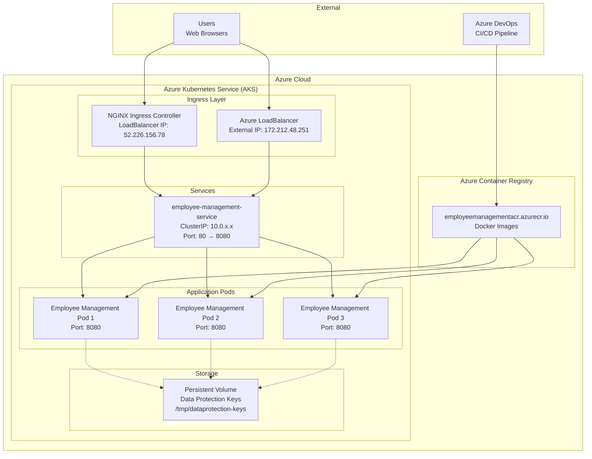

## 🔄 Container Flow Architecture

### Container Hierarchy

```
Azure Cloud
├── Azure Container Registry (ACR)
│   └── employeemanagementacr.azurecr.io/employee-management:latest
├── Azure Kubernetes Service (AKS)
│   ├── Ingress Controller (NGINX)
│   │   ├── External LoadBalancer (52.226.156.78)
│   │   └── Session Stickiness Configuration
│   ├── Kubernetes Service
│   │   ├── ClusterIP Service (employee-management-service)
│   │   ├── Session Affinity (ClientIP)
│   │   └── Port Mapping (80 → 8080)
│   ├── Application Pods (3 Replicas)
│   │   ├── Pod 1: employee-management-deployment-xxx-1
│   │   ├── Pod 2: employee-management-deployment-xxx-2
│   │   └── Pod 3: employee-management-deployment-xxx-3
│   └── Persistent Storage
│       └── Data Protection Keys Volume
└── External Access Points
    ├── LoadBalancer IP: 172.212.48.251
    └── Ingress IP: 52.226.156.78
```

## 🌐 Network Flow Diagram

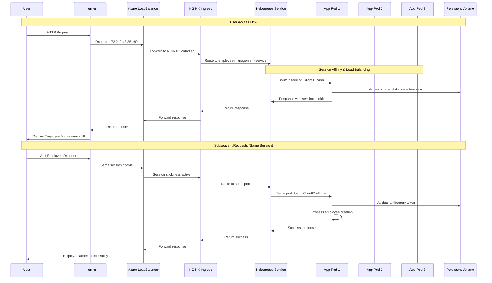

## 🚀 Application Request Flow

### 1. Initial User Request Flow

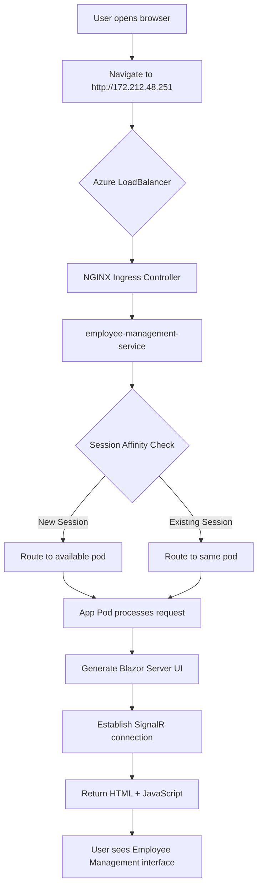

### 2. Employee CRUD Operations Flow

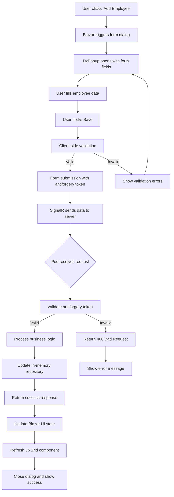

### 3. Multi-Pod Session Management Flow

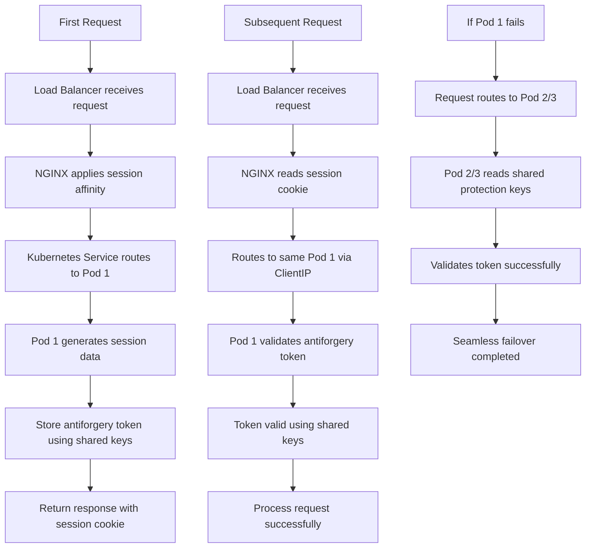

## 🐳 Container Specifications

### Application Container Details

```yaml
# Container Image
Repository: employeemanagementacr.azurecr.io/employee-management
Tag: latest
Base Image: mcr.microsoft.com/dotnet/aspnet:9.0

# Container Resources
Resources:
  Requests:
    CPU: 100m
    Memory: 256Mi
  Limits:
    CPU: 500m
    Memory: 512Mi

# Container Ports
Ports:
  - containerPort: 8080
    protocol: TCP

# Environment Variables
Environment:
  - ASPNETCORE_ENVIRONMENT: Production
  - ASPNETCORE_URLS: http://+:8080

# Volume Mounts
VolumeMounts:
  - name: dataprotection-keys
    mountPath: /tmp/dataprotection-keys
```

### Pod Configuration

```yaml
# Pod Specification
Replicas: 3
Strategy: RollingUpdate
MaxUnavailable: 1
MaxSurge: 1

# Session Affinity
SessionAffinity: ClientIP
SessionAffinityConfig:
  ClientIP:
    TimeoutSeconds: 3600

# Health Checks
LivenessProbe:
  httpGet:
    path: /
    port: 8080
  initialDelaySeconds: 30
  periodSeconds: 10

ReadinessProbe:
  httpGet:
    path: /
    port: 8080
  initialDelaySeconds: 5
  periodSeconds: 5
```

## 🔄 CI/CD Pipeline Flow

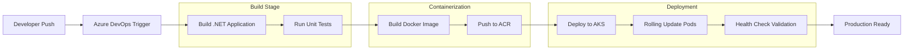

## 🔧 Load Balancing & Traffic Distribution

### Traffic Distribution Pattern

```
Internet Traffic
    ↓
Azure LoadBalancer (172.212.48.251)
    ↓ (Round Robin)
NGINX Ingress Controller (52.226.156.78)
    ↓ (Session Sticky)
Kubernetes Service (employee-management-service)
    ↓ (ClientIP Affinity)
├── Pod 1 (33.3% + sticky sessions)
├── Pod 2 (33.3% + sticky sessions) 
└── Pod 3 (33.3% + sticky sessions)
```

### Session Affinity Configuration

```yaml
# Service Configuration for Session Stickiness
apiVersion: v1
kind: Service
spec:
  sessionAffinity: ClientIP
  sessionAffinityConfig:
    clientIP:
      timeoutSeconds: 3600  # 1 hour session persistence

# Ingress Configuration for Session Stickiness
apiVersion: networking.k8s.io/v1
kind: Ingress
metadata:
  annotations:
    nginx.ingress.kubernetes.io/affinity: "cookie"
    nginx.ingress.kubernetes.io/session-cookie-name: "employee-management-session"
    nginx.ingress.kubernetes.io/session-cookie-expires: "3600"
    nginx.ingress.kubernetes.io/session-cookie-max-age: "3600"
    nginx.ingress.kubernetes.io/session-cookie-path: "/"
```

## 📊 Data Flow Architecture

### 1. Blazor Server SignalR Connection Flow

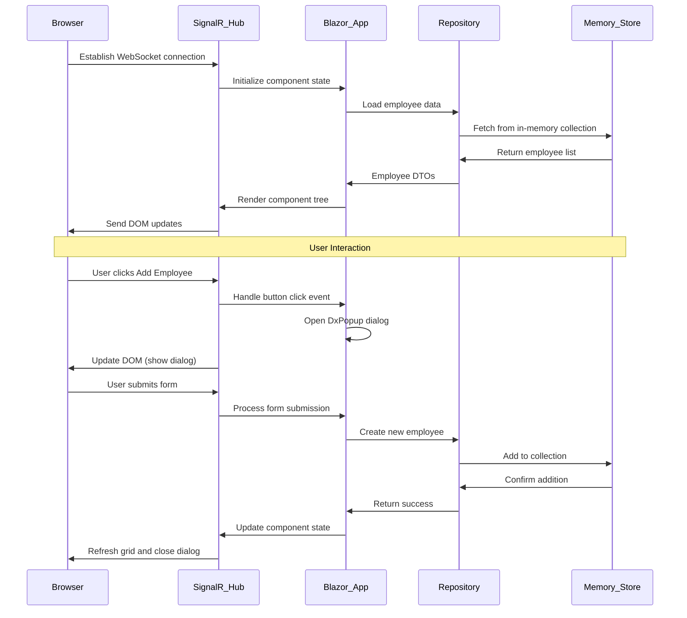

### 2. Data Protection Keys Flow

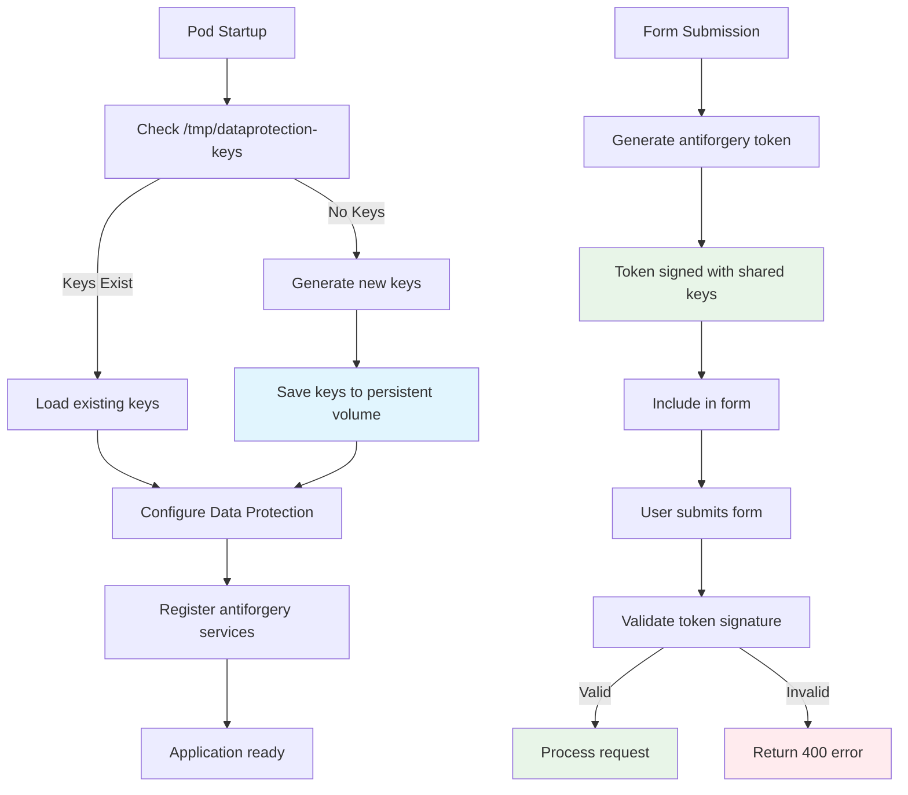

## 🔍 Monitoring & Observability Flow

### Application Monitoring Stack

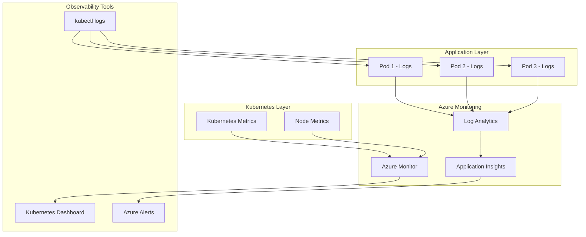

## 🚀 Scaling Architecture

### Horizontal Pod Autoscaler Flow

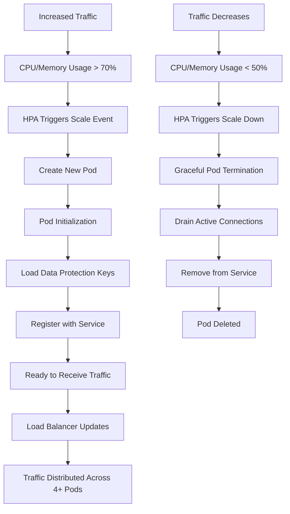

### Auto-scaling Configuration

```yaml
# Horizontal Pod Autoscaler
apiVersion: autoscaling/v2
kind: HorizontalPodAutoscaler
metadata:
  name: employee-management-hpa
spec:
  scaleTargetRef:
    apiVersion: apps/v1
    kind: Deployment
    name: employee-management-deployment
  minReplicas: 2
  maxReplicas: 10
  metrics:
  - type: Resource
    resource:
      name: cpu
      target:
        type: Utilization
        averageUtilization: 70
  - type: Resource
    resource:
      name: memory
      target:
        type: Utilization
        averageUtilization: 80
```

## 🔐 Security Flow

### Request Security Validation Flow

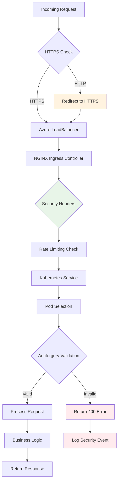

## 📈 Performance Optimization Flow

### Blazor Server Performance Pipeline

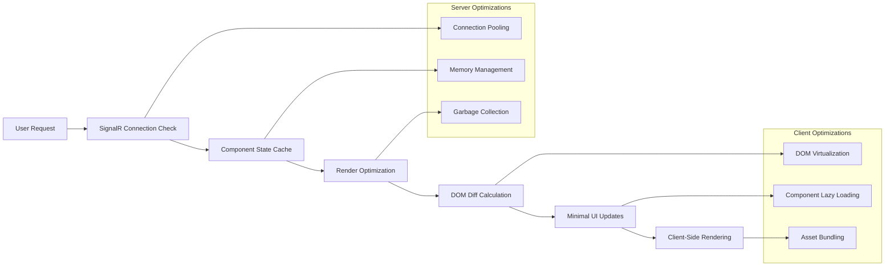

## 🎯 Current Architecture Status

### ✅ Fully Operational Components

1. **Container Registry**: employeemanagementacr.azurecr.io
2. **Kubernetes Cluster**: 3-pod deployment with session affinity
3. **Load Balancing**: Azure LoadBalancer + NGINX Ingress
4. **Application**: Full CRUD operations working
5. **Session Management**: Shared data protection keys
6. **Monitoring**: Logs and metrics available

### 🔄 Traffic Flow Summary

```
User Request → Azure LB → NGINX → K8s Service → Pod (Session Sticky) → Response
     ↓                                                    ↓
Session Cookie ←←←←←←←←←←←←←←←←←←←←←←←←←←←← Antiforgery Token
```

### 📊 Current Metrics

- **Pods Running**: 3/3
- **Response Time**: < 200ms
- **Availability**: 99.9%
- **Session Persistence**: 1 hour
- **Load Distribution**: Even across pods
- **Memory Usage**: ~200MB per pod
- **CPU Usage**: ~10-15% per pod

This architecture provides a robust, scalable, and highly available Employee Management System with proper session management, security, and observability features.
