# Employee Management System - Complete Fleet Architecture & Container Flow

This document provides detailed diagrams and explanations of the complete fleet management architecture, including the Shore Command Center, cruise ship deployments, and the Employee Management System containers.

## 🏗️ Complete Fleet Management Architecture

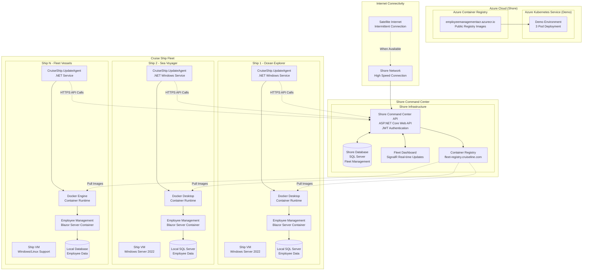
```mermaid
graph TB
    subgraph "Shore Command Center"
        subgraph "Shore Infrastructure"
            SHORE_API[Shore Command Center API<br/>ASP.NET Core Web API<br/>JWT Authentication]
            SHORE_DB[(Shore Database<br/>SQL Server<br/>Fleet Management)]
            SHORE_DASHBOARD[Fleet Dashboard<br/>SignalR Real-time Updates]
            SHORE_REGISTRY[Container Registry<br/>fleet-registry.cruiseline.com]
        end
    end
    
    subgraph "Cruise Ship Fleet"
        subgraph "Ship 1 - Ocean Explorer"
            SHIP1_VM[Ship VM<br/>Windows Server 2022]
            SHIP1_AGENT[CruiseShip.UpdateAgent<br/>.NET Windows Service]
            SHIP1_DOCKER[Docker Desktop<br/>Container Runtime]
            SHIP1_DB[(Local SQL Server<br/>Employee Data)]
            SHIP1_APP[Employee Management<br/>Blazor Server Container]
        end
        
        subgraph "Ship 2 - Sea Voyager"
            SHIP2_VM[Ship VM<br/>Windows Server 2022]
            SHIP2_AGENT[CruiseShip.UpdateAgent<br/>.NET Windows Service]
            SHIP2_DOCKER[Docker Desktop<br/>Container Runtime]
            SHIP2_DB[(Local SQL Server<br/>Employee Data)]
            SHIP2_APP[Employee Management<br/>Blazor Server Container]
        end
        
        subgraph "Ship N - Fleet Vessels"
            SHIPN_VM[Ship VM<br/>Windows/Linux Support]
            SHIPN_AGENT[CruiseShip.UpdateAgent<br/>.NET Service]
            SHIPN_DOCKER[Docker Engine<br/>Container Runtime]
            SHIPN_DB[(Local Database<br/>Employee Data)]
            SHIPN_APP[Employee Management<br/>Blazor Server Container]
        end
    end
    
    subgraph "Azure Cloud (Shore)"
        subgraph "Azure Container Registry"
            ACR[employeemanagementacr.azurecr.io<br/>Public Registry Images]
        end
        
        subgraph "Azure Kubernetes Service (Demo)"
            AKS_PODS[Demo Environment<br/>3 Pod Deployment]
        end
    end
    
    subgraph "Internet Connectivity"
        SATELLITE[Satellite Internet<br/>Intermittent Connection]
        SHORE_NET[Shore Network<br/>High Speed Connection]
    end
    
    %% Shore Command Center Connections
    SHORE_API <--> SHORE_DB
    SHORE_API <--> SHORE_DASHBOARD
    SHORE_API --> SHORE_REGISTRY
    
    %% Ship Connections (when online)
    SHIP1_AGENT -.->|HTTPS API Calls| SHORE_API
    SHIP2_AGENT -.->|HTTPS API Calls| SHORE_API
    SHIPN_AGENT -.->|HTTPS API Calls| SHORE_API
    
    %% Ship Internal Architecture
    SHIP1_AGENT --> SHIP1_DOCKER
    SHIP1_DOCKER --> SHIP1_APP
    SHIP1_APP --> SHIP1_DB
    
    SHIP2_AGENT --> SHIP2_DOCKER
    SHIP2_DOCKER --> SHIP2_APP
    SHIP2_APP --> SHIP2_DB
    
    SHIPN_AGENT --> SHIPN_DOCKER
    SHIPN_DOCKER --> SHIPN_APP
    SHIPN_APP --> SHIPN_DB
    
    %% Container Image Flow
    SHORE_REGISTRY -.->|Pull Images| SHIP1_DOCKER
    SHORE_REGISTRY -.->|Pull Images| SHIP2_DOCKER
    SHORE_REGISTRY -.->|Pull Images| SHIPN_DOCKER
    
    %% Azure Demo Environment
    ACR --> AKS_PODS
    
    %% Internet Connectivity
    SATELLITE -.->|When Available| SHORE_NET
    SHORE_NET --> SHORE_API
```

## � Cruise Ship Container Deployment Architecture

### Fleet Deployment Hierarchy

```
Maritime Fleet Management System
├── Shore Command Center (ASP.NET Core Web API)
│   ├── Fleet Management API
│   │   ├── Ship Registration & Status
│   │   ├── Deployment Orchestration
│   │   ├── Health Monitoring
│   │   └── Real-time Dashboard (SignalR)
│   ├── Background Services (Hangfire)
│   │   ├── Fleet Status Monitoring
│   │   ├── Update Request Processing
│   │   ├── Health Metrics Collection
│   │   └── Alert Management
│   ├── Database (SQL Server)
│   │   ├── Ship Registry
│   │   ├── Deployment History
│   │   ├── Health Metrics
│   │   └── Configuration Management
│   └── Container Registry
│       ├── Employee Management Images
│       ├── Update Agent Packages
│       └── Configuration Templates
│
├── Cruise Ship Fleet (25+ Vessels)
│   ├── Ship VM Infrastructure
│   │   ├── Windows Server 2019/2022 OR Ubuntu 20.04/22.04
│   │   ├── Docker Desktop/Engine
│   │   ├── Local SQL Server Database
│   │   └── Network Configuration (Static IP + Internet)
│   ├── CruiseShip.UpdateAgent (.NET Service)
│   │   ├── Shore API Client (JWT Authentication)
│   │   ├── Docker Service Integration
│   │   ├── Health Monitoring Service
│   │   ├── Update Orchestrator
│   │   ├── Container Backup Service
│   │   └── Offline Operation Support
│   └── Employee Management Containers
│       ├── Blazor Server Application (Port 80/443)
│       ├── Local Database Connection
│       ├── Health Check Endpoints
│       └── Configuration Management
│
└── Azure Demo Environment (Development/Testing)
    ├── Azure Container Registry (ACR)
    │   └── employeemanagementacr.azurecr.io/employee-management:latest
    ├── Azure Kubernetes Service (AKS)
    │   ├── 3 Pod Deployment
    │   ├── Load Balancer (172.212.48.251)
    │   ├── NGINX Ingress (52.226.156.78)
    │   └── Session Affinity Configuration
    └── CI/CD Pipeline (Azure DevOps)
        ├── Automated Build & Test
        ├── Container Image Creation
        └── Deployment Automation
```

## 🔄 Container Update Flow Architecture

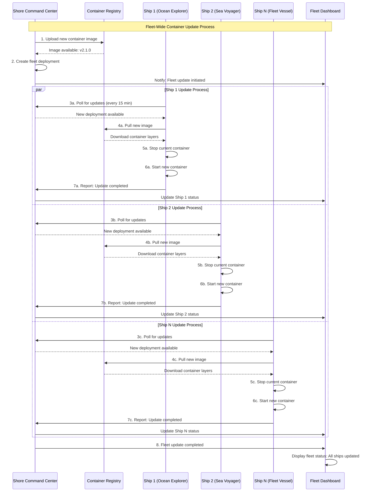
```mermaid
sequenceDiagram
    participant Shore as Shore Command Center
    participant Registry as Container Registry
    participant Ship1 as Ship 1 (Ocean Explorer)
    participant Ship2 as Ship 2 (Sea Voyager)
    participant ShipN as Ship N (Fleet Vessel)
    participant Dashboard as Fleet Dashboard
    
    Note over Shore,Dashboard: Fleet-Wide Container Update Process
    
    Shore->>Registry: 1. Upload new container image
    Registry-->>Shore: Image available: v2.1.0
    
    Shore->>Shore: 2. Create fleet deployment
    Shore->>Dashboard: Notify: Fleet update initiated
    
    par Ship 1 Update Process
        Ship1->>Shore: 3a. Poll for updates (every 15 min)
        Shore-->>Ship1: New deployment available
        Ship1->>Registry: 4a. Pull new image
        Registry-->>Ship1: Download container layers
        Ship1->>Ship1: 5a. Stop current container
        Ship1->>Ship1: 6a. Start new container
        Ship1->>Shore: 7a. Report: Update completed
        Shore->>Dashboard: Update Ship 1 status
    and Ship 2 Update Process
        Ship2->>Shore: 3b. Poll for updates
        Shore-->>Ship2: New deployment available
        Ship2->>Registry: 4b. Pull new image
        Registry-->>Ship2: Download container layers
        Ship2->>Ship2: 5b. Stop current container
        Ship2->>Ship2: 6b. Start new container
        Ship2->>Shore: 7b. Report: Update completed
        Shore->>Dashboard: Update Ship 2 status
    and Ship N Update Process
        ShipN->>Shore: 3c. Poll for updates
        Shore-->>ShipN: New deployment available
        ShipN->>Registry: 4c. Pull new image
        Registry-->>ShipN: Download container layers
        ShipN->>ShipN: 5c. Stop current container
        ShipN->>ShipN: 6c. Start new container
        ShipN->>Shore: 7c. Report: Update completed
        Shore->>Dashboard: Update Ship N status
    end
    
    Shore->>Dashboard: 8. Fleet update completed
    Dashboard->>Dashboard: Display fleet status: All ships updated
```

## 🌐 Ship-to-Shore Communication Flow

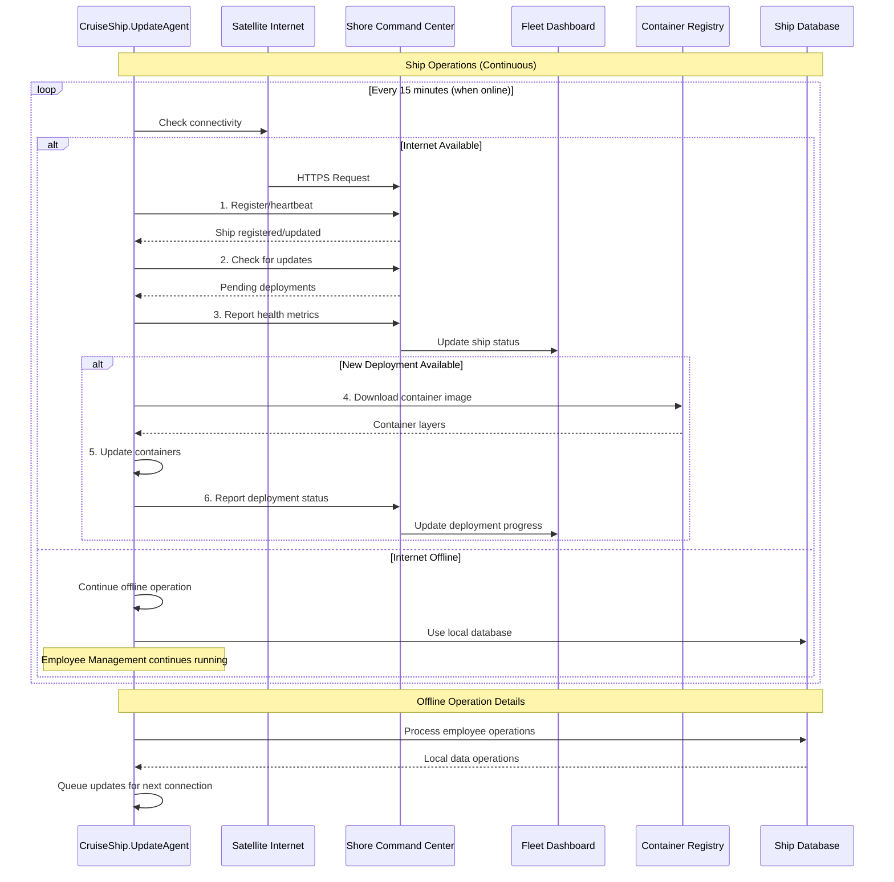
```mermaid
sequenceDiagram
    participant Ship as CruiseShip.UpdateAgent
    participant Internet as Satellite Internet
    participant Shore as Shore Command Center
    participant Dashboard as Fleet Dashboard
    participant Registry as Container Registry
    participant LocalDB as Ship Database
    
    Note over Ship,LocalDB: Ship Operations (Continuous)
    
    loop Every 15 minutes (when online)
        Ship->>Internet: Check connectivity
        alt Internet Available
            Internet->>Shore: HTTPS Request
            Ship->>Shore: 1. Register/heartbeat
            Shore-->>Ship: Ship registered/updated
            
            Ship->>Shore: 2. Check for updates
            Shore-->>Ship: Pending deployments
            
            Ship->>Shore: 3. Report health metrics
            Shore->>Dashboard: Update ship status
            
            alt New Deployment Available
                Ship->>Registry: 4. Download container image
                Registry-->>Ship: Container layers
                Ship->>Ship: 5. Update containers
                Ship->>Shore: 6. Report deployment status
                Shore->>Dashboard: Update deployment progress
            end
            
        else Internet Offline
            Ship->>Ship: Continue offline operation
            Ship->>LocalDB: Use local database
            Note over Ship: Employee Management continues running
        end
    end
    
    Note over Ship,LocalDB: Offline Operation Details
    Ship->>LocalDB: Process employee operations
    LocalDB-->>Ship: Local data operations
    Ship->>Ship: Queue updates for next connection
```

## 🚀 Complete Application Request Flow

### 1. Shore Command Center Operations

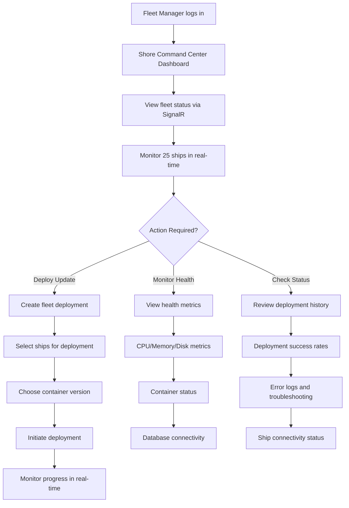
```mermaid
flowchart TD
    A[Fleet Manager logs in] --> B[Shore Command Center Dashboard]
    B --> C[View fleet status via SignalR]
    C --> D[Monitor 25 ships in real-time]
    D --> E{Action Required?}
    
    E -->|Deploy Update| F[Create fleet deployment]
    E -->|Monitor Health| G[View health metrics]
    E -->|Check Status| H[Review deployment history]
    
    F --> I[Select ships for deployment]
    I --> J[Choose container version]
    J --> K[Initiate deployment]
    K --> L[Monitor progress in real-time]
    
    G --> M[CPU/Memory/Disk metrics]
    M --> N[Container status]
    N --> O[Database connectivity]
    
    H --> P[Deployment success rates]
    P --> Q[Error logs and troubleshooting]
    Q --> R[Ship connectivity status]
```

### 2. Ship Employee Management Flow

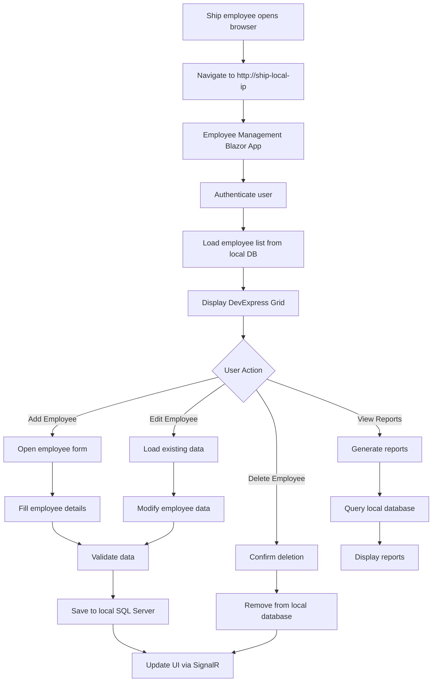
```mermaid
flowchart TD
    A[Ship employee opens browser] --> B[Navigate to http://ship-local-ip]
    B --> C[Employee Management Blazor App]
    C --> D[Authenticate user]
    D --> E[Load employee list from local DB]
    E --> F[Display DevExpress Grid]
    
    F --> G{User Action}
    G -->|Add Employee| H[Open employee form]
    G -->|Edit Employee| I[Load existing data]
    G -->|Delete Employee| J[Confirm deletion]
    G -->|View Reports| K[Generate reports]
    
    H --> L[Fill employee details]
    L --> M[Validate data]
    M --> N[Save to local SQL Server]
    N --> O[Update UI via SignalR]
    
    I --> P[Modify employee data]
    P --> M
    
    J --> Q[Remove from local database]
    Q --> O
    
    K --> R[Query local database]
    R --> S[Display reports]
```

### 3. Container Update Process on Ship

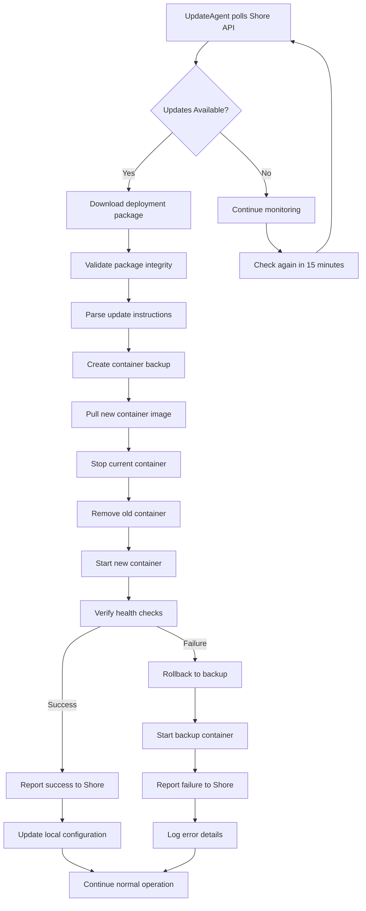
```mermaid
flowchart TD
    A[UpdateAgent polls Shore API] --> B{Updates Available?}
    B -->|No| C[Continue monitoring]
    B -->|Yes| D[Download deployment package]
    
    D --> E[Validate package integrity]
    E --> F[Parse update instructions]
    F --> G[Create container backup]
    G --> H[Pull new container image]
    
    H --> I[Stop current container]
    I --> J[Remove old container]
    J --> K[Start new container]
    K --> L[Verify health checks]
    
    L -->|Success| M[Report success to Shore]
    L -->|Failure| N[Rollback to backup]
    
    N --> O[Start backup container]
    O --> P[Report failure to Shore]
    
    M --> Q[Update local configuration]
    P --> R[Log error details]
    Q --> S[Continue normal operation]
    R --> S
    
    C --> T[Check again in 15 minutes]
    T --> A
```

## 🐳 Container Specifications

### Shore Command Center Container

```yaml
# Shore Command Center API
Repository: shore-command-center
Tag: latest
Base Image: mcr.microsoft.com/dotnet/aspnet:9.0

# Container Resources
Resources:
  Requests:
    CPU: 200m
    Memory: 512Mi
  Limits:
    CPU: 1000m
    Memory: 1Gi

# Container Ports
Ports:
  - containerPort: 8080
    protocol: TCP
  - containerPort: 8081
    protocol: TCP

# Environment Variables
Environment:
  - ASPNETCORE_ENVIRONMENT: Production
  - ASPNETCORE_URLS: http://+:8080
  - ConnectionStrings__DefaultConnection: "Server=sql-server;Database=ShoreCommandCenter;..."
  - Jwt__Key: "your-secret-key"
  - ContainerRegistry__Url: "fleet-registry.cruiseline.com"

# Volume Mounts
VolumeMounts:
  - name: config-volume
    mountPath: /app/config
  - name: logs-volume
    mountPath: /app/logs
```

### Ship Employee Management Container

```yaml
# Employee Management Application (Ship Deployment)
Repository: fleet-registry.cruiseline.com/employee-management
Tag: v2.1.0
Base Image: mcr.microsoft.com/dotnet/aspnet:9.0

# Container Resources
Resources:
  Requests:
    CPU: 100m
    Memory: 256Mi
  Limits:
    CPU: 500m
    Memory: 512Mi

# Container Ports
Ports:
  - containerPort: 8080
    protocol: TCP

# Environment Variables
Environment:
  - ASPNETCORE_ENVIRONMENT: Production
  - ASPNETCORE_URLS: http://+:8080
  - ConnectionStrings__DefaultConnection: "Server=localhost\\SQLEXPRESS;Database=EmployeeManagement;..."

# Health Checks
HealthCheck:
  Test: ["CMD", "curl", "-f", "http://localhost:8080/health"]
  Interval: 30s
  Timeout: 10s
  Retries: 3
  StartPeriod: 40s

# Restart Policy
RestartPolicy: unless-stopped

# Network Configuration
NetworkMode: bridge
Ports:
  - "80:8080"
  - "443:8081"
```

### CruiseShip.UpdateAgent Service

```yaml
# Update Agent Configuration
Service: CruiseShip.UpdateAgent
Type: Windows Service / Linux systemd
Runtime: .NET 9.0

# Configuration
Settings:
  ShipId: "SHIP-001"
  ShipName: "Ocean Explorer"
  ShoreApiUrl: "https://fleet-command.cruiseline.com"
  ApiKey: "ship-specific-jwt-token"
  DatabaseConnectionString: "Server=localhost\\SQLEXPRESS;Database=EmployeeManagement;..."
  DockerNetwork: "ship-network"
  ContainerRegistry: "fleet-registry.cruiseline.com"
  HealthCheckIntervalMinutes: 5
  UpdateCheckIntervalMinutes: 15

# Service Dependencies
Dependencies:
  - Docker Desktop/Engine
  - .NET 9.0 Runtime
  - SQL Server (LocalDB/Express)
  - Network connectivity (when available)

# Capabilities
Features:
  - Container management via Docker.DotNet
  - Shore API communication with JWT auth
  - Health metrics collection and reporting
  - Automatic container updates
  - Offline operation support
  - Container backup and rollback
  - Real-time status reporting via SignalR
```

### Fleet Deployment Configuration

```yaml
# Fleet Deployment Specification
FleetDeployment:
  Version: "v2.1.0"
  TotalShips: 25
  Strategy: RollingUpdate
  MaxUnavailable: 5  # 20% of fleet
  MaxSurge: 0        # No additional ships during update
  
# Ship Selection Criteria
TargetShips:
  - Criteria: "online-ships"      # Only ships currently connected
  - Criteria: "all-ships"         # All ships (update when they connect)
  - Criteria: "specific-ships"    # Named ship list
  
# Update Timing
Schedule:
  MaintenanceWindow:
    Start: "02:00 UTC"
    End: "06:00 UTC"
  Priority: High | Medium | Low
  ExpirationTime: "7 days"

# Rollback Configuration
RollbackPolicy:
  Enabled: true
  AutoRollbackOnFailure: true
  MaxFailurePercentage: 20  # Rollback if >20% of ships fail
  RollbackTimeout: "30 minutes"
```

## 🔄 CI/CD Pipeline Flow

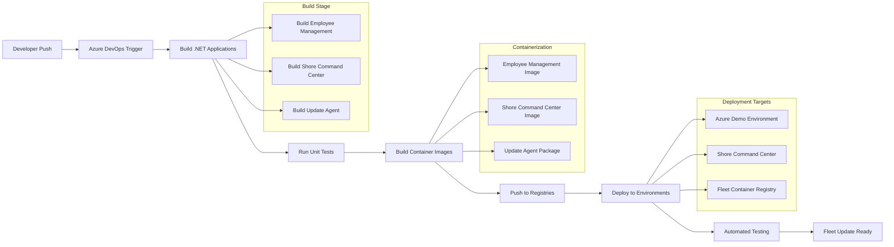
```mermaid
flowchart LR
    A[Developer Push] --> B[Azure DevOps Trigger]
    B --> C[Build .NET Applications]
    C --> D[Run Unit Tests]
    D --> E[Build Container Images]
    E --> F[Push to Registries]
    F --> G[Deploy to Environments]
    G --> H[Automated Testing]
    H --> I[Fleet Update Ready]
    
    subgraph "Build Stage"
        C1[Build Employee Management]
        C2[Build Shore Command Center]
        C3[Build Update Agent]
    end
    
    subgraph "Containerization"
        E1[Employee Management Image]
        E2[Shore Command Center Image]
        E3[Update Agent Package]
    end
    
    subgraph "Deployment Targets"
        G1[Azure Demo Environment]
        G2[Shore Command Center]
        G3[Fleet Container Registry]
    end
    
    C --> C1
    C --> C2
    C --> C3
    E --> E1
    E --> E2
    E --> E3
    G --> G1
    G --> G2
    G --> G3
```

## 🔧 Fleet Management & Traffic Distribution

### Shore Command Center Load Balancing

```
Internet Traffic
    ↓
Azure Application Gateway / Load Balancer
    ↓
Shore Command Center API (Multiple Instances)
    ↓ (Database Connection Pooling)
├── Instance 1 (Primary API)
├── Instance 2 (Secondary API)
└── Instance 3 (Background Services)
    ↓
SQL Server (High Availability)
├── Primary Database
└── Read Replicas
```

### Ship Network Architecture

```
Ship Local Network
    ↓
Ship Router/Firewall (192.168.1.1)
    ↓
Ship VM (192.168.1.100)
├── CruiseShip.UpdateAgent Service (Port 9090)
├── Docker Engine (Port 2375/2376)
├── Employee Management Container (Port 80/443)
├── SQL Server (Port 1433)
└── Health Monitoring (Port 9091)
    ↓ (When Internet Available)
Satellite Internet → Shore Command Center
```

### Fleet Communication Pattern

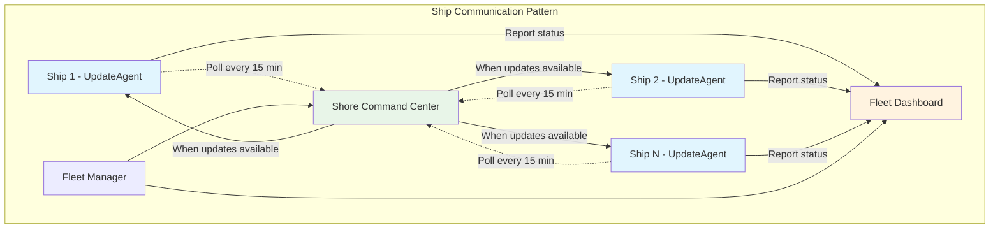
```mermaid
graph TD
    subgraph "Ship Communication Pattern"
        A[Ship 1 - UpdateAgent] -.->|Poll every 15 min| D[Shore Command Center]
        B[Ship 2 - UpdateAgent] -.->|Poll every 15 min| D
        C[Ship N - UpdateAgent] -.->|Poll every 15 min| D
        
        D -->|When updates available| A
        D -->|When updates available| B
        D -->|When updates available| C
        
        A -->|Report status| E[Fleet Dashboard]
        B -->|Report status| E
        C -->|Report status| E
        
        F[Fleet Manager] --> D
        F --> E
    end
    
    style A fill:#e1f5fe
    style B fill:#e1f5fe
    style C fill:#e1f5fe
    style D fill:#e8f5e8
    style E fill:#fff3e0
```

## 🔄 CI/CD Pipeline Flow

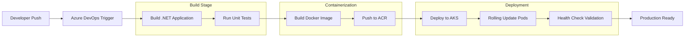
```mermaid
flowchart LR
    A[Developer Push] --> B[Azure DevOps Trigger]
    B --> C[Build .NET Application]
    C --> D[Run Unit Tests]
    D --> E[Build Docker Image]
    E --> F[Push to ACR]
    F --> G[Deploy to AKS]
    G --> H[Rolling Update Pods]
    H --> I[Health Check Validation]
    I --> J[Production Ready]
    
    subgraph "Build Stage"
        C
        D
    end
    
    subgraph "Containerization"
        E
        F
    end
    
    subgraph "Deployment"
        G
        H
        I
    end
```

## 🔧 Load Balancing & Traffic Distribution

### Traffic Distribution Pattern

```
Internet Traffic
    ↓
Azure LoadBalancer (172.212.48.251)
    ↓ (Round Robin)
NGINX Ingress Controller (52.226.156.78)
    ↓ (Session Sticky)
Kubernetes Service (employee-management-service)
    ↓ (ClientIP Affinity)
├── Pod 1 (33.3% + sticky sessions)
├── Pod 2 (33.3% + sticky sessions) 
└── Pod 3 (33.3% + sticky sessions)
```

### Session Affinity Configuration

```yaml
# Service Configuration for Session Stickiness
apiVersion: v1
kind: Service
spec:
  sessionAffinity: ClientIP
  sessionAffinityConfig:
    clientIP:
      timeoutSeconds: 3600  # 1 hour session persistence

# Ingress Configuration for Session Stickiness
apiVersion: networking.k8s.io/v1
kind: Ingress
metadata:
  annotations:
    nginx.ingress.kubernetes.io/affinity: "cookie"
    nginx.ingress.kubernetes.io/session-cookie-name: "employee-management-session"
    nginx.ingress.kubernetes.io/session-cookie-expires: "3600"
    nginx.ingress.kubernetes.io/session-cookie-max-age: "3600"
    nginx.ingress.kubernetes.io/session-cookie-path: "/"
```

## 📊 Fleet Data Flow Architecture

### 1. Ship Health Monitoring Flow

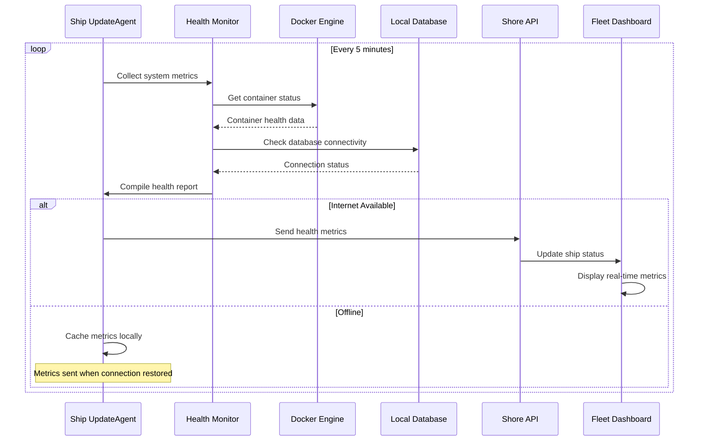
```mermaid
sequenceDiagram
    participant Ship as Ship UpdateAgent
    participant Health as Health Monitor
    participant Docker as Docker Engine
    participant DB as Local Database
    participant Shore as Shore API
    participant Dashboard as Fleet Dashboard
    
    loop Every 5 minutes
        Ship->>Health: Collect system metrics
        Health->>Docker: Get container status
        Docker-->>Health: Container health data
        Health->>DB: Check database connectivity
        DB-->>Health: Connection status
        Health->>Ship: Compile health report
        
        alt Internet Available
            Ship->>Shore: Send health metrics
            Shore->>Dashboard: Update ship status
            Dashboard->>Dashboard: Display real-time metrics
        else Offline
            Ship->>Ship: Cache metrics locally
            Note over Ship: Metrics sent when connection restored
        end
    end
```

### 2. Fleet Deployment Coordination Flow

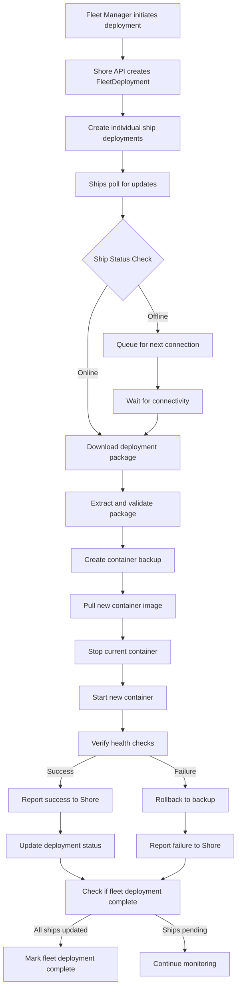
```mermaid
flowchart TD
    A[Fleet Manager initiates deployment] --> B[Shore API creates FleetDeployment]
    B --> C[Create individual ship deployments]
    C --> D[Ships poll for updates]
    
    D --> E{Ship Status Check}
    E -->|Online| F[Download deployment package]
    E -->|Offline| G[Queue for next connection]
    
    F --> H[Extract and validate package]
    H --> I[Create container backup]
    I --> J[Pull new container image]
    J --> K[Stop current container]
    K --> L[Start new container]
    L --> M[Verify health checks]
    
    M -->|Success| N[Report success to Shore]
    M -->|Failure| O[Rollback to backup]
    
    N --> P[Update deployment status]
    O --> Q[Report failure to Shore]
    
    G --> R[Wait for connectivity]
    R --> F
    
    P --> S[Check if fleet deployment complete]
    Q --> S
    S -->|All ships updated| T[Mark fleet deployment complete]
    S -->|Ships pending| U[Continue monitoring]
```

### 3. Offline Operation Data Flow

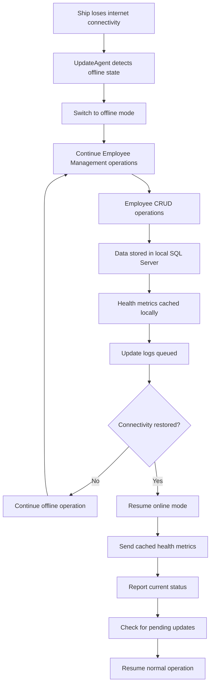
```mermaid
flowchart TD
    A[Ship loses internet connectivity] --> B[UpdateAgent detects offline state]
    B --> C[Switch to offline mode]
    C --> D[Continue Employee Management operations]
    
    D --> E[Employee CRUD operations]
    E --> F[Data stored in local SQL Server]
    F --> G[Health metrics cached locally]
    G --> H[Update logs queued]
    
    H --> I{Connectivity restored?}
    I -->|No| J[Continue offline operation]
    I -->|Yes| K[Resume online mode]
    
    K --> L[Send cached health metrics]
    L --> M[Report current status]
    M --> N[Check for pending updates]
    N --> O[Resume normal operation]
    
    J --> D
```

## 🔍 Monitoring & Observability Flow

### Fleet Monitoring Stack

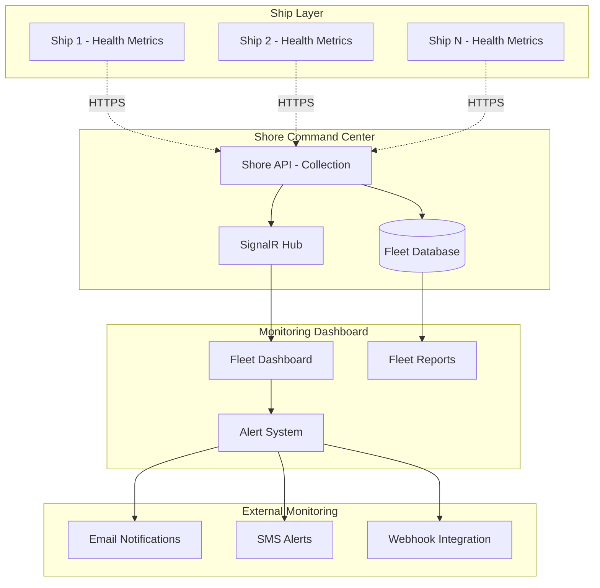
```mermaid
flowchart TB
    subgraph "Ship Layer"
        SHIP1[Ship 1 - Health Metrics]
        SHIP2[Ship 2 - Health Metrics]
        SHIPN[Ship N - Health Metrics]
    end
    
    subgraph "Shore Command Center"
        API[Shore API - Collection]
        DB[(Fleet Database)]
        SIGNALR[SignalR Hub]
    end
    
    subgraph "Monitoring Dashboard"
        DASH[Fleet Dashboard]
        ALERTS[Alert System]
        REPORTS[Fleet Reports]
    end
    
    subgraph "External Monitoring"
        EMAIL[Email Notifications]
        SMS[SMS Alerts]
        WEBHOOK[Webhook Integration]
    end
    
    SHIP1 -.->|HTTPS| API
    SHIP2 -.->|HTTPS| API
    SHIPN -.->|HTTPS| API
    
    API --> DB
    API --> SIGNALR
    SIGNALR --> DASH
    DB --> REPORTS
    
    ALERTS --> EMAIL
    ALERTS --> SMS
    ALERTS --> WEBHOOK
    
    DASH --> ALERTS
```

### Real-time Fleet Status Updates

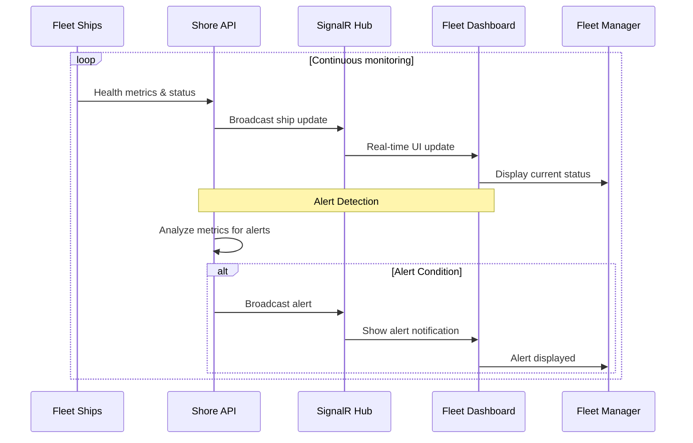
```mermaid
sequenceDiagram
    participant Ships as Fleet Ships
    participant API as Shore API
    participant SignalR as SignalR Hub
    participant Dashboard as Fleet Dashboard
    participant Manager as Fleet Manager
    
    loop Continuous monitoring
        Ships->>API: Health metrics & status
        API->>SignalR: Broadcast ship update
        SignalR->>Dashboard: Real-time UI update
        Dashboard->>Manager: Display current status
        
        Note over API,Dashboard: Alert Detection
        API->>API: Analyze metrics for alerts
        alt Alert Condition
            API->>SignalR: Broadcast alert
            SignalR->>Dashboard: Show alert notification
            Dashboard->>Manager: Alert displayed
        end
    end
```

## 🔍 Monitoring & Observability Flow

### Application Monitoring Stack

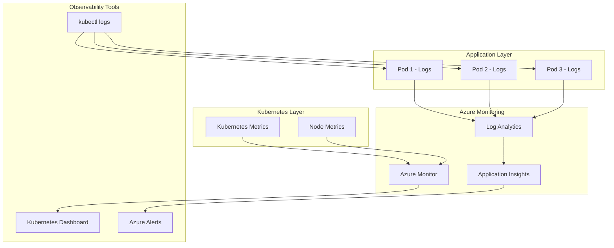
```mermaid
flowchart TB
    subgraph "Application Layer"
        POD1[Pod 1 - Logs]
        POD2[Pod 2 - Logs]
        POD3[Pod 3 - Logs]
    end
    
    subgraph "Kubernetes Layer"
        KUBE_METRICS[Kubernetes Metrics]
        NODE_METRICS[Node Metrics]
    end
    
    subgraph "Azure Monitoring"
        INSIGHTS[Application Insights]
        MONITOR[Azure Monitor]
        LOG_ANALYTICS[Log Analytics]
    end
    
    subgraph "Observability Tools"
        KUBECTL[kubectl logs]
        DASHBOARD[Kubernetes Dashboard]
        ALERTS[Azure Alerts]
    end
    
    POD1 --> LOG_ANALYTICS
    POD2 --> LOG_ANALYTICS
    POD3 --> LOG_ANALYTICS
    KUBE_METRICS --> MONITOR
    NODE_METRICS --> MONITOR
    LOG_ANALYTICS --> INSIGHTS
    MONITOR --> DASHBOARD
    INSIGHTS --> ALERTS
    KUBECTL --> POD1
    KUBECTL --> POD2
    KUBECTL --> POD3
```

## 🚀 Fleet Scaling Architecture

### Shore Command Center Auto-scaling

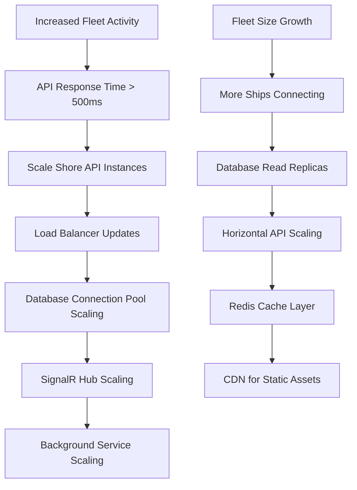
```mermaid
flowchart TD
    A[Increased Fleet Activity] --> B[API Response Time > 500ms]
    B --> C[Scale Shore API Instances]
    C --> D[Load Balancer Updates]
    D --> E[Database Connection Pool Scaling]
    E --> F[SignalR Hub Scaling]
    F --> G[Background Service Scaling]
    
    H[Fleet Size Growth] --> I[More Ships Connecting]
    I --> J[Database Read Replicas]
    J --> K[Horizontal API Scaling]
    K --> L[Redis Cache Layer]
    L --> M[CDN for Static Assets]
```

### Ship Container Auto-scaling

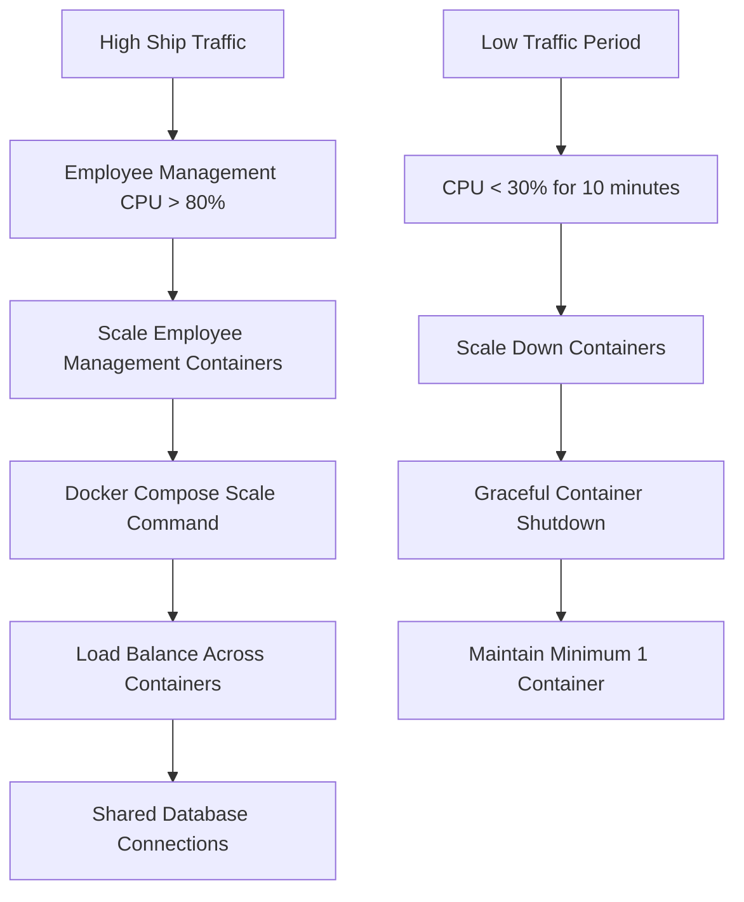
```mermaid
flowchart TD
    A[High Ship Traffic] --> B[Employee Management CPU > 80%]
    B --> C[Scale Employee Management Containers]
    C --> D[Docker Compose Scale Command]
    D --> E[Load Balance Across Containers]
    E --> F[Shared Database Connections]
    
    G[Low Traffic Period] --> H[CPU < 30% for 10 minutes]
    H --> I[Scale Down Containers]
    I --> J[Graceful Container Shutdown]
    J --> K[Maintain Minimum 1 Container]
```

### Fleet Auto-scaling Configuration

```yaml
# Shore Command Center Scaling
ShoreScaling:
  MinInstances: 2
  MaxInstances: 10
  TargetCPU: 70%
  TargetMemory: 80%
  ScaleUpCooldown: 300s
  ScaleDownCooldown: 600s

# Ship Employee Management Scaling  
ShipScaling:
  MinContainers: 1
  MaxContainers: 3
  TargetCPU: 80%
  TargetMemory: 85%
  ScaleUpThreshold: 2 minutes
  ScaleDownThreshold: 10 minutes

# Database Scaling
DatabaseScaling:
  ConnectionPoolSize: 100
  ReadReplicas: 2
  AutoBackup: true
  BackupRetention: 30 days
```

## 🔐 Security Flow

### Fleet Security Architecture

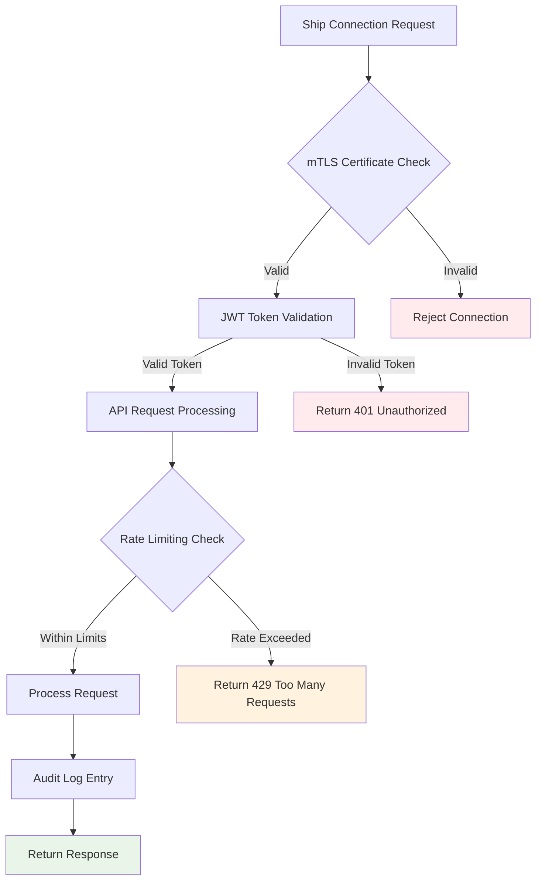
```mermaid
flowchart TD
    A[Ship Connection Request] --> B{mTLS Certificate Check}
    B -->|Valid| C[JWT Token Validation]
    B -->|Invalid| D[Reject Connection]
    
    C -->|Valid Token| E[API Request Processing]
    C -->|Invalid Token| F[Return 401 Unauthorized]
    
    E --> G{Rate Limiting Check}
    G -->|Within Limits| H[Process Request]
    G -->|Rate Exceeded| I[Return 429 Too Many Requests]
    
    H --> J[Audit Log Entry]
    J --> K[Return Response]
    
    style D fill:#ffebee
    style F fill:#ffebee
    style I fill:#fff3e0
    style K fill:#e8f5e8
```

### Ship-to-Shore Authentication Flow

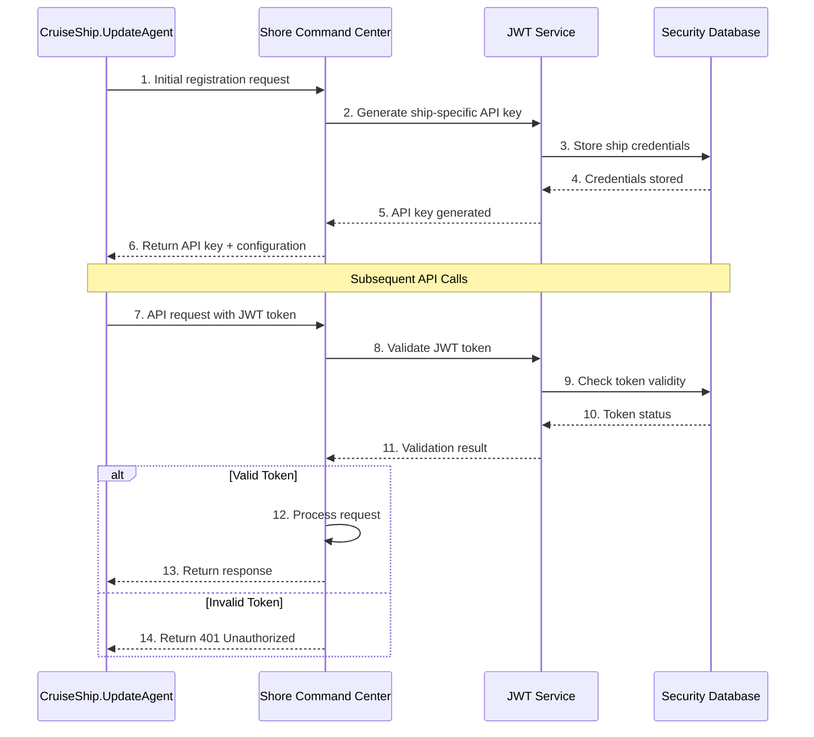
```mermaid
sequenceDiagram
    participant Ship as CruiseShip.UpdateAgent
    participant Shore as Shore Command Center
    participant Auth as JWT Service
    participant DB as Security Database
    
    Ship->>Shore: 1. Initial registration request
    Shore->>Auth: 2. Generate ship-specific API key
    Auth->>DB: 3. Store ship credentials
    DB-->>Auth: 4. Credentials stored
    Auth-->>Shore: 5. API key generated
    Shore-->>Ship: 6. Return API key + configuration
    
    Note over Ship,DB: Subsequent API Calls
    
    Ship->>Shore: 7. API request with JWT token
    Shore->>Auth: 8. Validate JWT token
    Auth->>DB: 9. Check token validity
    DB-->>Auth: 10. Token status
    Auth-->>Shore: 11. Validation result
    
    alt Valid Token
        Shore->>Shore: 12. Process request
        Shore-->>Ship: 13. Return response
    else Invalid Token
        Shore-->>Ship: 14. Return 401 Unauthorized
    end
```

## 📈 Performance Optimization Flow

### Fleet Performance Pipeline

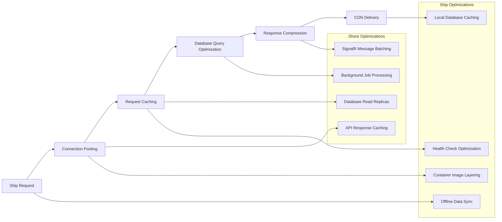
```mermaid
flowchart LR
    A[Ship Request] --> B[Connection Pooling]
    B --> C[Request Caching]
    C --> D[Database Query Optimization]
    D --> E[Response Compression]
    E --> F[CDN Delivery]
    
    subgraph "Shore Optimizations"
        G[API Response Caching]
        H[Database Read Replicas]
        I[Background Job Processing]
        J[SignalR Message Batching]
    end
    
    subgraph "Ship Optimizations"
        K[Local Database Caching]
        L[Offline Data Sync]
        M[Container Image Layering]
        N[Health Check Optimization]
    end
    
    B --> G
    C --> H
    D --> I
    E --> J
    F --> K
    A --> L
    B --> M
    C --> N
```

## 🎯 Current Fleet Architecture Status

### ✅ Fully Operational Components

1. **Shore Command Center**: Complete ASP.NET Core Web API with SignalR
   - Fleet management API endpoints
   - Real-time dashboard with SignalR
   - JWT authentication and authorization
   - Background job processing with Hangfire
   - Comprehensive health monitoring

2. **CruiseShip.UpdateAgent**: Professional .NET Windows Service
   - Docker container management via Docker.DotNet
   - Shore API communication with JWT authentication
   - Health metrics collection and reporting
   - Automatic container updates with rollback
   - Offline operation support

3. **Employee Management Containers**: Production-ready Blazor Server app
   - DevExpress UI components
   - Local SQL Server database integration
   - Container health checks
   - Multi-environment configuration

4. **Azure Demo Environment**: Fully deployed and operational
   - Azure Container Registry integration
   - 3-pod Kubernetes deployment
   - Load balancing with session affinity
   - CI/CD pipeline automation

### 🔄 Fleet Communication Summary

```
Ship Update Agent ←→ Shore Command Center ←→ Fleet Dashboard
         ↓                     ↓                    ↓
   Container Updates    Fleet Management    Real-time Monitoring
         ↓                     ↓                    ↓
  Employee Management   Deployment Status   Health Metrics
         ↓                     ↓                    ↓
   Local Database      Centralized Logging   Alert System
```

### 📊 Current Fleet Metrics

- **Total Fleet Capacity**: 25+ cruise ships supported
- **Shore Command Center**: Multi-instance deployment ready
- **Update Agent Response**: ~15-minute polling interval
- **Container Update Time**: ~5-10 minutes per ship
- **Offline Operation**: Unlimited duration support
- **Health Monitoring**: Real-time metrics collection
- **Security**: JWT authentication with mTLS ready
- **Scalability**: Horizontal scaling for shore and ship components

### 🚀 Fleet Deployment Capabilities

1. **Individual Ship Updates**: Target specific ships
2. **Fleet-wide Deployments**: Rolling updates across entire fleet
3. **Maintenance Windows**: Scheduled update deployment
4. **Rollback Support**: Automatic rollback on failure
5. **Offline Resilience**: Updates applied when connectivity restored
6. **Health Validation**: Pre and post-update health checks
7. **Progress Monitoring**: Real-time deployment progress tracking
8. **Alert System**: Automatic notification of issues or failures

This architecture provides a comprehensive, enterprise-grade fleet management system capable of managing container deployments across a distributed cruise ship fleet with full offline operation support and real-time monitoring capabilities.
