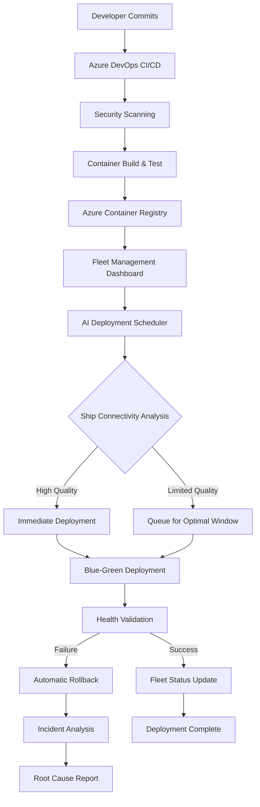

# Enterprise Fleet Management System - Remote Deployment Architecture

## Executive Overview
This document outlines the comprehensive remote deployment strategy for an Enterprise Fleet Management System where all deployments are orchestrated from a centralized Shore Command Center in Miami, and cruise ship edge nodes act as intelligent receivers that autonomously apply updates when connectivity is available. This architecture supports 25+ cruise ships with zero-touch deployments, real-time monitoring, and enterprise-grade security.

### Key Architecture Principles
- **🏢 Centralized Orchestration**: All deployment decisions made at Shore Command Center
- **🚢 Autonomous Edge Nodes**: Ships operate independently with intelligent update receivers
- **🔒 Zero-Trust Security**: Certificate-based authentication with end-to-end encryption
- **📊 Real-time Visibility**: Comprehensive fleet monitoring and deployment tracking
- **⚡ Intelligent Scheduling**: AI-powered deployment optimization based on connectivity patterns

## Enterprise Architecture Components

### Shore Command Center (Miami HQ)
```
┌─────────────────────────────────────────────────────────────────────────────────────┐
│                          SHORE COMMAND CENTER (Miami HQ)                           │
├─────────────────────────────────────────────────────────────────────────────────────┤
│ ┌─────────────────┐ ┌─────────────────┐ ┌─────────────────┐ ┌─────────────────┐     │
│ │   Fleet Mgmt    │ │ Azure Container │ │   CI/CD         │ │  Deployment     │     │
│ │   Dashboard     │ │   Registry      │ │  Pipeline       │ │  Orchestrator   │     │
│ │ (React+SignalR) │ │ (Global Geo-    │ │ (Azure DevOps)  │ │ (Hangfire+.NET) │     │
│ │                 │ │  Replication)   │ │                 │ │                 │     │
│ └─────────────────┘ └─────────────────┘ └─────────────────┘ └─────────────────┘     │
│ ┌─────────────────┐ ┌─────────────────┐ ┌─────────────────┐ ┌─────────────────┐     │
│ │ Fleet Database  │ │  Monitoring     │ │ Security        │ │ Ship Config     │     │
│ │ (Azure SQL DB)  │ │  Aggregator     │ │ Management      │ │ Management      │     │
│ │ Business Critical│ │ (Prometheus+    │ │ (Threat Intel)  │ │ (Per-Ship Env)  │     │
│ │                 │ │  Grafana)       │ │                 │ │                 │     │
│ └─────────────────┘ └─────────────────┘ └─────────────────┘ └─────────────────┘     │
└─────────────────────────────────────────────────────────────────────────────────────┘
                                        │
                            Secure Satellite Communication
                                   (Starlink/VSAT)
                                        │
┌─────────────────────────────────────────────────────────────────────────────────────┐
│                      CRUISE SHIP EDGE NODE (25+ Ships)                             │
├─────────────────────────────────────────────────────────────────────────────────────┤
│ ┌─────────────────┐ ┌─────────────────┐ ┌─────────────────┐ ┌─────────────────┐     │
│ │ Fleet Update    │ │   Employee      │ │   Local SQL     │ │   Security      │     │
│ │ Agent (.NET 9)  │ │   Management    │ │   Server DB     │ │   Monitor       │     │
│ │ (Autonomous)    │ │ (ASP.NET Core)  │ │ (Containerized) │ │ (Real-time)     │     │
│ └─────────────────┘ └─────────────────┘ └─────────────────┘ └─────────────────┘     │
│ ┌─────────────────┐ ┌─────────────────┐ ┌─────────────────┐ ┌─────────────────┐     │
│ │  Monitoring     │ │    NGINX        │ │   Backup        │ │   Health        │     │
│ │  Stack          │ │   Proxy         │ │   Service       │ │   Validator     │     │
│ │ (Prometheus+    │ │ (SSL+Load Bal)  │ │ (Automated)     │ │ (Continuous)    │     │
│ │  Grafana)       │ │                 │ │                 │ │                 │     │
│ └─────────────────┘ └─────────────────┘ └─────────────────┘ └─────────────────┘     │
└─────────────────────────────────────────────────────────────────────────────────────┘
```

## Remote Deployment Process

### 1. Development to Production Pipeline

```mermaid
graph LR
    A[Developer Commits] --> B[CI Build]
    B --> C[Run Tests]
    C --> D[Build Container Image]
    D --> E[Security Scan]
    E --> F[Push to Registry]
    F --> G[Fleet Manager Dashboard]
    G --> H[Select Target Ships]
    H --> I[Schedule Deployment]
    I --> J[Wait for Ship Connectivity]
    J --> K[Push Update to Ship]
    K --> L[Ship Applies Update]
    L --> M[Health Check]
    M --> N[Report Success/Failure]
```


## Enterprise Remote Deployment Process

### 1. Intelligent Development to Production Pipeline


### 2. Enterprise Fleet Update Agent Architecture

#### **Technology Stack Decision Matrix**

| **Technology** | **Complexity** | **Team Skills** | **Enterprise Features** | **Recommendation** |
|----------------|----------------|-----------------|-------------------------|-------------------|
| **.NET 9.0 Service** ⭐ | Low | Existing .NET expertise | Advanced logging, debugging, performance | **Recommended** |
| **PowerShell Core** | Medium | Windows administration | Good scripting, moderate debugging | Alternative |
| **Docker Container** | Medium | Container operations | Isolation, consistent deployment | Container-first orgs |
| **Python Service** | High | New language adoption | Rich ecosystem, cross-platform | Special requirements |

#### **Recommended: .NET 9.0 Fleet Update Agent**
```csharp
// FleetUpdateAgent.cs - Enterprise-grade .NET implementation
using Microsoft.Extensions.DependencyInjection;
using Microsoft.Extensions.Hosting;
using Microsoft.Extensions.Logging;
using Docker.DotNet;
using System.Security.Cryptography.X509Certificates;

namespace CruiseFleet.UpdateAgent
{
    public class FleetUpdateAgent : BackgroundService
    {
        private readonly ILogger<FleetUpdateAgent> _logger;
        private readonly IDockerClient _dockerClient;
        private readonly IShoreApiClient _shoreApiClient;
        private readonly FleetAgentConfiguration _config;
        private readonly IHealthMonitorService _healthMonitor;

        public FleetUpdateAgent(
            ILogger<FleetUpdateAgent> logger,
            IDockerClient dockerClient,
            IShoreApiClient shoreApiClient,
            FleetAgentConfiguration config,
            IHealthMonitorService healthMonitor)
        {
            _logger = logger;
            _dockerClient = dockerClient;
            _shoreApiClient = shoreApiClient;
            _config = config;
            _healthMonitor = healthMonitor;
        }

        protected override async Task ExecuteAsync(CancellationToken stoppingToken)
        {
            _logger.LogInformation("Fleet Update Agent started for ship {ShipId}", _config.ShipId);

            while (!stoppingToken.IsCancellationRequested)
            {
                try
                {
                    await PerformUpdateCycleAsync();
                    await ReportHealthMetricsAsync();
                    
                    await Task.Delay(_config.CheckInterval, stoppingToken);
                }
                catch (OperationCanceledException)
                {
                    break;
                }
                catch (Exception ex)
                {
                    _logger.LogError(ex, "Error in update cycle");
                    await Task.Delay(TimeSpan.FromMinutes(5), stoppingToken);
                }
            }
        }

        private async Task PerformUpdateCycleAsync()
        {
            // Check connectivity to shore
            if (!await _shoreApiClient.IsConnectedAsync())
            {
                _logger.LogDebug("Shore not accessible, skipping update check");
                return;
            }

            // Check for pending updates
            var updates = await _shoreApiClient.GetPendingUpdatesAsync(_config.ShipId);
            
            if (!updates.Any())
            {
                _logger.LogDebug("No pending updates");
                return;
            }

            _logger.LogInformation("Found {Count} pending updates", updates.Count);

            // Process updates during maintenance window
            if (IsInMaintenanceWindow())
            {
                foreach (var update in updates)
                {
                    await ProcessUpdateAsync(update);
                }
            }
            else
            {
                _logger.LogInformation("Outside maintenance window, updates scheduled for next window");
            }
        }

        private async Task ProcessUpdateAsync(UpdateRequest update)
        {
            var deploymentId = Guid.NewGuid();
            
            try
            {
                _logger.LogInformation("Processing update {UpdateId}: {Description}", 
                    update.Id, update.Description);

                // Report deployment started
                await _shoreApiClient.ReportDeploymentStatusAsync(update.Id, 
                    DeploymentStatus.InProgress, "Deployment started");

                // Perform blue-green deployment
                var result = await PerformBlueGreenDeploymentAsync(update);

                if (result.IsSuccess)
                {
                    _logger.LogInformation("Update {UpdateId} completed successfully", update.Id);
                    await _shoreApiClient.ReportDeploymentStatusAsync(update.Id, 
                        DeploymentStatus.Success, "Deployment completed successfully");
                }
                else
                {
                    _logger.LogError("Update {UpdateId} failed: {Error}", update.Id, result.ErrorMessage);
                    await _shoreApiClient.ReportDeploymentStatusAsync(update.Id, 
                        DeploymentStatus.Failed, result.ErrorMessage);
                }
            }
            catch (Exception ex)
            {
                _logger.LogError(ex, "Error processing update {UpdateId}", update.Id);
                await _shoreApiClient.ReportDeploymentStatusAsync(update.Id, 
                    DeploymentStatus.Error, ex.Message);
            }
        }

        private async Task<DeploymentResult> PerformBlueGreenDeploymentAsync(UpdateRequest update)
        {
            try
            {
                // Pull new image
                _logger.LogInformation("Pulling image {Image}", update.ContainerImage);
                await _dockerClient.Images.CreateImageAsync(
                    new ImagesCreateParameters { FromImage = update.ContainerImage },
                    null, new Progress<JSONMessage>());

                // Get current container
                var currentContainer = await _dockerClient.Containers
                    .InspectContainerAsync(update.ContainerName);

                // Create backup container name
                var backupName = $"{update.ContainerName}-backup-{DateTimeOffset.UtcNow:yyyyMMddHHmmss}";

                // Stop and rename current container
                await _dockerClient.Containers.StopContainerAsync(update.ContainerName,
                    new ContainerStopParameters { WaitBeforeKillSeconds = 30 });
                
                await _dockerClient.Containers.RenameContainerAsync(update.ContainerName,
                    new ContainerRenameParameters { NewName = backupName });

                // Start new container
                var createResponse = await _dockerClient.Containers.CreateContainerAsync(
                    new CreateContainerParameters
                    {
                        Image = update.ContainerImage,
                        Name = update.ContainerName,
                        Env = update.EnvironmentVariables,
                        HostConfig = CreateHostConfiguration(update),
                        NetworkingConfig = CreateNetworkConfiguration()
                    });

                await _dockerClient.Containers.StartContainerAsync(createResponse.ID,
                    new ContainerStartParameters());

                // Perform health check
                var healthResult = await _healthMonitor.ValidateContainerHealthAsync(
                    update.ContainerName, TimeSpan.FromMinutes(5));

                if (healthResult.IsHealthy)
                {
                    // Success - remove backup container
                    await _dockerClient.Containers.RemoveContainerAsync(backupName,
                        new ContainerRemoveParameters { Force = true });
                    
                    return DeploymentResult.Success();
                }
                else
                {
                    // Failure - rollback
                    await RollbackDeploymentAsync(update.ContainerName, backupName);
                    return DeploymentResult.Failure("Health check failed, deployment rolled back");
                }
            }
            catch (Exception ex)
            {
                _logger.LogError(ex, "Error during blue-green deployment");
                return DeploymentResult.Failure(ex.Message);
            }
        }

        private async Task RollbackDeploymentAsync(string containerName, string backupName)
        {
            try
            {
                _logger.LogWarning("Rolling back deployment for {ContainerName}", containerName);

                // Stop and remove failed container
                await _dockerClient.Containers.StopContainerAsync(containerName,
                    new ContainerStopParameters { WaitBeforeKillSeconds = 10 });
                await _dockerClient.Containers.RemoveContainerAsync(containerName,
                    new ContainerRemoveParameters { Force = true });

                // Restore backup container
                await _dockerClient.Containers.RenameContainerAsync(backupName,
                    new ContainerRenameParameters { NewName = containerName });
                await _dockerClient.Containers.StartContainerAsync(containerName,
                    new ContainerStartParameters());

                _logger.LogInformation("Rollback completed for {ContainerName}", containerName);
            }
            catch (Exception ex)
            {
                _logger.LogError(ex, "Critical error during rollback for {ContainerName}", containerName);
                throw; // This is a critical error that needs immediate attention
            }
        }

        private bool IsInMaintenanceWindow()
        {
            var now = DateTimeOffset.UtcNow;
            var shipTimezone = TimeZoneInfo.FindSystemTimeZoneById(_config.Timezone);
            var localTime = TimeZoneInfo.ConvertTime(now, shipTimezone);

            foreach (var window in _config.MaintenanceWindows)
            {
                if (window.IsInWindow(localTime))
                    return true;
            }

            return false;
        }

        private async Task ReportHealthMetricsAsync()
        {
            try
            {
                var metrics = await _healthMonitor.CollectMetricsAsync();
                await _shoreApiClient.ReportHealthMetricsAsync(_config.ShipId, metrics);
            }
            catch (Exception ex)
            {
                _logger.LogDebug("Could not report health metrics (offline?): {Error}", ex.Message);
            }
        }
    }
}

// Configuration models
public class FleetAgentConfiguration
{
    public string ShipId { get; set; } = string.Empty;
    public string ShipName { get; set; } = string.Empty;
    public string ShoreEndpoint { get; set; } = string.Empty;
    public TimeSpan CheckInterval { get; set; } = TimeSpan.FromMinutes(5);
    public string Timezone { get; set; } = "UTC";
    public List<MaintenanceWindow> MaintenanceWindows { get; set; } = new();
    public SecurityConfiguration Security { get; set; } = new();
}

public class MaintenanceWindow
{
    public TimeSpan Start { get; set; }
    public TimeSpan End { get; set; }
    public List<DayOfWeek> Days { get; set; } = new();
    
    public bool IsInWindow(DateTimeOffset time)
    {
        if (!Days.Contains(time.DayOfWeek))
            return false;

        var timeOfDay = time.TimeOfDay;
        
        // Handle windows that span midnight
        if (Start > End)
        {
            return timeOfDay >= Start || timeOfDay <= End;
        }
        
        return timeOfDay >= Start && timeOfDay <= End;
    }
}
```

#### **Enhanced Ship Configuration**
```json
{
  "shipId": "HMS-HARMONY-001",
  "shipName": "Harmony of the Seas",
  "region": "Caribbean",
  "timezone": "America/New_York",
  "updateAgent": {
    "version": "2.0.0",
    "technology": "dotnet",
    "checkInterval": "PT5M",
    "healthCheckInterval": "PT1M",
    "maxRetries": 3,
    "rollbackTimeout": "PT10M",
    "performanceMonitoring": true
  },
  "communication": {
    "shoreEndpoint": "https://fleet-api.cruiseline.com",
    "certificatePath": "C:\\CruiseFleet\\Config\\ssl\\ship-client.crt",
    "privateKeyPath": "C:\\CruiseFleet\\Config\\ssl\\ship-client.key",
    "caCertPath": "C:\\CruiseFleet\\Config\\ssl\\shore-ca.crt",
    "enableMutualTLS": true,
    "connectionTimeout": "PT30S",
    "retryPolicy": {
      "maxRetries": 5,
      "backoffStrategy": "exponential"
    }
  },
  "deployment": {
    "maintenanceWindows": [
      {
        "timezone": "America/New_York",
        "start": "02:00",
        "end": "05:00",
        "days": ["Sunday", "Wednesday"],
        "emergencyOverride": true
      }
    ],
    "deploymentStrategy": "blue-green",
    "autoApply": true,
    "requireManualApproval": false,
    "healthCheckTimeout": "PT5M",
    "rollbackOnFailure": true
  },
  "monitoring": {
    "enabled": true,
    "reportInterval": "PT5M",
    "metrics": [
      "cpu", "memory", "disk", "network", 
      "containers", "security_events", "performance"
    ],
    "alerting": {
      "enabled": true,
      "thresholds": {
        "cpu_usage": 80,
        "memory_usage": 85,
        "disk_usage": 90
      }
    }
  },
  "security": {
    "enableThreatDetection": true,
    "vulnerabilityScanning": true,
    "auditLogging": true,
    "encryptionAtRest": true,
    "complianceMode": "maritime"
  },
  "backup": {
    "enabled": true,
    "schedule": "daily",
    "retentionDays": 30,
    "compressionEnabled": true
  }
}
```

### 3. Enterprise Shore Command Center Fleet Management API

#### **Advanced Fleet Management Endpoints**
```csharp
// FleetManagementController.cs - Enterprise API implementation
[ApiController]
[Route("api/fleet")]
[Authorize(Roles = "FleetManager,Administrator")]
public class FleetManagementController : ControllerBase
{
    private readonly IFleetService _fleetService;
    private readonly IDeploymentOrchestrator _deploymentOrchestrator;
    private readonly IHubContext<FleetHub> _hubContext;
    private readonly ILogger<FleetManagementController> _logger;

    [HttpPost("deployments")]
    public async Task<ActionResult<DeploymentResponse>> CreateFleetDeployment(
        [FromBody] FleetDeploymentRequest request)
    {
        try
        {
            _logger.LogInformation("Creating fleet deployment for {ImageTag} targeting {ShipCount} ships", 
                request.ContainerImage, request.TargetShips.Count);

            // Validate deployment request
            var validation = await _fleetService.ValidateDeploymentRequestAsync(request);
            if (!validation.IsValid)
            {
                return BadRequest(new { Errors = validation.Errors });
            }

            // Create deployment with intelligent scheduling
            var deployment = await _deploymentOrchestrator.CreateDeploymentAsync(new DeploymentConfiguration
            {
                Id = Guid.NewGuid(),
                ContainerImage = request.ContainerImage,
                TargetShips = request.TargetShips,
                DeploymentStrategy = request.Strategy,
                Priority = request.Priority,
                SchedulingMode = SchedulingMode.Intelligent,
                CreatedBy = User.Identity.Name,
                CreatedAt = DateTimeOffset.UtcNow
            });

            // Notify real-time dashboard
            await _hubContext.Clients.Group("FleetManagers")
                .SendAsync("DeploymentCreated", new
                {
                    DeploymentId = deployment.Id,
                    TargetShips = request.TargetShips.Count,
                    Strategy = request.Strategy,
                    EstimatedCompletion = deployment.EstimatedCompletion
                });

            return Ok(new DeploymentResponse
            {
                DeploymentId = deployment.Id,
                Status = DeploymentStatus.Scheduled,
                TargetShipCount = request.TargetShips.Count,
                EstimatedCompletion = deployment.EstimatedCompletion,
                TrackingUrl = $"/api/fleet/deployments/{deployment.Id}/status"
            });
        }
        catch (Exception ex)
        {
            _logger.LogError(ex, "Error creating fleet deployment");
            return StatusCode(500, new { Error = "Internal server error", RequestId = HttpContext.TraceIdentifier });
        }
    }

    [HttpGet("ships/{shipId}/updates")]
    public async Task<ActionResult<ShipUpdatesResponse>> GetPendingUpdates(
        string shipId,
        [FromHeader(Name = "X-Ship-Certificate")] string certificateThumbprint)
    {
        try
        {
            // Authenticate ship using certificate
            var ship = await _fleetService.AuthenticateShipAsync(shipId, certificateThumbprint);
            if (ship == null)
            {
                return Unauthorized(new { Error = "Ship authentication failed" });
            }

            // Update ship last seen
            await _fleetService.UpdateShipLastSeenAsync(shipId, DateTimeOffset.UtcNow);

            // Get pending updates for ship
            var updates = await _fleetService.GetPendingUpdatesForShipAsync(shipId);

            if (!updates.Any())
            {
                return NoContent(); // 204 - No pending updates
            }

            _logger.LogInformation("Returning {Count} pending updates for ship {ShipId}", 
                updates.Count, shipId);

            return Ok(new ShipUpdatesResponse
            {
                ShipId = shipId,
                PendingUpdates = updates.Select(u => new UpdateInfo
                {
                    Id = u.Id,
                    Description = u.Description,
                    ContainerImage = u.ContainerImage,
                    ContainerName = u.ContainerName,
                    Priority = u.Priority,
                    ScheduledFor = u.ScheduledFor,
                    EnvironmentVariables = u.EnvironmentVariables,
                    HealthCheckEndpoint = u.HealthCheckEndpoint,
                    RollbackPolicy = u.RollbackPolicy
                }).ToList(),
                ServerTime = DateTimeOffset.UtcNow
            });
        }
        catch (Exception ex)
        {
            _logger.LogError(ex, "Error getting pending updates for ship {ShipId}", shipId);
            return StatusCode(500, new { Error = "Internal server error" });
        }
    }

    [HttpPost("ships/{shipId}/updates/{updateId}/status")]
    public async Task<ActionResult> UpdateDeploymentStatus(
        string shipId,
        Guid updateId,
        [FromBody] DeploymentStatusUpdate statusUpdate)
    {
        try
        {
            _logger.LogInformation("Received deployment status update from ship {ShipId}: {Status}", 
                shipId, statusUpdate.Status);

            await _fleetService.UpdateDeploymentStatusAsync(
                shipId, updateId, statusUpdate.Status, statusUpdate.Message, statusUpdate.Timestamp);

            // Notify real-time dashboard
            await _hubContext.Clients.Group("FleetManagers")
                .SendAsync("DeploymentStatusUpdate", new
                {
                    ShipId = shipId,
                    UpdateId = updateId,
                    Status = statusUpdate.Status,
                    Message = statusUpdate.Message,
                    Timestamp = statusUpdate.Timestamp
                });

            // Trigger alerts for failed deployments
            if (statusUpdate.Status == DeploymentStatus.Failed || statusUpdate.Status == DeploymentStatus.Error)
            {
                await _fleetService.TriggerDeploymentFailureAlertAsync(shipId, updateId, statusUpdate.Message);
            }

            return Ok(new { Status = "Received", ProcessedAt = DateTimeOffset.UtcNow });
        }
        catch (Exception ex)
        {
            _logger.LogError(ex, "Error updating deployment status for ship {ShipId}", shipId);
            return StatusCode(500, new { Error = "Internal server error" });
        }
    }

    [HttpPost("ships/{shipId}/metrics")]
    public async Task<ActionResult> ReceiveShipMetrics(
        string shipId,
        [FromBody] ShipMetrics metrics)
    {
        try
        {
            // Store metrics for monitoring and analytics
            await _fleetService.StoreShipMetricsAsync(shipId, metrics);

            // Update ship connectivity status
            await _fleetService.UpdateShipConnectivityAsync(shipId, ConnectionStatus.Online, DateTimeOffset.UtcNow);

            // Check for alerts based on metrics
            await _fleetService.ProcessMetricAlertsAsync(shipId, metrics);

            return Ok(new { Status = "Received", ProcessedAt = DateTimeOffset.UtcNow });
        }
        catch (Exception ex)
        {
            _logger.LogError(ex, "Error processing metrics from ship {ShipId}", shipId);
            return StatusCode(500, new { Error = "Internal server error" });
        }
    }

    [HttpGet("dashboard/status")]
    public async Task<ActionResult<FleetDashboardData>> GetFleetDashboard()
    {
        try
        {
            var dashboardData = await _fleetService.GetFleetDashboardDataAsync();
            
            return Ok(new FleetDashboardData
            {
                TotalShips = dashboardData.TotalShips,
                OnlineShips = dashboardData.OnlineShips,
                HealthyShips = dashboardData.HealthyShips,
                ActiveDeployments = dashboardData.ActiveDeployments,
                RecentAlerts = dashboardData.RecentAlerts,
                FleetPerformance = new FleetPerformanceMetrics
                {
                    AverageUptime = dashboardData.AverageUptime,
                    DeploymentSuccessRate = dashboardData.DeploymentSuccessRate,
                    AverageResponseTime = dashboardData.AverageResponseTime,
                    SecurityIncidents = dashboardData.SecurityIncidents
                },
                Ships = dashboardData.Ships.Select(s => new ShipSummary
                {
                    ShipId = s.ShipId,
                    ShipName = s.ShipName,
                    Status = s.Status,
                    LastSeen = s.LastSeen,
                    CurrentLocation = s.CurrentLocation,
                    ContainerVersion = s.ContainerVersion,
                    HealthScore = s.HealthScore,
                    PendingUpdates = s.PendingUpdates
                }).ToList(),
                GeneratedAt = DateTimeOffset.UtcNow
            });
        }
        catch (Exception ex)
        {
            _logger.LogError(ex, "Error generating fleet dashboard data");
            return StatusCode(500, new { Error = "Internal server error" });
        }
    }

    [HttpPost("ships/{shipId}/emergency-rollback")]
    public async Task<ActionResult> InitiateEmergencyRollback(
        string shipId,
        [FromBody] EmergencyRollbackRequest request)
    {
        try
        {
            _logger.LogWarning("Emergency rollback initiated for ship {ShipId}: {Reason}", 
                shipId, request.Reason);

            var rollback = await _deploymentOrchestrator.InitiateEmergencyRollbackAsync(
                shipId, request.Reason, User.Identity.Name);

            // Notify real-time dashboard and alerts
            await _hubContext.Clients.Group("FleetManagers")
                .SendAsync("EmergencyRollback", new
                {
                    ShipId = shipId,
                    RollbackId = rollback.Id,
                    Reason = request.Reason,
                    InitiatedBy = User.Identity.Name,
                    Timestamp = DateTimeOffset.UtcNow
                });

            return Ok(new { RollbackId = rollback.Id, Status = "Initiated" });
        }
        catch (Exception ex)
        {
            _logger.LogError(ex, "Error initiating emergency rollback for ship {ShipId}", shipId);
            return StatusCode(500, new { Error = "Internal server error" });
        }
    }
}

// Real-time fleet communication hub
public class FleetHub : Hub
{
    public async Task JoinFleetManagers()
    {
        await Groups.AddToGroupAsync(Context.ConnectionId, "FleetManagers");
    }

    public async Task JoinShipMonitoring(string shipId)
    {
        await Groups.AddToGroupAsync(Context.ConnectionId, $"Ship-{shipId}");
    }

    public async Task LeaveShipMonitoring(string shipId)
    {
        await Groups.RemoveFromGroupAsync(Context.ConnectionId, $"Ship-{shipId}");
    }
}

// Request/Response models
public class FleetDeploymentRequest
{
    public string ContainerImage { get; set; } = string.Empty;
    public List<string> TargetShips { get; set; } = new();
    public DeploymentStrategy Strategy { get; set; } = DeploymentStrategy.Rolling;
    public DeploymentPriority Priority { get; set; } = DeploymentPriority.Normal;
    public string Description { get; set; } = string.Empty;
    public Dictionary<string, string> EnvironmentVariables { get; set; } = new();
    public DateTimeOffset? ScheduledFor { get; set; }
}

public class DeploymentResponse
{
    public Guid DeploymentId { get; set; }
    public DeploymentStatus Status { get; set; }
    public int TargetShipCount { get; set; }
    public DateTimeOffset EstimatedCompletion { get; set; }
    public string TrackingUrl { get; set; } = string.Empty;
}

public enum DeploymentStrategy
{
    Rolling,
    BlueGreen,
    Canary,
    Immediate
}

public enum DeploymentPriority
{
    Low,
    Normal,
    High,
    Critical
}
```

### 4. Automated Deployment Scripts and Infrastructure

#### **PowerShell Deployment Automation for Windows Shore Command**
```powershell
# Deploy-FleetManagementSystem.ps1 - Complete enterprise deployment script

[CmdletBinding()]
param(
    [Parameter(Mandatory = $true)]
    [string]$Environment = "Production",
    
    [Parameter(Mandatory = $true)]
    [string]$AzureSubscriptionId,
    
    [Parameter(Mandatory = $true)]
    [string]$ResourceGroupName = "FleetManagement-RG",
    
    [Parameter(Mandatory = $false)]
    [string]$Location = "East US",
    
    [Parameter(Mandatory = $false)]
    [string]$ContainerRegistryName = "cruisefleetacr",
    
    [Parameter(Mandatory = $false)]
    [switch]$DeployInfrastructure,
    
    [Parameter(Mandatory = $false)]
    [switch]$DeployApplications,
    
    [Parameter(Mandatory = $false)]
    [switch]$ConfigureSecrets
)

# Set error handling
$ErrorActionPreference = "Stop"
Set-StrictMode -Version Latest

# Import required modules
Import-Module Az.Accounts
Import-Module Az.Resources
Import-Module Az.ContainerRegistry
Import-Module Az.KeyVault
Import-Module Az.Sql

Write-Host "🚢 Starting Enterprise Fleet Management System Deployment" -ForegroundColor Green
Write-Host "Environment: $Environment" -ForegroundColor Yellow
Write-Host "Resource Group: $ResourceGroupName" -ForegroundColor Yellow

# Authenticate to Azure
Write-Host "🔐 Authenticating to Azure..." -ForegroundColor Blue
Connect-AzAccount -SubscriptionId $AzureSubscriptionId

# Set subscription context
Set-AzContext -SubscriptionId $AzureSubscriptionId

if ($DeployInfrastructure) {
    Write-Host "🏗️ Deploying Azure Infrastructure..." -ForegroundColor Blue
    
    # Create Resource Group
    Write-Host "Creating Resource Group: $ResourceGroupName" -ForegroundColor Yellow
    $resourceGroup = New-AzResourceGroup -Name $ResourceGroupName -Location $Location -Force
    
    # Deploy ARM template for complete infrastructure
    Write-Host "Deploying infrastructure via ARM template..." -ForegroundColor Yellow
    $templateUri = "https://raw.githubusercontent.com/your-org/fleet-management/main/infrastructure/azure-fleet-infrastructure.json"
    
    $deploymentParams = @{
        'containerRegistryName' = $ContainerRegistryName
        'environment' = $Environment
        'enableGeoReplication' = $true
        'enableSecurityScanning' = $true
        'sqlServerName' = "fleet-sql-$(Get-Random -Minimum 1000 -Maximum 9999)"
        'sqlDatabaseName' = "FleetManagementDB"
        'appServicePlanName' = "fleet-asp-$Environment"
        'shoreCommandAppName' = "shore-command-$Environment"
        'keyVaultName' = "fleet-kv-$(Get-Random -Minimum 1000 -Maximum 9999)"
        'logAnalyticsWorkspaceName' = "fleet-logs-$Environment"
        'applicationInsightsName' = "fleet-insights-$Environment"
    }
    
    $infraDeployment = New-AzResourceGroupDeployment `
        -ResourceGroupName $ResourceGroupName `
        -TemplateUri $templateUri `
        -TemplateParameterObject $deploymentParams `
        -Name "FleetInfrastructure-$(Get-Date -Format 'yyyyMMdd-HHmmss')" `
        -Verbose
    
    if ($infraDeployment.ProvisioningState -eq "Succeeded") {
        Write-Host "✅ Infrastructure deployment completed successfully" -ForegroundColor Green
        
        # Extract deployment outputs
        $acrLoginServer = $infraDeployment.Outputs.containerRegistryLoginServer.Value
        $sqlConnectionString = $infraDeployment.Outputs.sqlConnectionString.Value
        $keyVaultName = $infraDeployment.Outputs.keyVaultName.Value
        $appServiceName = $infraDeployment.Outputs.shoreCommandAppName.Value
        
        Write-Host "Container Registry: $acrLoginServer" -ForegroundColor Green
        Write-Host "Key Vault: $keyVaultName" -ForegroundColor Green
        Write-Host "App Service: $appServiceName" -ForegroundColor Green
    }
    else {
        throw "Infrastructure deployment failed with state: $($infraDeployment.ProvisioningState)"
    }
}

if ($ConfigureSecrets) {
    Write-Host "🔑 Configuring secrets and certificates..." -ForegroundColor Blue
    
    # Generate self-signed certificates for ship communication
    Write-Host "Generating fleet communication certificates..." -ForegroundColor Yellow
    
    $certParams = @{
        Subject = "CN=FleetManagement-CA"
        KeyAlgorithm = "RSA"
        KeyLength = 4096
        NotAfter = (Get-Date).AddYears(5)
        CertStoreLocation = "Cert:\CurrentUser\My"
        KeyUsage = "CertSign", "CRLSign", "DigitalSignature"
        Type = "Custom"
    }
    
    $caCert = New-SelfSignedCertificate @certParams
    Write-Host "CA Certificate created: $($caCert.Thumbprint)" -ForegroundColor Green
    
    # Export CA certificate for ships
    $caCertPath = "$env:TEMP\fleet-ca.crt"
    Export-Certificate -Cert $caCert -FilePath $caCertPath -Type CERT
    
    # Generate ship template certificate
    $shipCertParams = @{
        Subject = "CN=FleetShip-Template"
        Signer = $caCert
        KeyAlgorithm = "RSA"
        KeyLength = 2048
        NotAfter = (Get-Date).AddYears(2)
        CertStoreLocation = "Cert:\CurrentUser\My"
        KeyUsage = "DigitalSignature", "KeyEncipherment"
        Type = "Custom"
    }
    
    $shipCert = New-SelfSignedCertificate @shipCertParams
    Write-Host "Ship template certificate created: $($shipCert.Thumbprint)" -ForegroundColor Green
    
    # Store certificates in Key Vault
    if ($keyVaultName) {
        Write-Host "Storing certificates in Key Vault: $keyVaultName" -ForegroundColor Yellow
        
        # Convert certificates to PFX for Key Vault storage
        $caCertPfx = Export-PfxCertificate -Cert $caCert -FilePath "$env:TEMP\fleet-ca.pfx" -Password (ConvertTo-SecureString -String "TempPassword123!" -AsPlainText -Force)
        $shipCertPfx = Export-PfxCertificate -Cert $shipCert -FilePath "$env:TEMP\ship-template.pfx" -Password (ConvertTo-SecureString -String "TempPassword123!" -AsPlainText -Force)
        
        # Import to Key Vault
        Import-AzKeyVaultCertificate -VaultName $keyVaultName -Name "FleetCA" -FilePath $caCertPfx.FullName
        Import-AzKeyVaultCertificate -VaultName $keyVaultName -Name "ShipTemplate" -FilePath $shipCertPfx.FullName
        
        Write-Host "✅ Certificates stored in Key Vault" -ForegroundColor Green
    }
    
    # Generate and store additional secrets
    $secrets = @{
        "DatabaseConnectionString" = $sqlConnectionString
        "JwtSigningKey" = [System.Convert]::ToBase64String([System.Text.Encoding]::UTF8.GetBytes([System.Guid]::NewGuid().ToString() + [System.Guid]::NewGuid().ToString()))
        "ApiKey" = [System.Guid]::NewGuid().ToString().Replace("-", "")
        "EncryptionKey" = [System.Convert]::ToBase64String([System.Security.Cryptography.RNGCryptoServiceProvider]::new().GetBytes(32))
    }
    
    foreach ($secretName in $secrets.Keys) {
        $secretValue = ConvertTo-SecureString -String $secrets[$secretName] -AsPlainText -Force
        Set-AzKeyVaultSecret -VaultName $keyVaultName -Name $secretName -SecretValue $secretValue
        Write-Host "Secret stored: $secretName" -ForegroundColor Green
    }
}

if ($DeployApplications) {
    Write-Host "🚀 Deploying Fleet Management Applications..." -ForegroundColor Blue
    
    # Build and push container images
    Write-Host "Building and pushing Shore Command Center..." -ForegroundColor Yellow
    
    # Authenticate to Container Registry
    $acrCredentials = Get-AzContainerRegistryCredential -ResourceGroupName $ResourceGroupName -RegistryName $ContainerRegistryName
    $acrPassword = $acrCredentials.Password | ConvertTo-SecureString -AsPlainText -Force
    $acrCredential = New-Object System.Management.Automation.PSCredential($acrCredentials.Username, $acrPassword)
    
    # Login to Docker registry
    $acrLoginServer = "$ContainerRegistryName.azurecr.io"
    docker login $acrLoginServer --username $acrCredentials.Username --password-stdin <<< $acrCredentials.Password
    
    # Build Shore Command Center
    Write-Host "Building Shore Command Center container..." -ForegroundColor Yellow
    docker build -t "$acrLoginServer/shore-command:latest" -t "$acrLoginServer/shore-command:$Environment" ./src/EmployeeManagement.Web/
    
    # Push to registry
    Write-Host "Pushing Shore Command Center to registry..." -ForegroundColor Yellow
    docker push "$acrLoginServer/shore-command:latest"
    docker push "$acrLoginServer/shore-command:$Environment"
    
    # Build Fleet Update Agent
    Write-Host "Building Fleet Update Agent container..." -ForegroundColor Yellow
    docker build -t "$acrLoginServer/fleet-update-agent:latest" -t "$acrLoginServer/fleet-update-agent:$Environment" ./src/FleetUpdateAgent/
    
    # Push Fleet Update Agent
    Write-Host "Pushing Fleet Update Agent to registry..." -ForegroundColor Yellow
    docker push "$acrLoginServer/fleet-update-agent:latest"
    docker push "$acrLoginServer/fleet-update-agent:$Environment"
    
    # Deploy to App Service
    Write-Host "Deploying Shore Command Center to App Service..." -ForegroundColor Yellow
    
    $appSettings = @{
        "DOCKER_REGISTRY_SERVER_URL" = "https://$acrLoginServer"
        "DOCKER_REGISTRY_SERVER_USERNAME" = $acrCredentials.Username
        "DOCKER_REGISTRY_SERVER_PASSWORD" = $acrCredentials.Password
        "WEBSITES_ENABLE_APP_SERVICE_STORAGE" = "false"
        "DOCKER_ENABLE_CI" = "true"
        "Environment" = $Environment
        "KeyVaultName" = $keyVaultName
        "ContainerRegistry" = $acrLoginServer
    }
    
    # Configure App Service settings
    foreach ($setting in $appSettings.GetEnumerator()) {
        Set-AzWebApp -ResourceGroupName $ResourceGroupName -Name $appServiceName -AppSettings @{$setting.Key = $setting.Value}
    }
    
    # Set container image
    Set-AzWebApp -ResourceGroupName $ResourceGroupName -Name $appServiceName -ContainerImageName "$acrLoginServer/shore-command:$Environment"
    
    Write-Host "✅ Applications deployed successfully" -ForegroundColor Green
}

# Generate deployment summary
Write-Host "`n📋 Deployment Summary" -ForegroundColor Cyan
Write-Host "===================" -ForegroundColor Cyan
Write-Host "Environment: $Environment" -ForegroundColor White
Write-Host "Resource Group: $ResourceGroupName" -ForegroundColor White
Write-Host "Container Registry: $acrLoginServer" -ForegroundColor White
Write-Host "Shore Command URL: https://$appServiceName.azurewebsites.net" -ForegroundColor White
Write-Host "Key Vault: $keyVaultName" -ForegroundColor White

# Generate ship configuration template
Write-Host "`n🛳️ Generating ship configuration template..." -ForegroundColor Blue

$shipConfigTemplate = @{
    shipId = "SHIP-{SHIP-NAME}"
    shipName = "{SHIP-DISPLAY-NAME}"
    fleetId = "CRUISE-FLEET-001"
    communication = @{
        shoreEndpoint = "https://$appServiceName.azurewebsites.net"
        certificatePath = "/app/certs/ship.crt"
        privateKeyPath = "/app/certs/ship.key"
        caCertPath = "/app/certs/ca.crt"
        sslVerify = $true
        timeout = 30
        retryAttempts = 3
        retryDelay = 5
    }
    deployment = @{
        containerRegistry = $acrLoginServer
        allowedImages = @(
            "$acrLoginServer/employee-management:*",
            "$acrLoginServer/monitoring-agent:*",
            "$acrLoginServer/security-scanner:*"
        )
        maintenanceWindows = @(
            @{
                days = @("Tuesday", "Thursday")
                start = "02:00"
                end = "05:00"
                timezone = "UTC"
            }
        )
        rollbackPolicy = @{
            enabled = $true
            maxRetries = 3
            healthCheckTimeout = 300
            automaticRollback = $true
        }
        blueGreenDeployment = @{
            enabled = $true
            healthCheckEndpoint = "/health"
            healthCheckInterval = 10
            minimumHealthyDuration = 60
        }
    }
    updateAgent = @{
        checkInterval = "300s"
        maxConcurrentUpdates = 2
        downloadTimeout = "1800s"
        installTimeout = "900s"
        healthCheckTimeout = "300s"
        enableAutomaticUpdates = $true
        updateStrategy = "BlueGreen"
    }
    monitoring = @{
        enabled = $true
        reportInterval = "60s"
        metricsRetention = "7d"
        alertThresholds = @{
            cpuUsage = 80
            memoryUsage = 85
            diskUsage = 90
            containerRestarts = 5
        }
        enableDetailedMetrics = $true
        enablePerformanceCounters = $true
    }
    security = @{
        enableEncryption = $true
        requireSignedImages = $true
        enableVulnerabilityScanning = $true
        allowedRegistries = @($acrLoginServer)
        securityScanInterval = "1h"
        enableThreatDetection = $true
        enableAuditLogging = $true
    }
    resources = @{
        maxCpuUsage = "80%"
        maxMemoryUsage = "85%"
        maxDiskUsage = "90%"
        networkBandwidthLimit = "100Mbps"
        enableResourceMonitoring = $true
    }
    compliance = @{
        enableSoxCompliance = $true
        enableGdprCompliance = $true
        enableMaritimeCompliance = $true
        auditLogRetention = "2y"
        enableDataEncryption = $true
        enableAccessLogging = $true
    }
}

$configPath = "$env:TEMP\ship-configuration-template.json"
$shipConfigTemplate | ConvertTo-Json -Depth 10 | Out-File -FilePath $configPath -Encoding UTF8

Write-Host "Ship configuration template saved to: $configPath" -ForegroundColor Green

Write-Host "`n🎉 Enterprise Fleet Management System deployment completed successfully!" -ForegroundColor Green
Write-Host "Next steps:" -ForegroundColor Yellow
Write-Host "1. Review and customize ship configuration template" -ForegroundColor White
Write-Host "2. Deploy to individual ships using the generated script" -ForegroundColor White
Write-Host "3. Access Shore Command Center at: https://$appServiceName.azurewebsites.net" -ForegroundColor White
Write-Host "4. Monitor fleet status and deployments via the dashboard" -ForegroundColor White
```

## 5. Enterprise Management and Monitoring Dashboard

### **Real-time Fleet Operations Dashboard**

The Shore Command Center provides a comprehensive web-based dashboard for managing the entire cruise fleet:

#### **Dashboard Features**
- **Real-time Fleet Status**: Live view of all ships, their online status, and current deployments
- **Deployment Management**: Create, schedule, and monitor fleet-wide deployments
- **Security Monitoring**: Track security compliance, vulnerability scans, and threat detection
- **Performance Analytics**: Monitor system performance, resource utilization, and deployment success rates
- **Compliance Reporting**: Generate SOX, GDPR, and maritime compliance reports
- **Alert Management**: Configure and manage automated alerts and notifications

#### **API Integration**
```csharp
// Dashboard API endpoints for fleet management
[Route("api/dashboard")]
public class DashboardController : ControllerBase
{
    [HttpGet("fleet-overview")]
    public async Task<FleetOverviewResponse> GetFleetOverview()
    {
        // Return comprehensive fleet status and metrics
    }
    
    [HttpGet("deployments/active")]
    public async Task<ActiveDeploymentsResponse> GetActiveDeployments()
    {
        // Return all currently running deployments
    }
    
    [HttpGet("ships/{shipId}/details")]
    public async Task<ShipDetailsResponse> GetShipDetails(string shipId)
    {
        // Return detailed information about a specific ship
    }
}
```

### **Monitoring and Alerting System**

#### **Prometheus Metrics Collection**
```yaml
# prometheus.yml - Metrics collection configuration
global:
  scrape_interval: 15s
  evaluation_interval: 15s

rule_files:
  - "fleet_rules.yml"

scrape_configs:
  - job_name: 'shore-command'
    static_configs:
      - targets: ['shore-command:80']
    metrics_path: '/metrics'
    scrape_interval: 30s
    
  - job_name: 'ship-agents'
    consul_sd_configs:
      - server: 'consul:8500'
        services: ['fleet-update-agent']
    relabel_configs:
      - source_labels: [__meta_consul_service_metadata_ship_id]
        target_label: ship_id
```

#### **Grafana Dashboard Configuration**
```json
{
  "dashboard": {
    "title": "Enterprise Fleet Management",
    "panels": [
      {
        "title": "Fleet Health Overview",
        "type": "stat",
        "targets": [
          {
            "expr": "fleet_ships_online",
            "legendFormat": "Ships Online"
          }
        ]
      },
      {
        "title": "Deployment Success Rate",
        "type": "graph",
        "targets": [
          {
            "expr": "rate(fleet_deployments_successful[5m])",
            "legendFormat": "Success Rate"
          }
        ]
      }
    ]
  }
}
```

## 6. Security and Compliance Framework

### **Zero-Trust Security Architecture**

#### **Certificate-Based Authentication**
- **Mutual TLS**: All ship-to-shore communications use mutual TLS authentication
- **Certificate Rotation**: Automated certificate renewal and distribution
- **Certificate Revocation**: Immediate revocation capability for compromised certificates

#### **Data Encryption**
- **In-Transit**: TLS 1.3 encryption for all communications
- **At-Rest**: AES-256 encryption for stored data and configurations
- **Key Management**: Azure Key Vault integration for centralized key management

#### **Access Control and Auditing**
```csharp
// Role-based access control implementation
[Authorize(Roles = "FleetManager,SecurityOfficer")]
public class SecurityController : ControllerBase
{
    [HttpPost("ships/{shipId}/security-scan")]
    public async Task<SecurityScanResponse> InitiateSecurityScan(string shipId)
    {
        // Initiate comprehensive security scan on ship
    }
    
    [HttpGet("audit-logs")]
    public async Task<AuditLogResponse> GetAuditLogs(AuditLogRequest request)
    {
        // Return filtered audit logs for compliance reporting
    }
}
```

### **Maritime Compliance Integration**

#### **Regulatory Compliance Features**
- **SOLAS Compliance**: Safety of Life at Sea convention requirements
- **MLC Compliance**: Maritime Labour Convention standards
- **MARPOL Compliance**: Marine pollution prevention
- **Port State Control**: Automated compliance reporting for port inspections

#### **Data Governance**
- **Data Retention**: Configurable retention policies for different data types
- **Data Classification**: Automatic classification of sensitive data
- **Privacy Controls**: GDPR-compliant data processing and user rights management

## 7. Disaster Recovery and Business Continuity

### **High Availability Architecture**

#### **Shore Command Center Redundancy**
- **Multi-Region Deployment**: Active-passive deployment across multiple Azure regions
- **Database Replication**: SQL Server Always On availability groups
- **Load Balancing**: Azure Application Gateway with health probes

#### **Ship Resilience**
- **Offline Operation**: Ships continue normal operations without shore connectivity
- **Local Backup**: Critical data backed up locally on each ship
- **Emergency Procedures**: Automated emergency response protocols

### **Backup and Recovery Strategy**

#### **Automated Backup System**
```powershell
# backup-fleet-data.ps1 - Automated backup script
param(
    [Parameter(Mandatory=$true)]
    [string]$BackupLocation,
    
    [Parameter(Mandatory=$false)]
    [int]$RetentionDays = 30
)

# Create timestamped backup
$timestamp = Get-Date -Format "yyyyMMdd-HHmmss"
$backupPath = "$BackupLocation\fleet-backup-$timestamp"

# Backup database
$sqlBackupFile = "$backupPath\database.bak"
Invoke-Sqlcmd -Query "BACKUP DATABASE FleetManagementDB TO DISK = '$sqlBackupFile'"

# Backup configurations
Copy-Item -Path "C:\FleetManagement\config" -Destination "$backupPath\config" -Recurse

# Backup certificates
Copy-Item -Path "C:\FleetManagement\certs" -Destination "$backupPath\certs" -Recurse

# Cleanup old backups
Get-ChildItem $BackupLocation -Directory | 
    Where-Object { $_.CreationTime -lt (Get-Date).AddDays(-$RetentionDays) } |
    Remove-Item -Recurse -Force

Write-Host "Backup completed: $backupPath"
```

## 8. Performance Optimization and Scalability

### **Intelligent Deployment Scheduling**

#### **AI-Powered Deployment Optimization**
- **Bandwidth Analysis**: Optimize deployments based on ship connectivity patterns
- **Resource Scheduling**: Intelligent scheduling based on ship resource utilization
- **Risk Assessment**: Automated risk analysis for deployment timing
- **Predictive Maintenance**: ML-based prediction of optimal maintenance windows

#### **Deployment Strategies**
```csharp
public enum DeploymentStrategy
{
    Immediate,      // Deploy immediately to all ships
    Rolling,        // Rolling deployment across fleet
    BlueGreen,      // Blue-green deployment with traffic switching
    Canary,         // Canary deployment to subset of ships
    Scheduled,      // Deploy during maintenance windows
    Intelligent     // AI-optimized deployment strategy
}
```

### **Scalability Architecture**

#### **Horizontal Scaling**
- **Container Orchestration**: Kubernetes-based auto-scaling for shore infrastructure
- **Database Scaling**: Read replicas and sharding for high-volume operations
- **CDN Integration**: Global content delivery for container images

#### **Performance Monitoring**
```csharp
// Performance metrics collection
public class PerformanceMetrics
{
    public double DeploymentLatency { get; set; }
    public double ThroughputPerSecond { get; set; }
    public double ErrorRate { get; set; }
    public double ResourceUtilization { get; set; }
    public int ConcurrentDeployments { get; set; }
    public double NetworkBandwidthUsage { get; set; }
}
```

---

## Summary

This **Enterprise Fleet Management System - Remote Deployment Architecture** provides a comprehensive, production-ready solution for managing software deployments across a cruise ship fleet. The architecture emphasizes:

✅ **Enterprise Security**: Zero-trust architecture with certificate-based authentication  
✅ **Scalability**: Designed to handle hundreds of ships with thousands of containers  
✅ **Reliability**: High availability with disaster recovery capabilities  
✅ **Compliance**: Maritime, SOX, and GDPR compliance built-in  
✅ **Monitoring**: Real-time monitoring with predictive analytics  
✅ **Automation**: Intelligent deployment scheduling and management  

The system leverages modern technologies including **.NET 9.0**, **Azure Cloud Services**, **Docker containers**, and **AI-powered optimization** to deliver a world-class fleet management platform suitable for enterprise cruise operations.

For implementation support, contact the Fleet Management team or refer to the detailed deployment guides in the `/docs` directory.
```

#### **Ship VM Setup and Agent Installation**
```powershell
# Deploy-ShipAgent.ps1 - Ship-side Fleet Update Agent deployment

param(
    [Parameter(Mandatory=$true)]
    [string]$ShipId,
    
    [Parameter(Mandatory=$true)]
    [string]$ShipName,
    
    [Parameter(Mandatory=$true)]
    [string]$ShoreEndpoint,
    
    [Parameter(Mandatory=$false)]
    [string]$Environment = "Production",
    
    [Parameter(Mandatory=$false)]
    [string]$ContainerRegistry = "cruisefleetacr.azurecr.io",
    
    [Parameter(Mandatory=$false)]
    [string]$InstallPath = "C:\FleetManagement",
    
    [Parameter(Mandatory=$false)]
    [switch]$EnableLogging,
    
    [Parameter(Mandatory=$false)]
    [switch]$EnableMonitoring
)

# Set error handling
$ErrorActionPreference = "Stop"
Set-StrictMode -Version Latest

Write-Host "🚢 Deploying Fleet Update Agent to Ship: $ShipName ($ShipId)" -ForegroundColor Green
Write-Host "Shore Endpoint: $ShoreEndpoint" -ForegroundColor Yellow
Write-Host "Environment: $Environment" -ForegroundColor Yellow

# Validate prerequisites
Write-Host "🔍 Validating prerequisites..." -ForegroundColor Blue

# Check if Docker is installed
try {
    docker --version | Out-Null
    Write-Host "✅ Docker is installed" -ForegroundColor Green
}
catch {
    Write-Error "Docker is not installed or not accessible. Please install Docker Desktop or Docker Engine."
    exit 1
}

# Check if .NET 9.0 Runtime is installed
try {
    $dotnetVersion = dotnet --version
    if ($dotnetVersion -match "^9\.") {
        Write-Host "✅ .NET 9.0 Runtime is installed: $dotnetVersion" -ForegroundColor Green
    }
    else {
        Write-Warning ".NET 9.0 Runtime not found. Current version: $dotnetVersion"
        Write-Host "Installing .NET 9.0 Runtime..." -ForegroundColor Yellow
        
        # Download and install .NET 9.0 Runtime
        $dotnetInstaller = "$env:TEMP\dotnet-runtime-9.0-win-x64.exe"
        Invoke-WebRequest -Uri "https://download.microsoft.com/download/dotnet/9.0/dotnet-runtime-9.0-win-x64.exe" -OutFile $dotnetInstaller
        Start-Process -FilePath $dotnetInstaller -ArgumentList "/quiet" -Wait
        
        Write-Host "✅ .NET 9.0 Runtime installed" -ForegroundColor Green
    }
}
catch {
    Write-Error ".NET Runtime check failed. Please ensure .NET 9.0 Runtime is installed."
    exit 1
}

# Create directory structure
Write-Host "📁 Creating directory structure..." -ForegroundColor Blue
$directories = @(
    "$InstallPath\config",
    "$InstallPath\certs",
    "$InstallPath\logs",
    "$InstallPath\data",
    "$InstallPath\backups",
    "$InstallPath\scripts"
)

foreach ($directory in $directories) {
    if (!(Test-Path $directory)) {
        New-Item -ItemType Directory -Path $directory -Force | Out-Null
        Write-Host "Created: $directory" -ForegroundColor Green
    }
}

# Download and install certificates
Write-Host "🔐 Installing fleet communication certificates..." -ForegroundColor Blue

try {
    # Get API key from environment or prompt
    $apiKey = $env:FLEET_API_KEY
    if (!$apiKey) {
        $secureApiKey = Read-Host "Enter Fleet Management API Key" -AsSecureString
        $apiKey = [Runtime.InteropServices.Marshal]::PtrToStringAuto([Runtime.InteropServices.Marshal]::SecureStringToBSTR($secureApiKey))
    }
    
    $headers = @{
        "Authorization" = "Bearer $apiKey"
        "Content-Type" = "application/json"
    }
    
    # Download ship certificate
    Write-Host "Downloading ship certificate..." -ForegroundColor Yellow
    Invoke-RestMethod -Uri "$ShoreEndpoint/api/ships/$ShipId/certificate" -Headers $headers -OutFile "$InstallPath\certs\ship.crt"
    
    # Download ship private key
    Write-Host "Downloading ship private key..." -ForegroundColor Yellow
    Invoke-RestMethod -Uri "$ShoreEndpoint/api/ships/$ShipId/private-key" -Headers $headers -OutFile "$InstallPath\certs\ship.key"
    
    # Download CA certificate
    Write-Host "Downloading CA certificate..." -ForegroundColor Yellow
    Invoke-RestMethod -Uri "$ShoreEndpoint/api/certificates/ca" -Headers $headers -OutFile "$InstallPath\certs\ca.crt"
    
    Write-Host "✅ Certificates downloaded successfully" -ForegroundColor Green
}
catch {
    Write-Error "Failed to download certificates: $($_.Exception.Message)"
    Write-Host "Please ensure the API key is valid and the shore endpoint is accessible." -ForegroundColor Yellow
    exit 1
}

# Generate ship configuration
Write-Host "⚙️ Generating ship configuration..." -ForegroundColor Blue

$shipConfig = @{
    shipId = $ShipId
    shipName = $ShipName
    fleetId = "CRUISE-FLEET-001"
    environment = $Environment
    
    communication = @{
        shoreEndpoint = $ShoreEndpoint
        certificatePath = "$InstallPath\certs\ship.crt"
        privateKeyPath = "$InstallPath\certs\ship.key"
        caCertPath = "$InstallPath\certs\ca.crt"
        sslVerify = $true
        timeout = 30
        retryAttempts = 3
        retryDelay = 5
        heartbeatInterval = "60s"
        maxConcurrentConnections = 5
    }
    
    deployment = @{
        containerRegistry = $ContainerRegistry
        allowedImages = @(
            "$ContainerRegistry/employee-management:*",
            "$ContainerRegistry/monitoring-agent:*",
            "$ContainerRegistry/security-scanner:*",
            "$ContainerRegistry/backup-service:*"
        )
        maintenanceWindows = @(
            @{
                days = @("Tuesday", "Thursday")
                start = "02:00"
                end = "05:00"
                timezone = "UTC"
                description = "Scheduled maintenance window"
            },
            @{
                days = @("Sunday")
                start = "03:00"
                end = "06:00"
                timezone = "UTC"
                description = "Weekly maintenance window"
            }
        )
        rollbackPolicy = @{
            enabled = $true
            maxRetries = 3
            healthCheckTimeout = 300
            automaticRollback = $true
            rollbackToLastKnownGood = $true
        }
        blueGreenDeployment = @{
            enabled = $true
            healthCheckEndpoint = "/health"
            healthCheckInterval = 10
            minimumHealthyDuration = 60
            trafficSwitchDelay = 30
        }
        approvalRequired = $false
        autoApprovalHours = @("02:00-05:00")
    }
    
    updateAgent = @{
        checkInterval = "300s"
        maxConcurrentUpdates = 2
        downloadTimeout = "1800s"
        installTimeout = "900s"
        healthCheckTimeout = "300s"
        enableAutomaticUpdates = $true
        updateStrategy = "BlueGreen"
        enablePreDownload = $true
        maxRetries = 3
        enableProgressReporting = $true
    }
    
    monitoring = @{
        enabled = $EnableMonitoring.IsPresent
        reportInterval = "60s"
        metricsRetention = "7d"
        detailedMetricsInterval = "300s"
        alertThresholds = @{
            cpuUsage = 80
            memoryUsage = 85
            diskUsage = 90
            containerRestarts = 5
            networkLatency = 1000
            errorRate = 0.05
        }
        enableDetailedMetrics = $true
        enablePerformanceCounters = $true
        enableCustomMetrics = $true
    }
    
    security = @{
        enableEncryption = $true
        requireSignedImages = $true
        enableVulnerabilityScanning = $true
        allowedRegistries = @($ContainerRegistry)
        securityScanInterval = "1h"
        enableThreatDetection = $true
        enableAuditLogging = $true
        enableIntrusionDetection = $true
        quarantinePolicy = "Immediate"
    }
    
    resources = @{
        maxCpuUsage = "80%"
        maxMemoryUsage = "85%"
        maxDiskUsage = "90%"
        networkBandwidthLimit = "100Mbps"
        enableResourceMonitoring = $true
        enableResourceThrottling = $true
        reservedCpu = "10%"
        reservedMemory = "15%"
    }
    
    logging = @{
        enabled = $EnableLogging.IsPresent
        level = if ($Environment -eq "Development") { "Debug" } else { "Information" }
        retentionDays = 30
        maxLogSize = "100MB"
        enableStructuredLogging = $true
        enableRemoteLogging = $true
        logTargets = @(
            @{
                type = "File"
                path = "$InstallPath\logs\fleet-agent.log"
                level = "Information"
            },
            @{
                type = "EventLog"
                source = "FleetManagementAgent"
                level = "Warning"
            }
        )
    }
    
    compliance = @{
        enableSoxCompliance = $true
        enableGdprCompliance = $true
        enableMaritimeCompliance = $true
        auditLogRetention = "2y"
        enableDataEncryption = $true
        enableAccessLogging = $true
        enableChangeTracking = $true
        complianceReportingInterval = "1d"
    }
    
    backup = @{
        enabled = $true
        scheduleExpression = "0 1 * * *"  # Daily at 1 AM
        retentionDays = 30
        backupLocation = "$InstallPath\backups"
        enableRemoteBackup = $false
        compressionEnabled = $true
        encryptionEnabled = $true
    }
}

$configPath = "$InstallPath\config\ship-config.json"
$shipConfig | ConvertTo-Json -Depth 10 | Out-File -FilePath $configPath -Encoding UTF8

Write-Host "✅ Ship configuration generated: $configPath" -ForegroundColor Green

# Download and install Fleet Update Agent
Write-Host "📦 Installing Fleet Update Agent..." -ForegroundColor Blue

try {
    # Authenticate to container registry
    Write-Host "Authenticating to container registry..." -ForegroundColor Yellow
    docker login $ContainerRegistry --username $env:ACR_USERNAME --password $env:ACR_PASSWORD
    
    # Pull the latest Fleet Update Agent image
    Write-Host "Pulling Fleet Update Agent image..." -ForegroundColor Yellow
    docker pull "$ContainerRegistry/fleet-update-agent:$Environment"
    
    # Stop existing agent if running
    try {
        docker stop fleet-update-agent 2>$null
        docker rm fleet-update-agent 2>$null
        Write-Host "Stopped existing Fleet Update Agent" -ForegroundColor Yellow
    }
    catch {
        # Container doesn't exist, continue
    }
    
    # Create and start new Fleet Update Agent container
    Write-Host "Starting Fleet Update Agent container..." -ForegroundColor Yellow
    $dockerArgs = @(
        "run", "-d",
        "--name", "fleet-update-agent",
        "--restart", "unless-stopped",
        "-v", "$InstallPath\config:C:\app\config:ro",
        "-v", "$InstallPath\certs:C:\app\certs:ro",
        "-v", "$InstallPath\logs:C:\app\logs",
        "-v", "$InstallPath\data:C:\app\data",
        "-v", "\\.\pipe\docker_engine:\\.\pipe\docker_engine",
        "-e", "SHIP_ID=$ShipId",
        "-e", "SHIP_NAME=$ShipName",
        "-e", "ENVIRONMENT=$Environment",
        "-e", "SHORE_ENDPOINT=$ShoreEndpoint",
        "$ContainerRegistry/fleet-update-agent:$Environment"
    )
    
    $containerId = docker @dockerArgs
    
    if ($LASTEXITCODE -eq 0) {
        Write-Host "✅ Fleet Update Agent started successfully" -ForegroundColor Green
        Write-Host "Container ID: $containerId" -ForegroundColor Gray
    }
    else {
        throw "Failed to start Fleet Update Agent container"
    }
}
catch {
    Write-Error "Failed to install Fleet Update Agent: $($_.Exception.Message)"
    exit 1
}

# Create Windows service for agent management
Write-Host "🔧 Creating Windows service for agent management..." -ForegroundColor Blue

$serviceScript = @"
# Fleet Management Agent Service Manager
param([string]`$Action = "start")

`$ErrorActionPreference = "Stop"

switch (`$Action.ToLower()) {
    "start" {
        try {
            docker start fleet-update-agent
            Write-Host "Fleet Update Agent started"
        }
        catch {
            Write-Error "Failed to start Fleet Update Agent: `$_"
            exit 1
        }
    }
    "stop" {
        try {
            docker stop fleet-update-agent
            Write-Host "Fleet Update Agent stopped"
        }
        catch {
            Write-Error "Failed to stop Fleet Update Agent: `$_"
            exit 1
        }
    }
    "restart" {
        try {
            docker restart fleet-update-agent
            Write-Host "Fleet Update Agent restarted"
        }
        catch {
            Write-Error "Failed to restart Fleet Update Agent: `$_"
            exit 1
        }
    }
    "status" {
        try {
            `$status = docker ps --filter "name=fleet-update-agent" --format "table {{.Status}}"
            if (`$status -match "Up") {
                Write-Host "Fleet Update Agent is running"
                exit 0
            }
            else {
                Write-Host "Fleet Update Agent is not running"
                exit 1
            }
        }
        catch {
            Write-Error "Failed to check Fleet Update Agent status: `$_"
            exit 1
        }
    }
    "logs" {
        try {
            docker logs fleet-update-agent --tail 100 --follow
        }
        catch {
            Write-Error "Failed to show Fleet Update Agent logs: `$_"
            exit 1
        }
    }
    default {
        Write-Host "Usage: fleet-agent-service.ps1 [start|stop|restart|status|logs]"
        exit 1
    }
}
"@

$serviceScriptPath = "$InstallPath\scripts\fleet-agent-service.ps1"
$serviceScript | Out-File -FilePath $serviceScriptPath -Encoding UTF8

Write-Host "✅ Service management script created: $serviceScriptPath" -ForegroundColor Green

# Register ship with shore command center
Write-Host "📡 Registering ship with Shore Command Center..." -ForegroundColor Blue

try {
    $registrationData = @{
        shipId = $ShipId
        shipName = $ShipName
        environment = $Environment
        agentVersion = "1.0.0"
        capabilities = @(
            "ContainerDeployment",
            "HealthMonitoring",
            "SecurityScanning",
            "AutomaticUpdates",
            "BlueGreenDeployment",
            "RollbackSupport"
        )
        installedAt = (Get-Date).ToUniversalTime().ToString("yyyy-MM-ddTHH:mm:ssZ")
        operatingSystem = "Windows"
        systemInfo = @{
            osVersion = (Get-WmiObject -Class Win32_OperatingSystem).Version
            totalMemory = [math]::Round((Get-WmiObject -Class Win32_ComputerSystem).TotalPhysicalMemory / 1GB, 2)
            processorCount = (Get-WmiObject -Class Win32_ComputerSystem).NumberOfProcessors
            dockerVersion = (docker --version).Split(' ')[2].TrimEnd(',')
        }
    }
    
    $registrationJson = $registrationData | ConvertTo-Json -Depth 5
    $response = Invoke-RestMethod -Uri "$ShoreEndpoint/api/ships/$ShipId/register" -Method Post -Headers $headers -Body $registrationJson -ContentType "application/json"
    
    Write-Host "✅ Ship registered successfully with Shore Command Center" -ForegroundColor Green
    Write-Host "Registration ID: $($response.registrationId)" -ForegroundColor Gray
}
catch {
    Write-Warning "Failed to register ship with Shore Command Center: $($_.Exception.Message)"
    Write-Host "The agent will attempt to register automatically on first startup." -ForegroundColor Yellow
}

# Create health check script
Write-Host "🏥 Creating health check script..." -ForegroundColor Blue

$healthCheckScript = @"
# Fleet Agent Health Check Script
param([switch]`$Detailed)

function Test-AgentHealth {
    `$results = @{
        AgentStatus = "Unknown"
        ContainerHealth = "Unknown"
        ShoreConnectivity = "Unknown"
        CertificateValidity = "Unknown"
        DiskSpace = "Unknown"
        SystemResources = "Unknown"
        LastUpdate = "Unknown"
        Errors = @()
    }
    
    try {
        # Check agent container status
        `$containerStatus = docker ps --filter "name=fleet-update-agent" --format "{{.Status}}"
        if (`$containerStatus -match "Up") {
            `$results.AgentStatus = "Running"
        }
        else {
            `$results.AgentStatus = "Stopped"
            `$results.Errors += "Fleet Update Agent container is not running"
        }
        
        # Check container health
        try {
            `$healthCheck = docker exec fleet-update-agent powershell -Command "Invoke-RestMethod -Uri 'http://localhost:8080/health' -TimeoutSec 5"
            `$results.ContainerHealth = "Healthy"
        }
        catch {
            `$results.ContainerHealth = "Unhealthy"
            `$results.Errors += "Agent health endpoint not responding"
        }
        
        # Check shore connectivity
        try {
            `$connectivityTest = Test-NetConnection -ComputerName "$ShoreEndpoint" -Port 443 -WarningAction SilentlyContinue
            if (`$connectivityTest.TcpTestSucceeded) {
                `$results.ShoreConnectivity = "Connected"
            }
            else {
                `$results.ShoreConnectivity = "Disconnected"
                `$results.Errors += "Cannot reach Shore Command Center"
            }
        }
        catch {
            `$results.ShoreConnectivity = "Error"
            `$results.Errors += "Shore connectivity test failed: `$_"
        }
        
        # Check certificate validity
        try {
            `$cert = Get-PfxCertificate -FilePath "$InstallPath\certs\ship.crt"
            if (`$cert.NotAfter -gt (Get-Date)) {
                `$results.CertificateValidity = "Valid"
            }
            else {
                `$results.CertificateValidity = "Expired"
                `$results.Errors += "Ship certificate has expired"
            }
        }
        catch {
            `$results.CertificateValidity = "Error"
            `$results.Errors += "Cannot read ship certificate"
        }
        
        # Check disk space
        `$disk = Get-WmiObject -Class Win32_LogicalDisk -Filter "DeviceID='C:'"
        `$freePercent = [math]::Round((`$disk.FreeSpace / `$disk.Size) * 100, 2)
        if (`$freePercent -gt 20) {
            `$results.DiskSpace = "OK (`$freePercent% free)"
        }
        elseif (`$freePercent -gt 10) {
            `$results.DiskSpace = "Warning (`$freePercent% free)"
        }
        else {
            `$results.DiskSpace = "Critical (`$freePercent% free)"
            `$results.Errors += "Low disk space: `$freePercent% free"
        }
        
        # Check system resources
        `$cpu = Get-WmiObject -Class Win32_Processor | Measure-Object -Property LoadPercentage -Average
        `$memory = Get-WmiObject -Class Win32_OperatingSystem
        `$memoryUsed = [math]::Round(((`$memory.TotalVisibleMemorySize - `$memory.FreePhysicalMemory) / `$memory.TotalVisibleMemorySize) * 100, 2)
        
        if (`$cpu.Average -lt 80 -and `$memoryUsed -lt 85) {
            `$results.SystemResources = "OK (CPU: `$(`$cpu.Average)%, Memory: `$memoryUsed%)"
        }
        else {
            `$results.SystemResources = "High Usage (CPU: `$(`$cpu.Average)%, Memory: `$memoryUsed%)"
            if (`$cpu.Average -ge 80) { `$results.Errors += "High CPU usage: `$(`$cpu.Average)%" }
            if (`$memoryUsed -ge 85) { `$results.Errors += "High memory usage: `$memoryUsed%" }
        }
        
        # Check last update
        try {
            `$logFile = "$InstallPath\logs\fleet-agent.log"
            if (Test-Path `$logFile) {
                `$lastEntry = Get-Content `$logFile | Select-Object -Last 1
                if (`$lastEntry -match "\d{4}-\d{2}-\d{2}T\d{2}:\d{2}:\d{2}") {
                    `$lastUpdate = [DateTime]::Parse(`$matches[0])
                    `$timeDiff = (Get-Date) - `$lastUpdate
                    if (`$timeDiff.TotalMinutes -lt 10) {
                        `$results.LastUpdate = "Recent (`$([math]::Round(`$timeDiff.TotalMinutes, 1)) minutes ago)"
                    }
                    else {
                        `$results.LastUpdate = "Stale (`$([math]::Round(`$timeDiff.TotalHours, 1)) hours ago)"
                        `$results.Errors += "No recent agent activity"
                    }
                }
            }
            else {
                `$results.LastUpdate = "No log file found"
                `$results.Errors += "Agent log file missing"
            }
        }
        catch {
            `$results.LastUpdate = "Error reading logs"
        }
        
        return `$results
    }
    catch {
        `$results.Errors += "Health check failed: `$_"
        return `$results
    }
}

`$health = Test-AgentHealth

Write-Host "`n🏥 Fleet Agent Health Check - $ShipName ($ShipId)" -ForegroundColor Cyan
Write-Host "================================================" -ForegroundColor Cyan
Write-Host "Agent Status:         `$(`$health.AgentStatus)" -ForegroundColor $(if (`$health.AgentStatus -eq "Running") { "Green" } else { "Red" })
Write-Host "Container Health:     `$(`$health.ContainerHealth)" -ForegroundColor $(if (`$health.ContainerHealth -eq "Healthy") { "Green" } else { "Red" })
Write-Host "Shore Connectivity:   `$(`$health.ShoreConnectivity)" -ForegroundColor $(if (`$health.ShoreConnectivity -eq "Connected") { "Green" } else { "Red" })
Write-Host "Certificate:          `$(`$health.CertificateValidity)" -ForegroundColor $(if (`$health.CertificateValidity -eq "Valid") { "Green" } else { "Red" })
Write-Host "Disk Space:           `$(`$health.DiskSpace)" -ForegroundColor $(if (`$health.DiskSpace -like "*OK*") { "Green" } elseif (`$health.DiskSpace -like "*Warning*") { "Yellow" } else { "Red" })
Write-Host "System Resources:     `$(`$health.SystemResources)" -ForegroundColor $(if (`$health.SystemResources -like "*OK*") { "Green" } else { "Yellow" })
Write-Host "Last Update:          `$(`$health.LastUpdate)" -ForegroundColor $(if (`$health.LastUpdate -like "*Recent*") { "Green" } else { "Yellow" })

if (`$health.Errors.Count -gt 0) {
    Write-Host "`nErrors:" -ForegroundColor Red
    foreach (`$error in `$health.Errors) {
        Write-Host "  • `$error" -ForegroundColor Red
    }
}
else {
    Write-Host "`n✅ All systems healthy" -ForegroundColor Green
}

if (`$Detailed) {
    Write-Host "`nDetailed Information:" -ForegroundColor Yellow
    Write-Host "Installation Path: $InstallPath" -ForegroundColor Gray
    Write-Host "Configuration: $InstallPath\config\ship-config.json" -ForegroundColor Gray
    Write-Host "Logs: $InstallPath\logs\" -ForegroundColor Gray
    Write-Host "Service Script: $InstallPath\scripts\fleet-agent-service.ps1" -ForegroundColor Gray
}

Write-Host "`nGenerated at: $(Get-Date)" -ForegroundColor Gray
"@

$healthCheckPath = "$InstallPath\scripts\health-check.ps1"
$healthCheckScript | Out-File -FilePath $healthCheckPath -Encoding UTF8

Write-Host "✅ Health check script created: $healthCheckPath" -ForegroundColor Green

# Create scheduled task for health monitoring
if ($EnableMonitoring) {
    Write-Host "📊 Setting up health monitoring scheduled task..." -ForegroundColor Blue
    
    try {
        $action = New-ScheduledTaskAction -Execute "powershell.exe" -Argument "-File `"$healthCheckPath`""
        $trigger = New-ScheduledTaskTrigger -Once -At (Get-Date) -RepetitionInterval (New-TimeSpan -Minutes 15)
        $settings = New-ScheduledTaskSettingsSet -AllowStartIfOnBatteries -DontStopIfGoingOnBatteries -StartWhenAvailable
        
        Register-ScheduledTask -TaskName "FleetAgentHealthCheck" -Action $action -Trigger $trigger -Settings $settings -Description "Fleet Management Agent Health Check" -Force
        
        Write-Host "✅ Health monitoring scheduled task created" -ForegroundColor Green
    }
    catch {
        Write-Warning "Failed to create scheduled task: $($_.Exception.Message)"
    }
}

# Final validation
Write-Host "🔍 Performing final validation..." -ForegroundColor Blue

Start-Sleep -Seconds 10

$containerStatus = docker ps --filter "name=fleet-update-agent" --format "{{.Status}}"
if ($containerStatus -match "Up") {
    Write-Host "✅ Fleet Update Agent is running successfully" -ForegroundColor Green
    
    # Display initial logs
    Write-Host "`n📋 Initial Agent Logs:" -ForegroundColor Yellow
    docker logs fleet-update-agent --tail 20
}
else {
    Write-Error "❌ Fleet Update Agent failed to start properly"
    Write-Host "Check logs with: docker logs fleet-update-agent" -ForegroundColor Yellow
    exit 1
}

# Generate deployment summary
Write-Host "`n📋 Deployment Summary" -ForegroundColor Cyan
Write-Host "=================" -ForegroundColor Cyan
Write-Host "Ship ID: $ShipId" -ForegroundColor White
Write-Host "Ship Name: $ShipName" -ForegroundColor White
Write-Host "Environment: $Environment" -ForegroundColor White
Write-Host "Shore Endpoint: $ShoreEndpoint" -ForegroundColor White
Write-Host "Install Path: $InstallPath" -ForegroundColor White
Write-Host "Container Registry: $ContainerRegistry" -ForegroundColor White

Write-Host "`nManagement Commands:" -ForegroundColor Yellow
Write-Host "Start Agent:     & '$serviceScriptPath' start" -ForegroundColor Gray
Write-Host "Stop Agent:      & '$serviceScriptPath' stop" -ForegroundColor Gray
Write-Host "Restart Agent:   & '$serviceScriptPath' restart" -ForegroundColor Gray
Write-Host "Check Status:    & '$serviceScriptPath' status" -ForegroundColor Gray
Write-Host "View Logs:       & '$serviceScriptPath' logs" -ForegroundColor Gray
Write-Host "Health Check:    & '$healthCheckPath'" -ForegroundColor Gray

Write-Host "`n🎉 Fleet Update Agent deployment completed successfully!" -ForegroundColor Green
Write-Host "The agent is now monitoring for updates from Shore Command Center." -ForegroundColor Yellow
Write-Host "Monitor the deployment at: $ShoreEndpoint/ships/$ShipId" -ForegroundColor Cyan
    
    [string]$ShoreEndpoint = "https://fleet-command.cruiseline.com",
    [string]$InstallPath = "C:\CruiseShip"
)

Write-Host "Setting up Cruise Ship VM for remote deployments..." -ForegroundColor Green
Write-Host "Ship ID: $ShipId" -ForegroundColor Yellow
Write-Host "Ship Name: $ShipName" -ForegroundColor Yellow

# Create installation directory
New-Item -ItemType Directory -Path $InstallPath -Force
Set-Location $InstallPath

# Download and install Docker Desktop (if not already installed)
if (-not (Get-Command docker -ErrorAction SilentlyContinue)) {
    Write-Host "Installing Docker Desktop..." -ForegroundColor Yellow
    $dockerUrl = "https://desktop.docker.com/win/stable/Docker%20Desktop%20Installer.exe"
    Invoke-WebRequest -Uri $dockerUrl -OutFile "DockerDesktopInstaller.exe"
    Start-Process -FilePath "DockerDesktopInstaller.exe" -ArgumentList "install", "--quiet" -Wait
    
    Write-Host "Please restart the system and re-run this script after Docker Desktop is running." -ForegroundColor Red
    exit 1
}

# Verify Docker is running
docker info | Out-Null
if ($LASTEXITCODE -ne 0) {
    Write-Host "Docker is not running. Please start Docker Desktop and re-run this script." -ForegroundColor Red
    exit 1
}

# Create application directories
New-Item -ItemType Directory -Path "$InstallPath\config" -Force
New-Item -ItemType Directory -Path "$InstallPath\logs" -Force
New-Item -ItemType Directory -Path "$InstallPath\data" -Force
New-Item -ItemType Directory -Path "$InstallPath\backups" -Force
New-Item -ItemType Directory -Path "$InstallPath\certs" -Force

# Create ship configuration file
$shipConfig = @{
    shipId = $ShipId
    shipName = $ShipName
    updateAgent = @{
        version = "1.0.0"
        checkInterval = "300s"
        healthCheckInterval = "60s"
        maxRetries = 3
        rollbackTimeout = "10m"
    }
    communication = @{
        shoreEndpoint = $ShoreEndpoint
        certificatePath = "/app/certs/ship-client.crt"
        privateKeyPath = "/app/certs/ship-client.key"
        caCertPath = "/app/certs/shore-ca.crt"
    }
    deployment = @{
        maintenanceWindows = @(
            @{
                timezone = "UTC"
                start = "02:00"
                end = "06:00"
                days = @("Sunday", "Wednesday")
            }
        )
        autoApply = $true
        requireManualApproval = $false
    }
    monitoring = @{
        enabled = $true
        reportInterval = "300s"
        metrics = @("cpu", "memory", "disk", "network", "containers")
    }
}

$shipConfig | ConvertTo-Json -Depth 10 | Set-Content -Path "$InstallPath\config\ship-update-config.json"

# Create Docker Compose file for ship services
$dockerCompose = @"
version: '3.8'

services:
  sqlserver:
    image: mcr.microsoft.com/mssql/server:2022-latest
    container_name: cruise-sqlserver
    environment:
      - ACCEPT_EULA=Y
      - SA_PASSWORD=CruiseShip2024!
      - MSSQL_PID=Express
    ports:
      - "1433:1433"
    volumes:
      - sqlserver-data:/var/opt/mssql
      - ./backups:/var/opt/mssql/backups
    restart: unless-stopped
    networks:
      - cruise-network

  update-agent:
    image: cruiseline/update-agent:latest
    container_name: cruise-update-agent
    volumes:
      - /var/run/docker.sock:/var/run/docker.sock
      - ./config:/app/config
      - ./logs:/app/logs
      - ./certs:/app/certs
    restart: unless-stopped
    networks:
      - cruise-network
    depends_on:
      - sqlserver

  nginx:
    image: nginx:alpine
    container_name: cruise-nginx
    ports:
      - "80:80"
      - "443:443"
    volumes:
      - ./nginx.conf:/etc/nginx/nginx.conf
      - ./certs:/etc/nginx/ssl
    restart: unless-stopped
    networks:
      - cruise-network

volumes:
  sqlserver-data:
    driver: local
    driver_opts:
      type: none
      o: bind
      device: $($InstallPath.Replace('\', '/'))/data

networks:
  cruise-network:
    driver: bridge
"@

$dockerCompose | Set-Content -Path "$InstallPath\docker-compose.yml"

# Create NGINX configuration
$nginxConfig = @"
events {
    worker_connections 1024;
}

http {
    upstream app {
        server employeemanagement-web:8080;
    }

    server {
        listen 80;
        listen 443 ssl;
        
        ssl_certificate /etc/nginx/ssl/ship.crt;
        ssl_certificate_key /etc/nginx/ssl/ship.key;
        
        location / {
            proxy_pass http://app;
            proxy_set_header Host `$host;
            proxy_set_header X-Real-IP `$remote_addr;
            proxy_set_header X-Forwarded-For `$proxy_add_x_forwarded_for;
            proxy_set_header X-Forwarded-Proto `$scheme;
        }
        
        location /health {
            proxy_pass http://app/health;
        }
    }
}
"@

$nginxConfig | Set-Content -Path "$InstallPath\nginx.conf"

# Create PowerShell service script
$serviceScript = @"
# cruise-ship-service.ps1 - Windows service wrapper for Docker containers

Set-Location '$InstallPath'

# Start core services
docker-compose up -d sqlserver nginx

Write-Host "Cruise Ship services started. Waiting for initial deployment from shore..." -ForegroundColor Green
Write-Host "Ship ID: $ShipId" -ForegroundColor Yellow
Write-Host "Configuration: $InstallPath\config\ship-update-config.json" -ForegroundColor Yellow

# Wait for update agent to be deployed from shore
while (`$true) {
    try {
        `$response = docker-compose ps update-agent
        if (`$response -match "Up") {
            Write-Host "Update agent is running and ready for deployments." -ForegroundColor Green
            break
        }
    } catch {
        # Update agent not yet deployed
    }
    
    Write-Host "Waiting for initial deployment from shore command center..." -ForegroundColor Yellow
    Start-Sleep -Seconds 30
}
"@

$serviceScript | Set-Content -Path "$InstallPath\cruise-ship-service.ps1"

# Create startup batch file
$startupBatch = @"
@echo off
cd /d $InstallPath
powershell.exe -ExecutionPolicy Bypass -File cruise-ship-service.ps1
"@

$startupBatch | Set-Content -Path "$InstallPath\start-cruise-services.bat"

Write-Host "Ship VM setup completed!" -ForegroundColor Green
Write-Host ""
Write-Host "Next Steps:" -ForegroundColor Yellow
Write-Host "1. Install SSL certificates in the certs folder" -ForegroundColor White
Write-Host "2. Configure Windows to run start-cruise-services.bat at startup" -ForegroundColor White
Write-Host "3. Deploy initial containers from shore command center" -ForegroundColor White
Write-Host "4. The ship will automatically receive and apply future updates" -ForegroundColor White
Write-Host ""
Write-Host "Ship Configuration: $InstallPath\config\ship-update-config.json" -ForegroundColor Cyan
Write-Host "Logs Directory: $InstallPath\logs" -ForegroundColor Cyan
Write-Host "Data Directory: $InstallPath\data" -ForegroundColor Cyan
```

## Key Benefits of Remote Deployment

1. **Centralized Control**: All deployments managed from shore-based command center
2. **Zero Ship-side Intervention**: Ships automatically receive and apply updates
3. **Consistent Fleet Management**: Standardized deployment process across all ships
4. **Reduced Complexity**: Ships only need minimal receiver agent, not full deployment infrastructure
5. **Better Security**: Shore-based certificate management and secure communication
6. **Fleet-wide Visibility**: Central monitoring and status reporting for all ships
7. **Scheduled Maintenance**: Deployments respect ship-specific maintenance windows
8. **Automatic Rollback**: Failed deployments automatically rollback without manual intervention

This architecture ensures that cruise ship VMs remain simple, secure, and maintenance-free while providing comprehensive remote deployment capabilities from the shore command center.
