# Enterprise Shore Command Center - Fleet Management Guide

## Executive Overview

This comprehensive guide provides complete setup, deployment, and operational procedures for the **Enterprise Shore Command Center**, the centralized hub for managing software deployments, security compliance, and operational monitoring across the entire cruise ship fleet. Built on .NET 9.0 with Azure cloud infrastructure, this system manages hundreds of ships with enterprise-grade security, compliance, and monitoring capabilities.

### **Key Capabilities**
- **Centralized Fleet Management**: Unified control of 100+ cruise ships from Miami HQ
- **Enterprise Security**: Zero-trust architecture with certificate-based authentication
- **Compliance Integration**: SOX, GDPR, and maritime regulatory compliance
- **AI-Powered Operations**: Intelligent deployment scheduling and predictive maintenance
- **Real-time Monitoring**: Live fleet status, performance analytics, and alerting
- **High Availability**: Multi-region deployment with disaster recovery

## Enterprise Shore Command Center Architecture

```mermaid
graph TB
    subgraph "Miami Shore Command Center - Primary Site"
        subgraph "Presentation Layer"
            WEB[Web Dashboard<br/>ASP.NET Core 9.0]
            API[Fleet Management API<br/>RESTful + SignalR]
            MOBILE[Mobile Command App<br/>React Native]
        end
        
        subgraph "Application Layer"
            ORCH[Deployment Orchestrator<br/>Intelligent Scheduling]
            SEC[Security Manager<br/>Zero-Trust Architecture]
            COMP[Compliance Engine<br/>SOX/GDPR/Maritime]
            AI[AI Analytics Engine<br/>Predictive Maintenance]
        end
        
        subgraph "Data Layer"
            SQL[SQL Server Business Critical<br/>High Availability Cluster]
            REDIS[Redis Enterprise<br/>Caching & Sessions]
            VAULT[Azure Key Vault<br/>Secrets & Certificates]
        end
        
        subgraph "Infrastructure Layer"
            ACR[Azure Container Registry<br/>Geo-Replicated]
            AKS[Azure Kubernetes Service<br/>Auto-Scaling]
            CDN[Azure CDN<br/>Global Distribution]
            MONITOR[Azure Monitor<br/>Application Insights]
        end
    end
    
    subgraph "Disaster Recovery Site - West US"
        DR_WEB[Standby Web Services]
        DR_SQL[SQL Always On Replica]
        DR_STORAGE[Geo-Replicated Storage]
    end
    
    subgraph "Fleet Ships - Global Distribution"
        SHIP1[Ship Alpha<br/>Fleet Update Agent]
        SHIP2[Ship Beta<br/>Fleet Update Agent]
        SHIP3[Ship Gamma<br/>Fleet Update Agent]
        SHIPN[100+ Ships<br/>Worldwide]
    end
    
    subgraph "External Systems"
        AAD[Azure Active Directory<br/>Identity Provider]
        SENTINEL[Azure Sentinel<br/>Security Operations]
        BACKUP[Azure Backup<br/>Data Protection]
    end
    
    WEB --> API
    API --> ORCH
    API --> SEC
    API --> COMP
    ORCH --> AI
    
    API --> SQL
    API --> REDIS
    SEC --> VAULT
    
    ORCH --> ACR
    API --> AKS
    WEB --> CDN
    API --> MONITOR
    
    API -.->|Encrypted HTTPS<br/>Certificate Auth| SHIP1
    API -.->|Encrypted HTTPS<br/>Certificate Auth| SHIP2
    API -.->|Encrypted HTTPS<br/>Certificate Auth| SHIP3
    API -.->|Encrypted HTTPS<br/>Certificate Auth| SHIPN
    
    SQL --> DR_SQL
    WEB --> DR_WEB
    
    SEC --> AAD
    SEC --> SENTINEL
    SQL --> BACKUP
    
    classDef primary fill:#e1f5fe
    classDef secondary fill:#f3e5f5
    classDef external fill:#fff3e0
    classDef ship fill:#e8f5e8
    
    class WEB,API,MOBILE primary
    class ORCH,SEC,COMP,AI secondary
    class AAD,SENTINEL,BACKUP external
    class SHIP1,SHIP2,SHIP3,SHIPN ship
```



### **Enterprise Architecture Principles**
- **Microservices Architecture**: Loosely coupled, independently deployable services
- **Cloud-Native Design**: Built for Azure with auto-scaling and resilience
- **Security by Design**: Zero-trust architecture with end-to-end encryption
- **Event-Driven Architecture**: Real-time updates and responsive operations
- **Observability First**: Comprehensive monitoring, logging, and tracing

## Enterprise Infrastructure Deployment

### 1. Azure Infrastructure Setup (Production-Ready)

#### **Automated Infrastructure Deployment**
```powershell
# Deploy-EnterpriseInfrastructure.ps1 - Complete Azure setup

[CmdletBinding()]
param(
    [Parameter(Mandatory = $true)]
    [ValidateSet("Development", "Staging", "Production")]
    [string]$Environment,
    
    [Parameter(Mandatory = $true)]
    [string]$SubscriptionId,
    
    [Parameter(Mandatory = $true)]
    [string]$ResourceGroupName,
    
    [Parameter(Mandatory = $false)]
    [string]$Location = "East US",
    
    [Parameter(Mandatory = $false)]
    [string]$SecondaryLocation = "West US 2",
    
    [Parameter(Mandatory = $false)]
    [switch]$EnableDisasterRecovery
)

# Import required modules
Import-Module Az.Accounts, Az.Resources, Az.Sql, Az.KeyVault, Az.ContainerRegistry, Az.Kubernetes

Write-Host "🚢 Deploying Enterprise Shore Command Center Infrastructure" -ForegroundColor Green
Write-Host "Environment: $Environment" -ForegroundColor Yellow
Write-Host "Primary Region: $Location" -ForegroundColor Yellow
if ($EnableDisasterRecovery) {
    Write-Host "DR Region: $SecondaryLocation" -ForegroundColor Yellow
}

# Connect to Azure
Connect-AzAccount -SubscriptionId $SubscriptionId
Set-AzContext -SubscriptionId $SubscriptionId

# Create Resource Groups
Write-Host "📦 Creating Resource Groups..." -ForegroundColor Blue
$primaryRG = New-AzResourceGroup -Name $ResourceGroupName -Location $Location -Force
if ($EnableDisasterRecovery) {
    $drRGName = "$ResourceGroupName-DR"
    $drRG = New-AzResourceGroup -Name $drRGName -Location $SecondaryLocation -Force
}

# Deploy Azure Container Registry with geo-replication
Write-Host "🏗️ Setting up Azure Container Registry..." -ForegroundColor Blue
$acrName = "cruisefleet$($Environment.ToLower())acr$(Get-Random -Minimum 1000 -Maximum 9999)"
$acr = New-AzContainerRegistry -ResourceGroupName $ResourceGroupName -Name $acrName -Location $Location -Sku Premium

# Enable geo-replication for disaster recovery
if ($EnableDisasterRecovery) {
    Write-Host "🌍 Configuring geo-replication..." -ForegroundColor Blue
    # Note: Geo-replication requires Premium SKU
    # This would be configured via ARM template or Azure CLI
}

# Deploy SQL Server with Always On
Write-Host "💾 Setting up SQL Server Business Critical..." -ForegroundColor Blue
$sqlServerName = "cruise-sql-$($Environment.ToLower())-$(Get-Random -Minimum 1000 -Maximum 9999)"
$sqlAdminPassword = ConvertTo-SecureString -String "FleetCommand2025!$(Get-Random -Minimum 100 -Maximum 999)" -AsPlainText -Force

$sqlServer = New-AzSqlServer -ResourceGroupName $ResourceGroupName `
    -ServerName $sqlServerName `
    -Location $Location `
    -SqlAdministratorCredentials (New-Object PSCredential("fleetadmin", $sqlAdminPassword))

# Create databases
$databases = @(
    @{ Name = "FleetManagement"; Edition = "BusinessCritical"; ServiceObjective = "BC_Gen5_4" },
    @{ Name = "FleetCompliance"; Edition = "BusinessCritical"; ServiceObjective = "BC_Gen5_2" },
    @{ Name = "FleetMetrics"; Edition = "BusinessCritical"; ServiceObjective = "BC_Gen5_2" }
)

foreach ($db in $databases) {
    Write-Host "Creating database: $($db.Name)" -ForegroundColor Yellow
    New-AzSqlDatabase -ResourceGroupName $ResourceGroupName `
        -ServerName $sqlServerName `
        -DatabaseName $db.Name `
        -Edition $db.Edition `
        -RequestedServiceObjectiveName $db.ServiceObjective
}

# Deploy Azure Kubernetes Service
Write-Host "☸️ Setting up Azure Kubernetes Service..." -ForegroundColor Blue
$aksName = "cruise-aks-$($Environment.ToLower())"
$nodeCount = if ($Environment -eq "Production") { 5 } else { 3 }

$aks = New-AzAksCluster -ResourceGroupName $ResourceGroupName `
    -Name $aksName `
    -Location $Location `
    -NodeCount $nodeCount `
    -NodeVmSize "Standard_D4s_v3" `
    -KubernetesVersion "1.28" `
    -EnableAutoScaling `
    -MinNodeCount 2 `
    -MaxNodeCount 10

# Create Azure Key Vault
Write-Host "🔐 Setting up Azure Key Vault..." -ForegroundColor Blue
$keyVaultName = "cruise-kv-$($Environment.ToLower())-$(Get-Random -Minimum 1000 -Maximum 9999)"
$keyVault = New-AzKeyVault -ResourceGroupName $ResourceGroupName `
    -VaultName $keyVaultName `
    -Location $Location `
    -EnabledForDeployment `
    -EnabledForTemplateDeployment `
    -EnabledForDiskEncryption `
    -EnablePurgeProtection

# Setup Application Insights and Log Analytics
Write-Host "📊 Setting up monitoring infrastructure..." -ForegroundColor Blue
$logAnalyticsName = "cruise-logs-$($Environment.ToLower())"
$appInsightsName = "cruise-insights-$($Environment.ToLower())"

# Create Log Analytics Workspace
$logAnalytics = New-AzOperationalInsightsWorkspace -ResourceGroupName $ResourceGroupName `
    -Name $logAnalyticsName `
    -Location $Location `
    -Sku "PerGB2018"

# Generate deployment summary
Write-Host "`n📋 Enterprise Infrastructure Deployment Summary" -ForegroundColor Cyan
Write-Host "=" * 50 -ForegroundColor Cyan
Write-Host "Environment: $Environment" -ForegroundColor White
Write-Host "Resource Group: $ResourceGroupName" -ForegroundColor White
Write-Host "Container Registry: $($acr.LoginServer)" -ForegroundColor White
Write-Host "SQL Server: $sqlServerName.database.windows.net" -ForegroundColor White
Write-Host "AKS Cluster: $aksName" -ForegroundColor White
Write-Host "Key Vault: $keyVaultName" -ForegroundColor White
Write-Host "Log Analytics: $logAnalyticsName" -ForegroundColor White

# Store critical values in Key Vault
$secrets = @{
    "SqlConnectionString" = "Server=$sqlServerName.database.windows.net;Database=FleetManagement;User Id=fleetadmin;Password=$(ConvertFrom-SecureString $sqlAdminPassword -AsPlainText);Encrypt=true;TrustServerCertificate=false;"
    "ContainerRegistryUrl" = $acr.LoginServer
    "AksClusterName" = $aksName
    "LogAnalyticsWorkspaceId" = $logAnalytics.CustomerId
}

foreach ($secret in $secrets.GetEnumerator()) {
    $secretValue = ConvertTo-SecureString -String $secret.Value -AsPlainText -Force
    Set-AzKeyVaultSecret -VaultName $keyVaultName -Name $secret.Key -SecretValue $secretValue
    Write-Host "Secret stored: $($secret.Key)" -ForegroundColor Green
}

Write-Host "`n✅ Enterprise infrastructure deployment completed!" -ForegroundColor Green
```

#### **Enterprise Database Schema**
```sql
-- FleetManagement Database - Enterprise Schema
CREATE DATABASE FleetManagement;
GO

USE FleetManagement;
GO

-- Enterprise Ships Management
CREATE TABLE Ships (
    ShipId NVARCHAR(50) PRIMARY KEY,
    ShipName NVARCHAR(200) NOT NULL,
    ShipClass NVARCHAR(100) NOT NULL,
    Status NVARCHAR(50) NOT NULL DEFAULT 'Offline',
    LastSeen DATETIME2,
    LastHeartbeat DATETIME2,
    CurrentSoftwareVersion NVARCHAR(50),
    TargetSoftwareVersion NVARCHAR(50),
    CurrentLocation NVARCHAR(100),
    Region NVARCHAR(50),
    TimeZone NVARCHAR(50),
    Capacity INT,
    YearBuilt INT,
    ComplianceStatus NVARCHAR(50) DEFAULT 'Compliant',
    SecurityRating NVARCHAR(20) DEFAULT 'High',
    MaintenanceWindow NVARCHAR(MAX), -- JSON configuration
    ConfigurationJson NVARCHAR(MAX),
    CreatedAt DATETIME2 NOT NULL DEFAULT GETUTCDATE(),
    UpdatedAt DATETIME2,
    CreatedBy NVARCHAR(100),
    UpdatedBy NVARCHAR(100),
    
    INDEX IX_Ships_Status (Status),
    INDEX IX_Ships_Region (Region),
    INDEX IX_Ships_LastSeen (LastSeen),
    INDEX IX_Ships_ComplianceStatus (ComplianceStatus)
);

-- Fleet Deployments with Enterprise Features
CREATE TABLE FleetDeployments (
    DeploymentId UNIQUEIDENTIFIER PRIMARY KEY DEFAULT NEWID(),
    DeploymentName NVARCHAR(200) NOT NULL,
    Description NVARCHAR(1000),
    ContainerImage NVARCHAR(500) NOT NULL,
    ImageVersion NVARCHAR(50) NOT NULL,
    TargetShips NVARCHAR(MAX), -- JSON array of ship IDs
    ShipFilter NVARCHAR(MAX), -- JSON criteria for ship selection
    DeploymentStrategy NVARCHAR(50) NOT NULL DEFAULT 'Rolling', -- Rolling, BlueGreen, Canary, Immediate
    Priority NVARCHAR(20) NOT NULL DEFAULT 'Normal', -- Low, Normal, High, Critical
    Status NVARCHAR(50) NOT NULL DEFAULT 'Draft', -- Draft, Scheduled, InProgress, Completed, Failed, Cancelled
    ScheduledFor DATETIME2,
    StartedAt DATETIME2,
    CompletedAt DATETIME2,
    EstimatedDuration INT, -- Minutes
    ActualDuration INT, -- Minutes
    SuccessfulShips INT DEFAULT 0,
    FailedShips INT DEFAULT 0,
    TotalTargetShips INT DEFAULT 0,
    ApprovalRequired BIT DEFAULT 0,
    ApprovedBy NVARCHAR(100),
    ApprovedAt DATETIME2,
    EnvironmentVariables NVARCHAR(MAX), -- JSON
    RollbackPolicy NVARCHAR(MAX), -- JSON
    HealthCheckConfig NVARCHAR(MAX), -- JSON
    CreatedBy NVARCHAR(100) NOT NULL,
    CreatedAt DATETIME2 NOT NULL DEFAULT GETUTCDATE(),
    UpdatedBy NVARCHAR(100),
    UpdatedAt DATETIME2,
    
    INDEX IX_FleetDeployments_Status (Status),
    INDEX IX_FleetDeployments_Priority (Priority),
    INDEX IX_FleetDeployments_ScheduledFor (ScheduledFor),
    INDEX IX_FleetDeployments_CreatedAt (CreatedAt)
);

-- Individual Ship Deployments
CREATE TABLE ShipDeployments (
    ShipDeploymentId UNIQUEIDENTIFIER PRIMARY KEY DEFAULT NEWID(),
    FleetDeploymentId UNIQUEIDENTIFIER NOT NULL,
    ShipId NVARCHAR(50) NOT NULL,
    ContainerImage NVARCHAR(500) NOT NULL,
    ContainerName NVARCHAR(200) NOT NULL,
    Status NVARCHAR(50) NOT NULL DEFAULT 'Pending', -- Pending, Downloading, Installing, HealthCheck, Completed, Failed, RolledBack
    StartedAt DATETIME2,
    CompletedAt DATETIME2,
    Duration INT, -- Seconds
    PreviousVersion NVARCHAR(50),
    ErrorMessage NVARCHAR(MAX),
    ErrorCode NVARCHAR(50),
    DownloadSize BIGINT, -- Bytes
    HealthCheckResults NVARCHAR(MAX), -- JSON
    RollbackReason NVARCHAR(MAX),
    DeploymentLogs NVARCHAR(MAX),
    
    FOREIGN KEY (FleetDeploymentId) REFERENCES FleetDeployments(DeploymentId),
    FOREIGN KEY (ShipId) REFERENCES Ships(ShipId),
    
    INDEX IX_ShipDeployments_FleetDeploymentId (FleetDeploymentId),
    INDEX IX_ShipDeployments_ShipId (ShipId),
    INDEX IX_ShipDeployments_Status (Status),
    INDEX IX_ShipDeployments_StartedAt (StartedAt)
);

-- Enterprise Ship Metrics and Monitoring
CREATE TABLE ShipMetrics (
    MetricId BIGINT IDENTITY(1,1) PRIMARY KEY,
    ShipId NVARCHAR(50) NOT NULL,
    Timestamp DATETIME2 NOT NULL,
    MetricType NVARCHAR(50) NOT NULL, -- Performance, Security, Compliance, Application
    CpuPercent DECIMAL(5,2),
    MemoryPercent DECIMAL(5,2),
    DiskPercent DECIMAL(5,2),
    NetworkLatency INT, -- Milliseconds
    ContainerCount INT,
    RunningContainers INT,
    FailedContainers INT,
    SecurityScore DECIMAL(3,1), -- 0-10 scale
    ComplianceScore DECIMAL(3,1), -- 0-10 scale
    ErrorCount INT,
    WarningCount INT,
    AlertCount INT,
    PerformanceScore DECIMAL(3,1), -- 0-10 scale
    DetailedMetrics NVARCHAR(MAX), -- JSON with detailed metrics
    
    FOREIGN KEY (ShipId) REFERENCES Ships(ShipId),
    
    INDEX IX_ShipMetrics_ShipId_Timestamp (ShipId, Timestamp),
    INDEX IX_ShipMetrics_MetricType (MetricType),
    INDEX IX_ShipMetrics_Timestamp (Timestamp)
);

-- Compliance and Audit Trail
CREATE TABLE ComplianceAudits (
    AuditId UNIQUEIDENTIFIER PRIMARY KEY DEFAULT NEWID(),
    ShipId NVARCHAR(50),
    AuditType NVARCHAR(50) NOT NULL, -- SOX, GDPR, SOLAS, MLC, Security
    AuditDate DATETIME2 NOT NULL,
    ComplianceStatus NVARCHAR(50) NOT NULL, -- Compliant, NonCompliant, Warning
    AuditDetails NVARCHAR(MAX), -- JSON with audit results
    Remediation NVARCHAR(MAX),
    RemediationDueDate DATETIME2,
    RemediationCompletedAt DATETIME2,
    AuditorName NVARCHAR(100),
    CertificationExpiry DATETIME2,
    NextAuditDue DATETIME2,
    
    FOREIGN KEY (ShipId) REFERENCES Ships(ShipId),
    
    INDEX IX_ComplianceAudits_AuditType (AuditType),
    INDEX IX_ComplianceAudits_AuditDate (AuditDate),
    INDEX IX_ComplianceAudits_ComplianceStatus (ComplianceStatus)
);

-- Security Events and Incidents
CREATE TABLE SecurityEvents (
    EventId UNIQUEIDENTIFIER PRIMARY KEY DEFAULT NEWID(),
    ShipId NVARCHAR(50),
    EventType NVARCHAR(50) NOT NULL, -- Login, Deployment, Configuration, Alert, Incident
    Severity NVARCHAR(20) NOT NULL, -- Low, Medium, High, Critical
    EventTimestamp DATETIME2 NOT NULL,
    EventDescription NVARCHAR(1000),
    SourceIP NVARCHAR(45),
    UserAgent NVARCHAR(500),
    UserId NVARCHAR(100),
    EventData NVARCHAR(MAX), -- JSON
    Status NVARCHAR(50) DEFAULT 'Open', -- Open, Investigating, Resolved, False Positive
    AssignedTo NVARCHAR(100),
    ResolvedAt DATETIME2,
    Resolution NVARCHAR(MAX),
    
    FOREIGN KEY (ShipId) REFERENCES Ships(ShipId),
    
    INDEX IX_SecurityEvents_EventType (EventType),
    INDEX IX_SecurityEvents_Severity (Severity),
    INDEX IX_SecurityEvents_EventTimestamp (EventTimestamp),
    INDEX IX_SecurityEvents_Status (Status)
);

-- Fleet Performance Analytics
CREATE TABLE FleetAnalytics (
    AnalyticsId UNIQUEIDENTIFIER PRIMARY KEY DEFAULT NEWID(),
    AnalyticsDate DATE NOT NULL,
    TotalShips INT,
    OnlineShips INT,
    OfflineShips INT,
    HealthyShips INT,
    DeploymentSuccessRate DECIMAL(5,2),
    AverageDeploymentTime INT, -- Minutes
    SecurityIncidents INT,
    ComplianceViolations INT,
    AveragePerformanceScore DECIMAL(3,1),
    AverageSecurityScore DECIMAL(3,1),
    AverageComplianceScore DECIMAL(3,1),
    TotalDataTransferred BIGINT, -- Bytes
    AnalyticsData NVARCHAR(MAX), -- JSON with detailed analytics
    
    INDEX IX_FleetAnalytics_AnalyticsDate (AnalyticsDate)
);

-- Initial Fleet Data (Sample Ships)
INSERT INTO Ships (ShipId, ShipName, ShipClass, Status, Region, TimeZone, Capacity, YearBuilt, MaintenanceWindow, ConfigurationJson) VALUES
('CRUISE-001', 'Ocean Explorer', 'Voyager Class', 'Online', 'Caribbean', 'UTC-4', 3500, 2018, '{"windows":[{"days":["Sunday","Wednesday"],"start":"02:00","end":"06:00"}]}', '{"features":{"aiScheduling":true,"predictiveMaintenance":true,"compliance":["SOX","GDPR","SOLAS"]}}'),
('CRUISE-002', 'Sea Adventure', 'Explorer Class', 'Online', 'Mediterranean', 'UTC+1', 2800, 2020, '{"windows":[{"days":["Tuesday","Thursday"],"start":"03:00","end":"07:00"}]}', '{"features":{"aiScheduling":true,"predictiveMaintenance":true,"compliance":["SOX","GDPR","SOLAS"]}}'),
('CRUISE-003', 'Atlantic Voyager', 'Freedom Class', 'Offline', 'Atlantic', 'UTC-3', 4200, 2019, '{"windows":[{"days":["Sunday","Wednesday"],"start":"01:00","end":"05:00"}]}', '{"features":{"aiScheduling":true,"predictiveMaintenance":true,"compliance":["SOX","GDPR","SOLAS"]}}'),
('CRUISE-004', 'Pacific Dream', 'Oasis Class', 'Online', 'Pacific', 'UTC-7', 5400, 2021, '{"windows":[{"days":["Tuesday","Friday"],"start":"04:00","end":"08:00"}]}', '{"features":{"aiScheduling":true,"predictiveMaintenance":true,"compliance":["SOX","GDPR","SOLAS"]}}'),
('CRUISE-005', 'Nordic Star', 'Quantum Class', 'Online', 'Northern Europe', 'UTC+1', 4100, 2022, '{"windows":[{"days":["Monday","Thursday"],"start":"02:30","end":"06:30"}]}', '{"features":{"aiScheduling":true,"predictiveMaintenance":true,"compliance":["SOX","GDPR","SOLAS"]}}');

PRINT 'Enterprise Fleet Management database schema created successfully';
```

### 2. Enterprise Container Registry and Image Management

#### **Build and Deploy Shore Command Center**
```powershell
# Build-EnterpriseContainers.ps1 - Complete container build and deployment

param(
    [Parameter(Mandatory = $true)]
    [string]$ContainerRegistry,
    
    [Parameter(Mandatory = $true)]
    [string]$ImageTag,
    
    [Parameter(Mandatory = $false)]
    [ValidateSet("Development", "Staging", "Production")]
    [string]$Environment = "Production",
    
    [Parameter(Mandatory = $false)]
    [switch]$SkipSecurityScan
)

Write-Host "🏗️ Building Enterprise Fleet Management Containers" -ForegroundColor Green
Write-Host "Registry: $ContainerRegistry" -ForegroundColor Yellow
Write-Host "Tag: $ImageTag" -ForegroundColor Yellow
Write-Host "Environment: $Environment" -ForegroundColor Yellow

# Authenticate to Azure Container Registry
Write-Host "🔐 Authenticating to Azure Container Registry..." -ForegroundColor Blue
az acr login --name $ContainerRegistry

# Build Shore Command Center Web Application
Write-Host "🚢 Building Shore Command Center..." -ForegroundColor Blue
$shoreCommandImage = "$ContainerRegistry.azurecr.io/shore-command-center:$ImageTag"

docker build -t $shoreCommandImage `
    --build-arg ASPNETCORE_ENVIRONMENT=$Environment `
    --build-arg BUILD_VERSION=$ImageTag `
    --build-arg BUILD_DATE=$(Get-Date -Format "yyyy-MM-ddTHH:mm:ssZ") `
    -f ./src/EmployeeManagement.Web/Dockerfile `
    ./src/

if ($LASTEXITCODE -ne 0) {
    throw "Failed to build Shore Command Center image"
}

# Build Fleet Management API
Write-Host "⚙️ Building Fleet Management API..." -ForegroundColor Blue
$fleetApiImage = "$ContainerRegistry.azurecr.io/fleet-management-api:$ImageTag"

docker build -t $fleetApiImage `
    --build-arg ASPNETCORE_ENVIRONMENT=$Environment `
    --build-arg BUILD_VERSION=$ImageTag `
    -f ./src/EmployeeManagement.Application/Dockerfile `
    ./src/

# Build Fleet Update Agent
Write-Host "🤖 Building Fleet Update Agent..." -ForegroundColor Blue
$updateAgentImage = "$ContainerRegistry.azurecr.io/fleet-update-agent:$ImageTag"

docker build -t $updateAgentImage `
    --build-arg AGENT_VERSION=$ImageTag `
    --build-arg ENVIRONMENT=$Environment `
    -f ./src/FleetUpdateAgent/Dockerfile `
    ./src/FleetUpdateAgent/

# Build Monitoring and Analytics Services
Write-Host "📊 Building Monitoring Services..." -ForegroundColor Blue
$monitoringImage = "$ContainerRegistry.azurecr.io/fleet-monitoring:$ImageTag"

docker build -t $monitoringImage `
    --build-arg BUILD_VERSION=$ImageTag `
    -f ./src/FleetMonitoring/Dockerfile `
    ./src/FleetMonitoring/

# Security scanning (if not skipped)
if (-not $SkipSecurityScan) {
    Write-Host "🔍 Performing security scans..." -ForegroundColor Blue
    
    $images = @($shoreCommandImage, $fleetApiImage, $updateAgentImage, $monitoringImage)
    
    foreach ($image in $images) {
        Write-Host "Scanning: $image" -ForegroundColor Yellow
        
        # Use Trivy for vulnerability scanning
        docker run --rm -v /var/run/docker.sock:/var/run/docker.sock `
            aquasec/trivy image --exit-code 1 --severity HIGH,CRITICAL $image
        
        if ($LASTEXITCODE -ne 0) {
            Write-Warning "Security vulnerabilities found in $image"
            if ($Environment -eq "Production") {
                throw "Production deployment blocked due to security vulnerabilities"
            }
        } else {
            Write-Host "✅ Security scan passed for $image" -ForegroundColor Green
        }
    }
}

# Push images to registry
Write-Host "📤 Pushing images to registry..." -ForegroundColor Blue

$imagesToPush = @(
    $shoreCommandImage,
    $fleetApiImage, 
    $updateAgentImage,
    $monitoringImage
)

foreach ($image in $imagesToPush) {
    Write-Host "Pushing: $image" -ForegroundColor Yellow
    docker push $image
    
    if ($LASTEXITCODE -eq 0) {
        Write-Host "✅ Successfully pushed: $image" -ForegroundColor Green
        
        # Tag as latest for non-development environments
        if ($Environment -ne "Development") {
            $latestTag = $image.Replace(":$ImageTag", ":latest")
            docker tag $image $latestTag
            docker push $latestTag
            Write-Host "✅ Tagged and pushed as latest: $latestTag" -ForegroundColor Green
        }
    } else {
        throw "Failed to push image: $image"
    }
}

# Generate image manifest
Write-Host "📋 Generating image manifest..." -ForegroundColor Blue
$manifest = @{
    buildTimestamp = Get-Date -Format "yyyy-MM-ddTHH:mm:ssZ"
    imageTag = $ImageTag
    environment = $Environment
    registry = $ContainerRegistry
    images = @{
        shoreCommand = $shoreCommandImage
        fleetApi = $fleetApiImage
        updateAgent = $updateAgentImage
        monitoring = $monitoringImage
    }
    securityScanPassed = (-not $SkipSecurityScan)
    buildAgent = $env:COMPUTERNAME
    gitCommit = git rev-parse HEAD
    gitBranch = git rev-parse --abbrev-ref HEAD
}

$manifest | ConvertTo-Json -Depth 5 | Out-File -FilePath "build-manifest-$ImageTag.json" -Encoding UTF8

Write-Host "`n✅ Enterprise container build completed successfully!" -ForegroundColor Green
Write-Host "Manifest saved: build-manifest-$ImageTag.json" -ForegroundColor Gray
```

#### **Production-Ready Docker Compose for Shore Command Center**
```yaml
# docker-compose.production.yml - Enterprise Shore Command Center

version: '3.8'

services:
  # Shore Command Center - Main Web Application
  shore-command-center:
    image: ${CONTAINER_REGISTRY}/shore-command-center:${IMAGE_TAG:-latest}
    container_name: shore-command-center
    restart: unless-stopped
    environment:
      - ASPNETCORE_ENVIRONMENT=Production
      - ASPNETCORE_URLS=https://+:443;http://+:80
      - ASPNETCORE_Kestrel__Certificates__Default__Password=${SSL_CERT_PASSWORD}
      - ASPNETCORE_Kestrel__Certificates__Default__Path=/https/shore-command.pfx
      - ConnectionStrings__DefaultConnection=${SQL_CONNECTION_STRING}
      - Azure__KeyVault__VaultName=${KEY_VAULT_NAME}
      - Fleet__ContainerRegistry=${CONTAINER_REGISTRY}
      - Fleet__Environment=Production
      - Fleet__MaxConcurrentDeployments=50
      - ApplicationInsights__InstrumentationKey=${APP_INSIGHTS_KEY}
      - SignalR__Enabled=true
      - Hangfire__Dashboard__Enabled=true
      - Hangfire__Dashboard__AppPath=/fleet-jobs
      - Authentication__AzureAd__TenantId=${AZURE_TENANT_ID}
      - Authentication__AzureAd__ClientId=${AZURE_CLIENT_ID}
      - Logging__LogLevel__Default=Information
      - Logging__LogLevel__Microsoft=Warning
      - HealthChecks__UI__HealthChecksUri=https://localhost/health
    ports:
      - "443:443"
      - "80:80"
    volumes:
      - ./certs:/https/:ro
      - ./logs/shore-command:/app/logs
      - fleet-uploads:/app/uploads
    depends_on:
      - fleet-sql-server
      - fleet-redis
      - fleet-rabbitmq
    networks:
      - fleet-network
    healthcheck:
      test: ["CMD", "curl", "-f", "https://localhost/health"]
      interval: 30s
      timeout: 10s
      retries: 3
      start_period: 60s
    deploy:
      resources:
        limits:
          cpus: '2.0'
          memory: 4G
        reservations:
          cpus: '1.0'
          memory: 2G

  # Fleet Management API
  fleet-management-api:
    image: ${CONTAINER_REGISTRY}/fleet-management-api:${IMAGE_TAG:-latest}
    container_name: fleet-management-api
    restart: unless-stopped
    environment:
      - ASPNETCORE_ENVIRONMENT=Production
      - ASPNETCORE_URLS=http://+:80
      - ConnectionStrings__DefaultConnection=${SQL_CONNECTION_STRING}
      - Redis__ConnectionString=${REDIS_CONNECTION_STRING}
      - RabbitMQ__ConnectionString=${RABBITMQ_CONNECTION_STRING}
      - Azure__KeyVault__VaultName=${KEY_VAULT_NAME}
      - Fleet__ContainerRegistry=${CONTAINER_REGISTRY}
      - ApplicationInsights__InstrumentationKey=${APP_INSIGHTS_KEY}
      - Logging__LogLevel__Default=Information
    ports:
      - "5000:80"
    volumes:
      - ./logs/fleet-api:/app/logs
    depends_on:
      - fleet-sql-server
      - fleet-redis
      - fleet-rabbitmq
    networks:
      - fleet-network
    healthcheck:
      test: ["CMD", "curl", "-f", "http://localhost/health"]
      interval: 30s
      timeout: 10s
      retries: 3
    deploy:
      resources:
        limits:
          cpus: '1.5'
          memory: 3G
        reservations:
          cpus: '0.5'
          memory: 1G

  # SQL Server for Fleet Data
  fleet-sql-server:
    image: mcr.microsoft.com/mssql/server:2022-latest
    container_name: fleet-sql-server
    restart: unless-stopped
    environment:
      - ACCEPT_EULA=Y
      - SA_PASSWORD=${SQL_SA_PASSWORD}
      - MSSQL_PID=Standard
      - MSSQL_AGENT_ENABLED=true
      - MSSQL_ENABLE_HADR=1
    ports:
      - "1433:1433"
    volumes:
      - fleet-sql-data:/var/opt/mssql
      - ./sql/init:/docker-entrypoint-initdb.d:ro
      - ./sql/backups:/var/opt/mssql/backups
    networks:
      - fleet-network
    healthcheck:
      test: ["CMD-SHELL", "/opt/mssql-tools/bin/sqlcmd -S localhost -U sa -P ${SQL_SA_PASSWORD} -Q 'SELECT 1' || exit 1"]
      interval: 30s
      timeout: 10s
      retries: 5
      start_period: 60s
    deploy:
      resources:
        limits:
          cpus: '4.0'
          memory: 8G
        reservations:
          cpus: '2.0'
          memory: 4G

  # Redis for Caching and Session Management
  fleet-redis:
    image: redis:7-alpine
    container_name: fleet-redis
    restart: unless-stopped
    command: redis-server --requirepass ${REDIS_PASSWORD} --appendonly yes --maxmemory 2gb --maxmemory-policy allkeys-lru
    ports:
      - "6379:6379"
    volumes:
      - fleet-redis-data:/data
      - ./redis/redis.conf:/usr/local/etc/redis/redis.conf:ro
    networks:
      - fleet-network
    healthcheck:
      test: ["CMD", "redis-cli", "--raw", "incr", "ping"]
      interval: 30s
      timeout: 10s
      retries: 3
    deploy:
      resources:
        limits:
          cpus: '1.0'
          memory: 2G
        reservations:
          cpus: '0.25'
          memory: 512M

  # RabbitMQ for Message Queuing
  fleet-rabbitmq:
    image: rabbitmq:3-management-alpine
    container_name: fleet-rabbitmq
    restart: unless-stopped
    environment:
      - RABBITMQ_DEFAULT_USER=${RABBITMQ_USER}
      - RABBITMQ_DEFAULT_PASS=${RABBITMQ_PASSWORD}
      - RABBITMQ_DEFAULT_VHOST=fleet
    ports:
      - "5672:5672"
      - "15672:15672"
    volumes:
      - fleet-rabbitmq-data:/var/lib/rabbitmq
      - ./rabbitmq/definitions.json:/etc/rabbitmq/definitions.json:ro
      - ./rabbitmq/rabbitmq.conf:/etc/rabbitmq/rabbitmq.conf:ro
    networks:
      - fleet-network
    healthcheck:
      test: ["CMD", "rabbitmq-diagnostics", "ping"]
      interval: 30s
      timeout: 10s
      retries: 3
    deploy:
      resources:
        limits:
          cpus: '1.0'
          memory: 1G
        reservations:
          cpus: '0.25'
          memory: 256M

  # Prometheus for Metrics Collection
  fleet-prometheus:
    image: prom/prometheus:latest
    container_name: fleet-prometheus
    restart: unless-stopped
    command:
      - '--config.file=/etc/prometheus/prometheus.yml'
      - '--storage.tsdb.path=/prometheus'
      - '--web.console.libraries=/etc/prometheus/console_libraries'
      - '--web.console.templates=/etc/prometheus/consoles'
      - '--storage.tsdb.retention.time=30d'
      - '--web.enable-lifecycle'
      - '--web.enable-admin-api'
    ports:
      - "9090:9090"
    volumes:
      - ./monitoring/prometheus/prometheus.yml:/etc/prometheus/prometheus.yml:ro
      - ./monitoring/prometheus/rules:/etc/prometheus/rules:ro
      - fleet-prometheus-data:/prometheus
    networks:
      - fleet-network
    healthcheck:
      test: ["CMD", "wget", "--quiet", "--tries=1", "--spider", "http://localhost:9090/-/healthy"]
      interval: 30s
      timeout: 10s
      retries: 3
    deploy:
      resources:
        limits:
          cpus: '2.0'
          memory: 4G
        reservations:
          cpus: '0.5'
          memory: 1G

  # Grafana for Visualization
  fleet-grafana:
    image: grafana/grafana:latest
    container_name: fleet-grafana
    restart: unless-stopped
    environment:
      - GF_SECURITY_ADMIN_PASSWORD=${GRAFANA_ADMIN_PASSWORD}
      - GF_INSTALL_PLUGINS=grafana-clock-panel,grafana-worldmap-panel,grafana-piechart-panel
      - GF_SECURITY_COOKIE_SECURE=true
      - GF_SECURITY_STRICT_TRANSPORT_SECURITY=true
      - GF_ANALYTICS_REPORTING_ENABLED=false
      - GF_ANALYTICS_CHECK_FOR_UPDATES=false
    ports:
      - "3000:3000"
    volumes:
      - fleet-grafana-data:/var/lib/grafana
      - ./monitoring/grafana/dashboards:/etc/grafana/provisioning/dashboards:ro
      - ./monitoring/grafana/datasources:/etc/grafana/provisioning/datasources:ro
    depends_on:
      - fleet-prometheus
    networks:
      - fleet-network
    healthcheck:
      test: ["CMD-SHELL", "wget --quiet --tries=1 --spider http://localhost:3000/api/health || exit 1"]
      interval: 30s
      timeout: 10s
      retries: 3
    deploy:
      resources:
        limits:
          cpus: '1.0'
          memory: 2G
        reservations:
          cpus: '0.25'
          memory: 512M

  # NGINX Reverse Proxy and Load Balancer
  fleet-nginx:
    image: nginx:alpine
    container_name: fleet-nginx
    restart: unless-stopped
    ports:
      - "80:80"
      - "443:443"
    volumes:
      - ./nginx/nginx.conf:/etc/nginx/nginx.conf:ro
      - ./nginx/conf.d:/etc/nginx/conf.d:ro
      - ./certs:/etc/nginx/certs:ro
      - ./nginx/html:/usr/share/nginx/html:ro
    depends_on:
      - shore-command-center
      - fleet-management-api
    networks:
      - fleet-network
    healthcheck:
      test: ["CMD", "wget", "--quiet", "--tries=1", "--spider", "http://localhost/health"]
      interval: 30s
      timeout: 10s
      retries: 3
    deploy:
      resources:
        limits:
          cpus: '0.5'
          memory: 512M
        reservations:
          cpus: '0.1'
          memory: 128M

  # Elasticsearch for Logging
  fleet-elasticsearch:
    image: docker.elastic.co/elasticsearch/elasticsearch:8.11.0
    container_name: fleet-elasticsearch
    restart: unless-stopped
    environment:
      - discovery.type=single-node
      - ES_JAVA_OPTS=-Xms2g -Xmx2g
      - xpack.security.enabled=false
      - xpack.security.enrollment.enabled=false
    ports:
      - "9200:9200"
      - "9300:9300"
    volumes:
      - fleet-elasticsearch-data:/usr/share/elasticsearch/data
    networks:
      - fleet-network
    healthcheck:
      test: ["CMD-SHELL", "curl -f http://localhost:9200/_cluster/health || exit 1"]
      interval: 30s
      timeout: 10s
      retries: 3
    deploy:
      resources:
        limits:
          cpus: '2.0'
          memory: 4G
        reservations:
          cpus: '1.0'
          memory: 2G

  # Kibana for Log Analysis
  fleet-kibana:
    image: docker.elastic.co/kibana/kibana:8.11.0
    container_name: fleet-kibana
    restart: unless-stopped
    environment:
      - ELASTICSEARCH_HOSTS=http://fleet-elasticsearch:9200
      - xpack.security.enabled=false
    ports:
      - "5601:5601"
    depends_on:
      - fleet-elasticsearch
    networks:
      - fleet-network
    healthcheck:
      test: ["CMD-SHELL", "curl -f http://localhost:5601/api/status || exit 1"]
      interval: 30s
      timeout: 10s
      retries: 3
    deploy:
      resources:
        limits:
          cpus: '1.0'
          memory: 2G
        reservations:
          cpus: '0.25'
          memory: 512M

volumes:
  fleet-sql-data:
    driver: local
  fleet-redis-data:
    driver: local
  fleet-rabbitmq-data:
    driver: local
  fleet-prometheus-data:
    driver: local
  fleet-grafana-data:
    driver: local
  fleet-elasticsearch-data:
    driver: local
  fleet-uploads:
    driver: local

networks:
  fleet-network:
    driver: bridge
    ipam:
      config:
        - subnet: 172.25.0.0/16
          gateway: 172.25.0.1
```

## Enterprise Fleet Operations

### 1. Advanced Deployment Management

#### **Enterprise Single Ship Deployment**
```powershell
# Deploy-ToShip.ps1 - Enterprise single ship deployment

param(
    [Parameter(Mandatory = $true)]
    [string]$ShipId,
    
    [Parameter(Mandatory = $true)]
    [string]$ContainerImage,
    
    [Parameter(Mandatory = $false)]
    [ValidateSet("Immediate", "Scheduled", "MaintenanceWindow")]
    [string]$DeploymentMode = "MaintenanceWindow",
    
    [Parameter(Mandatory = $false)]
    [ValidateSet("Low", "Normal", "High", "Critical")]
    [string]$Priority = "Normal",
    
    [Parameter(Mandatory = $false)]
    [hashtable]$EnvironmentVariables = @{},
    
    [Parameter(Mandatory = $false)]
    [string]$HealthCheckEndpoint = "/health",
    
    [Parameter(Mandatory = $false)]
    [switch]$EnableBlueGreen,
    
    [Parameter(Mandatory = $false)]
    [string]$ApiEndpoint = "https://fleet-command.cruise-enterprise.com",
    
    [Parameter(Mandatory = $true)]
    [string]$ApiToken
)

$headers = @{
    "Authorization" = "Bearer $ApiToken"
    "Content-Type" = "application/json"
    "X-Fleet-Operation" = "ShipDeployment"
    "X-Deployment-Source" = $env:COMPUTERNAME
}

# Validate ship exists and is online
Write-Host "🔍 Validating ship status..." -ForegroundColor Blue
try {
    $shipStatus = Invoke-RestMethod -Uri "$ApiEndpoint/api/ships/$ShipId/status" -Headers $headers -Method GET
    
    if ($shipStatus.status -ne "Online") {
        Write-Warning "Ship $ShipId is currently $($shipStatus.status). Deployment may be delayed."
    }
    
    Write-Host "✅ Ship validation completed" -ForegroundColor Green
    Write-Host "Ship: $($shipStatus.shipName)" -ForegroundColor Gray
    Write-Host "Current Version: $($shipStatus.currentVersion)" -ForegroundColor Gray
    Write-Host "Last Seen: $($shipStatus.lastSeen)" -ForegroundColor Gray
}
catch {
    Write-Error "Failed to validate ship: $_"
    exit 1
}

# Prepare deployment request
$deploymentRequest = @{
    shipId = $ShipId
    containerImage = $ContainerImage
    containerName = "employee-management-web"
    description = "Enterprise deployment of $ContainerImage to $ShipId"
    deploymentMode = $DeploymentMode
    priority = $Priority
    scheduledFor = if ($DeploymentMode -eq "Scheduled") { (Get-Date).AddHours(2).ToString("yyyy-MM-ddTHH:mm:ssZ") } else { $null }
    containerConfig = @{
        environment = $EnvironmentVariables
        ports = @{ "8080/tcp" = 8080; "8443/tcp" = 8443 }
        networks = @("cruise-network")
        restartPolicy = @{ Name = "unless-stopped" }
        healthCheck = @{
            endpoint = $HealthCheckEndpoint
            interval = "30s"
            timeout = "10s"
            retries = 3
            startPeriod = "60s"
        }
        resources = @{
            limits = @{
                cpus = "2.0"
                memory = "4G"
            }
            reservations = @{
                cpus = "1.0"
                memory = "2G"
            }
        }
    }
    deploymentStrategy = if ($EnableBlueGreen) { "BlueGreen" } else { "Rolling" }
    rollbackPolicy = @{
        enabled = $true
        automaticRollback = $true
        healthCheckTimeout = 300
        maxRetries = 3
    }
    notifications = @{
        onSuccess = $true
        onFailure = $true
        onRollback = $true
        channels = @("email", "teams", "dashboard")
    }
    metadata = @{
        deployedBy = $env:USERNAME
        deploymentSource = "PowerShell"
        buildNumber = $env:BUILD_NUMBER
        gitCommit = git rev-parse HEAD 2>$null
    }
} | ConvertTo-Json -Depth 10

Write-Host "🚀 Initiating deployment..." -ForegroundColor Blue
Write-Host "Target Ship: $ShipId" -ForegroundColor Yellow
Write-Host "Container Image: $ContainerImage" -ForegroundColor Yellow
Write-Host "Deployment Mode: $DeploymentMode" -ForegroundColor Yellow
Write-Host "Priority: $Priority" -ForegroundColor Yellow

try {
    $response = Invoke-RestMethod -Uri "$ApiEndpoint/api/ships/$ShipId/deploy" -Method Post -Headers $headers -Body $deploymentRequest
    
    Write-Host "✅ Deployment request submitted successfully" -ForegroundColor Green
    Write-Host "Deployment ID: $($response.deploymentId)" -ForegroundColor Gray
    Write-Host "Status: $($response.status)" -ForegroundColor Gray
    Write-Host "Estimated Completion: $($response.estimatedCompletion)" -ForegroundColor Gray
    Write-Host "Tracking URL: $ApiEndpoint$($response.trackingUrl)" -ForegroundColor Gray
    
    # Monitor deployment progress
    if ($response.status -eq "Accepted" -or $response.status -eq "Scheduled") {
        Write-Host "`n📊 Monitoring deployment progress..." -ForegroundColor Blue
        
        do {
            Start-Sleep -Seconds 30
            
            try {
                $status = Invoke-RestMethod -Uri "$ApiEndpoint$($response.trackingUrl)" -Headers $headers
                
                $statusColor = switch ($status.status) {
                    "InProgress" { "Yellow" }
                    "Completed" { "Green" }
                    "Failed" { "Red" }
                    "RolledBack" { "Magenta" }
                    default { "White" }
                }
                
                Write-Host "Status: $($status.status) | Progress: $($status.progressPercent)% | Duration: $($status.elapsedTime)" -ForegroundColor $statusColor
                
                if ($status.status -eq "InProgress" -and $status.currentStep) {
                    Write-Host "  Current Step: $($status.currentStep)" -ForegroundColor Gray
                }
                
                if ($status.logs -and $status.logs.Count -gt 0) {
                    $latestLog = $status.logs | Select-Object -Last 1
                    Write-Host "  Latest: $($latestLog.message)" -ForegroundColor Gray
                }
            }
            catch {
                Write-Warning "Failed to get deployment status: $_"
                break
            }
            
        } while ($status.status -eq "InProgress" -or $status.status -eq "Scheduled")
        
        # Final status
        switch ($status.status) {
            "Completed" {
                Write-Host "`n🎉 Deployment completed successfully!" -ForegroundColor Green
                Write-Host "Total Duration: $($status.totalDuration)" -ForegroundColor Gray
                Write-Host "New Version: $($status.deployedVersion)" -ForegroundColor Gray
            }
            "Failed" {
                Write-Host "`n❌ Deployment failed!" -ForegroundColor Red
                Write-Host "Error: $($status.errorMessage)" -ForegroundColor Red
                if ($status.rollbackStatus -eq "Completed") {
                    Write-Host "✅ Automatic rollback completed successfully" -ForegroundColor Yellow
                }
            }
            "RolledBack" {
                Write-Host "`n⚠️ Deployment was rolled back" -ForegroundColor Magenta
                Write-Host "Reason: $($status.rollbackReason)" -ForegroundColor Yellow
            }
        }
    }
}
catch {
    Write-Error "Deployment failed: $_"
    exit 1
}
```

#### **Fleet-Wide Enterprise Deployment**
```powershell
# Deploy-ToFleet.ps1 - Enterprise fleet-wide deployment

param(
    [Parameter(Mandatory = $true)]
    [string]$ContainerImage,
    
    [Parameter(Mandatory = $false)]
    [string[]]$TargetRegions = @(),
    
    [Parameter(Mandatory = $false)]
    [string[]]$ExcludeShips = @(),
    
    [Parameter(Mandatory = $false)]
    [ValidateSet("Rolling", "BlueGreen", "Canary", "Immediate")]
    [string]$RolloutStrategy = "Rolling",
    
    [Parameter(Mandatory = $false)]
    [int]$BatchSize = 5,
    
    [Parameter(Mandatory = $false)]
    [int]$DelayBetweenBatches = 120, # seconds
    
    [Parameter(Mandatory = $false)]
    [ValidateSet("Low", "Normal", "High", "Critical")]
    [string]$Priority = "Normal",
    
    [Parameter(Mandatory = $false)]
    [switch]$RequireApproval,
    
    [Parameter(Mandatory = $false)]
    [switch]$UseMaintenanceWindows,
    
    [Parameter(Mandatory = $false)]
    [string]$ApiEndpoint = "https://fleet-command.cruise-enterprise.com",
    
    [Parameter(Mandatory = $true)]
    [string]$ApiToken
)

$headers = @{
    "Authorization" = "Bearer $ApiToken"
    "Content-Type" = "application/json"
    "X-Fleet-Operation" = "FleetDeployment"
    "X-Deployment-Source" = $env:COMPUTERNAME
}

Write-Host "🌍 Initiating Fleet-Wide Deployment" -ForegroundColor Green
Write-Host "Container Image: $ContainerImage" -ForegroundColor Yellow
Write-Host "Rollout Strategy: $RolloutStrategy" -ForegroundColor Yellow
Write-Host "Priority: $Priority" -ForegroundColor Yellow

# Get current fleet status
Write-Host "`n📊 Analyzing fleet status..." -ForegroundColor Blue
try {
    $fleetStatus = Invoke-RestMethod -Uri "$ApiEndpoint/api/dashboard/fleet-overview" -Headers $headers
    
    Write-Host "Total Ships: $($fleetStatus.totalShips)" -ForegroundColor Gray
    Write-Host "Online Ships: $($fleetStatus.onlineShips)" -ForegroundColor Green
    Write-Host "Offline Ships: $($fleetStatus.offlineShips)" -ForegroundColor Red
    
    if ($fleetStatus.onlineShips -lt ($fleetStatus.totalShips * 0.7)) {
        Write-Warning "Only $($fleetStatus.onlineShips) of $($fleetStatus.totalShips) ships are online. Consider delaying deployment."
        
        $continue = Read-Host "Continue with deployment? (y/N)"
        if ($continue -ne "y" -and $continue -ne "Y") {
            Write-Host "Deployment cancelled by user" -ForegroundColor Yellow
            exit 0
        }
    }
}
catch {
    Write-Error "Failed to get fleet status: $_"
    exit 1
}

# Prepare fleet deployment request
$fleetDeploymentRequest = @{
    deploymentName = "Fleet Deployment $(Get-Date -Format 'yyyy-MM-dd HH:mm')"
    description = "Enterprise fleet-wide deployment of $ContainerImage"
    containerImage = $ContainerImage
    shipFilter = @{
        regions = $TargetRegions
        excludeShips = $ExcludeShips
        minVersion = $null
        maxVersion = $null
        status = @("Online")
        includeMaintenanceMode = $false
    }
    rolloutStrategy = @{
        type = $RolloutStrategy
        batchSize = $BatchSize
        delayBetweenBatches = "$($DelayBetweenBatches)s"
        maxParallelDeployments = $BatchSize
        continueOnFailure = $false
        failureThreshold = 0.1  # 10% failure threshold
    }
    priority = $Priority
    scheduledFor = if ($UseMaintenanceWindows) { $null } else { (Get-Date).AddMinutes(5).ToString("yyyy-MM-ddTHH:mm:ssZ") }
    useMaintenanceWindows = $UseMaintenanceWindows.IsPresent
    requireApproval = $RequireApproval.IsPresent
    containerConfig = @{
        environment = @{
            "ASPNETCORE_ENVIRONMENT" = "Production"
            "Logging__LogLevel__Default" = "Information"
            "HealthChecks__Enabled" = "true"
        }
        healthCheck = @{
            endpoint = "/health"
            interval = "30s"
            timeout = "10s"
            retries = 3
            startPeriod = "60s"
        }
        rollbackPolicy = @{
            enabled = $true
            automaticRollback = $true
            healthCheckTimeout = 300
            maxRetries = 3
        }
    }
    notifications = @{
        onStart = $true
        onProgress = $true
        onCompletion = $true
        onFailure = $true
        channels = @("email", "teams", "dashboard", "sms")
        recipients = @("fleet-ops@cruise-enterprise.com", "devops@cruise-enterprise.com")
    }
    compliance = @{
        requireChangeRequest = $RequireApproval.IsPresent
        auditTrail = $true
        approvalWorkflow = if ($RequireApproval) { "FleetManager,SecurityOfficer" } else { $null }
    }
    metadata = @{
        deployedBy = $env:USERNAME
        deploymentSource = "PowerShell-Enterprise"
        businessJustification = "Routine software update"
        riskAssessment = "Low"
        testingCompleted = $true
        securityScanPassed = $true
    }
} | ConvertTo-Json -Depth 10

Write-Host "`n🚀 Submitting fleet deployment request..." -ForegroundColor Blue

try {
    $response = Invoke-RestMethod -Uri "$ApiEndpoint/api/fleet/deploy" -Method Post -Headers $headers -Body $fleetDeploymentRequest
    
    Write-Host "✅ Fleet deployment request submitted successfully" -ForegroundColor Green
    Write-Host "Fleet Deployment ID: $($response.fleetDeploymentId)" -ForegroundColor Gray
    Write-Host "Target Ships: $($response.targetShipCount)" -ForegroundColor Gray
    Write-Host "Status: $($response.status)" -ForegroundColor Gray
    Write-Host "Estimated Completion: $($response.estimatedCompletion)" -ForegroundColor Gray
    
    if ($RequireApproval -and $response.status -eq "PendingApproval") {
        Write-Host "`n⏳ Deployment is pending approval..." -ForegroundColor Yellow
        Write-Host "Approval Required From: $($response.approvalRequired)" -ForegroundColor Gray
        Write-Host "Approval URL: $ApiEndpoint/fleet/deployments/$($response.fleetDeploymentId)/approve" -ForegroundColor Gray
        
        # Wait for approval
        do {
            Start-Sleep -Seconds 60
            $status = Invoke-RestMethod -Uri "$ApiEndpoint/api/fleet/deployments/$($response.fleetDeploymentId)/status" -Headers $headers
            Write-Host "Status: $($status.status) | Pending approval for $([math]::Round(((Get-Date) - [datetime]$response.submittedAt).TotalMinutes, 1)) minutes" -ForegroundColor Yellow
        } while ($status.status -eq "PendingApproval")
        
        if ($status.status -eq "Approved") {
            Write-Host "✅ Deployment approved by $($status.approvedBy)" -ForegroundColor Green
        } elseif ($status.status -eq "Rejected") {
            Write-Host "❌ Deployment rejected by $($status.rejectedBy): $($status.rejectionReason)" -ForegroundColor Red
            exit 1
        }
    }
    
    # Monitor fleet deployment progress
    Write-Host "`n📊 Monitoring fleet deployment progress..." -ForegroundColor Blue
    
    do {
        Start-Sleep -Seconds 60
        
        try {
            $status = Invoke-RestMethod -Uri "$ApiEndpoint/api/fleet/deployments/$($response.fleetDeploymentId)/status" -Headers $headers
            
            $progressBar = "█" * [math]::Floor($status.progressPercent / 5) + "░" * [math]::Ceiling((100 - $status.progressPercent) / 5)
            
            Write-Host "Progress: [$progressBar] $($status.progressPercent)%" -ForegroundColor Cyan
            Write-Host "Status: $($status.status) | Completed: $($status.completedShips)/$($status.totalShips) | Failed: $($status.failedShips) | Duration: $($status.elapsedTime)" -ForegroundColor White
            
            if ($status.currentBatch) {
                Write-Host "Current Batch: $($status.currentBatch.batchNumber)/$($status.totalBatches) | Ships: $($status.currentBatch.shipsInBatch) | ETA: $($status.currentBatch.estimatedCompletion)" -ForegroundColor Gray
            }
            
            if ($status.recentCompletions -and $status.recentCompletions.Count -gt 0) {
                Write-Host "Recent Completions:" -ForegroundColor Gray
                $status.recentCompletions | Select-Object -First 3 | ForEach-Object {
                    $statusColor = if ($_.status -eq "Completed") { "Green" } else { "Red" }
                    Write-Host "  • $($_.shipName): $($_.status)" -ForegroundColor $statusColor
                }
            }
            
        } catch {
            Write-Warning "Failed to get deployment status: $_"
        }
        
    } while ($status.status -eq "InProgress" -or $status.status -eq "Scheduled")
    
    # Final summary
    Write-Host "`n📋 Fleet Deployment Summary" -ForegroundColor Cyan
    Write-Host "=" * 50 -ForegroundColor Cyan
    
    switch ($status.status) {
        "Completed" {
            Write-Host "🎉 Fleet deployment completed successfully!" -ForegroundColor Green
            Write-Host "Total Ships Deployed: $($status.completedShips)" -ForegroundColor Green
            Write-Host "Success Rate: $([math]::Round(($status.completedShips / $status.totalShips) * 100, 1))%" -ForegroundColor Green
            Write-Host "Total Duration: $($status.totalDuration)" -ForegroundColor Gray
        }
        "Partial" {
            Write-Host "⚠️ Fleet deployment completed with some failures" -ForegroundColor Yellow
            Write-Host "Successful Ships: $($status.completedShips)" -ForegroundColor Green
            Write-Host "Failed Ships: $($status.failedShips)" -ForegroundColor Red
            Write-Host "Success Rate: $([math]::Round(($status.completedShips / $status.totalShips) * 100, 1))%" -ForegroundColor Yellow
        }
        "Failed" {
            Write-Host "❌ Fleet deployment failed!" -ForegroundColor Red
            Write-Host "Error: $($status.errorMessage)" -ForegroundColor Red
            Write-Host "Failed after: $($status.elapsedTime)" -ForegroundColor Gray
        }
    }
    
    if ($status.failedShips -gt 0 -and $status.failedDeployments) {
        Write-Host "`nFailed Deployments:" -ForegroundColor Red
        $status.failedDeployments | ForEach-Object {
            Write-Host "  • $($_.shipName): $($_.errorMessage)" -ForegroundColor Red
        }
    }
    
    Write-Host "`nDetailed Report: $ApiEndpoint/fleet/deployments/$($response.fleetDeploymentId)" -ForegroundColor Gray
}
catch {
    Write-Error "Fleet deployment failed: $_"
    exit 1
}
```

### 2. Advanced Fleet Monitoring & Dashboards

#### **Enterprise Command Dashboard Access**
```powershell
# Access-FleetDashboard.ps1 - Launch enterprise monitoring dashboards

param(
    [Parameter(Mandatory = $false)]
    [ValidateSet("Overview", "Operations", "Security", "Performance", "Compliance")]
    [string]$DashboardView = "Overview",
    
    [Parameter(Mandatory = $false)]
    [string]$ApiEndpoint = "https://fleet-command.cruise-enterprise.com",
    
    [Parameter(Mandatory = $true)]
    [string]$ApiToken
)

$headers = @{
    "Authorization" = "Bearer $ApiToken"
    "Content-Type" = "application/json"
}

Write-Host "🚀 Launching Enterprise Fleet Command Dashboard" -ForegroundColor Green
Write-Host "Dashboard View: $DashboardView" -ForegroundColor Yellow

# Dashboard URLs
$dashboardUrls = @{
    "Overview" = "$ApiEndpoint/dashboards/fleet-overview"
    "Operations" = "$ApiEndpoint/dashboards/operations"
    "Security" = "$ApiEndpoint/dashboards/security"
    "Performance" = "$ApiEndpoint/dashboards/performance"
    "Compliance" = "$ApiEndpoint/dashboards/compliance"
}

# Get dashboard authentication token
try {
    $dashboardAuth = Invoke-RestMethod -Uri "$ApiEndpoint/api/dashboard/auth" -Headers $headers -Method POST
    $dashboardUrl = $dashboardUrls[$DashboardView] + "?token=$($dashboardAuth.dashboardToken)"
    
    Write-Host "✅ Dashboard authentication successful" -ForegroundColor Green
    Write-Host "Opening: $DashboardView Dashboard" -ForegroundColor Gray
    
    # Open dashboard in default browser
    Start-Process $dashboardUrl
    
    Write-Host "📊 Dashboard opened successfully" -ForegroundColor Green
    Write-Host "Session expires: $($dashboardAuth.expiresAt)" -ForegroundColor Gray
}
catch {
    Write-Error "Failed to access dashboard: $_"
    exit 1
}
```

#### **Real-Time Fleet Status Monitoring**
```powershell
# Monitor-FleetStatus.ps1 - Real-time fleet monitoring

param(
    [Parameter(Mandatory = $false)]
    [int]$RefreshInterval = 30, # seconds
    
    [Parameter(Mandatory = $false)]
    [string[]]$IncludeRegions = @(),
    
    [Parameter(Mandatory = $false)]
    [string[]]$AlertThresholds = @("Critical", "High", "Medium"),
    
    [Parameter(Mandatory = $false)]
    [switch]$ShowPerformanceMetrics,
    
    [Parameter(Mandatory = $false)]
    [string]$ApiEndpoint = "https://fleet-command.cruise-enterprise.com",
    
    [Parameter(Mandatory = $true)]
    [string]$ApiToken
)

$headers = @{
    "Authorization" = "Bearer $ApiToken"
    "Content-Type" = "application/json"
}

function Show-FleetOverview {
    param($fleetData)
    
    Clear-Host
    Write-Host "=" * 80 -ForegroundColor Cyan
    Write-Host "🌊 ENTERPRISE FLEET COMMAND CENTER - REAL-TIME STATUS" -ForegroundColor Cyan
    Write-Host "=" * 80 -ForegroundColor Cyan
    Write-Host "Last Updated: $(Get-Date -Format 'yyyy-MM-dd HH:mm:ss')" -ForegroundColor Gray
    Write-Host ""
    
    # Fleet Summary
    Write-Host "📊 FLEET OVERVIEW" -ForegroundColor Green
    Write-Host "Total Ships: $($fleetData.summary.totalShips)" -ForegroundColor White
    Write-Host "Online: $($fleetData.summary.onlineShips)" -ForegroundColor Green
    Write-Host "Offline: $($fleetData.summary.offlineShips)" -ForegroundColor Red
    Write-Host "In Maintenance: $($fleetData.summary.maintenanceShips)" -ForegroundColor Yellow
    Write-Host "Deployment Active: $($fleetData.summary.deploymentActive)" -ForegroundColor Cyan
    Write-Host ""
    
    # Regional Status
    if ($fleetData.regions) {
        Write-Host "🌍 REGIONAL STATUS" -ForegroundColor Green
        $fleetData.regions | ForEach-Object {
            $healthColor = switch ($_.healthStatus) {
                "Healthy" { "Green" }
                "Warning" { "Yellow" }
                "Critical" { "Red" }
                default { "White" }
            }
            Write-Host "$($_.region): $($_.onlineShips)/$($_.totalShips) online" -ForegroundColor $healthColor
        }
        Write-Host ""
    }
    
    # Active Alerts
    if ($fleetData.alerts -and $fleetData.alerts.Count -gt 0) {
        Write-Host "🚨 ACTIVE ALERTS" -ForegroundColor Red
        $fleetData.alerts | Where-Object { $AlertThresholds -contains $_.severity } | ForEach-Object {
            $alertColor = switch ($_.severity) {
                "Critical" { "Red" }
                "High" { "Magenta" }
                "Medium" { "Yellow" }
                default { "White" }
            }
            Write-Host "[$($_.severity)] $($_.shipName): $($_.message)" -ForegroundColor $alertColor
        }
        Write-Host ""
    }
    
    # Recent Deployments
    if ($fleetData.recentDeployments -and $fleetData.recentDeployments.Count -gt 0) {
        Write-Host "🚀 RECENT DEPLOYMENTS" -ForegroundColor Green
        $fleetData.recentDeployments | Select-Object -First 5 | ForEach-Object {
            $statusColor = switch ($_.status) {
                "Completed" { "Green" }
                "InProgress" { "Yellow" }
                "Failed" { "Red" }
                default { "White" }
            }
            Write-Host "$($_.shipName): $($_.version) - $($_.status)" -ForegroundColor $statusColor
        }
        Write-Host ""
    }
    
    # Performance Metrics
    if ($ShowPerformanceMetrics -and $fleetData.performance) {
        Write-Host "⚡ FLEET PERFORMANCE" -ForegroundColor Green
        Write-Host "Average CPU: $($fleetData.performance.avgCpuUsage)%" -ForegroundColor White
        Write-Host "Average Memory: $($fleetData.performance.avgMemoryUsage)%" -ForegroundColor White
        Write-Host "Network Throughput: $($fleetData.performance.networkThroughput)" -ForegroundColor White
        Write-Host "Response Time: $($fleetData.performance.avgResponseTime)ms" -ForegroundColor White
        Write-Host ""
    }
    
    # System Health
    if ($fleetData.systemHealth) {
        Write-Host "🔧 SHORE COMMAND HEALTH" -ForegroundColor Green
        Write-Host "API Status: $($fleetData.systemHealth.apiStatus)" -ForegroundColor $(if ($fleetData.systemHealth.apiStatus -eq "Healthy") { "Green" } else { "Red" })
        Write-Host "Database: $($fleetData.systemHealth.databaseStatus)" -ForegroundColor $(if ($fleetData.systemHealth.databaseStatus -eq "Healthy") { "Green" } else { "Red" })
        Write-Host "Message Queue: $($fleetData.systemHealth.messageQueueStatus)" -ForegroundColor $(if ($fleetData.systemHealth.messageQueueStatus -eq "Healthy") { "Green" } else { "Red" })
        Write-Host "Active Connections: $($fleetData.systemHealth.activeConnections)" -ForegroundColor White
        Write-Host ""
    }
    
    Write-Host "Press Ctrl+C to exit | Refreshing every $RefreshInterval seconds..." -ForegroundColor Gray
}

Write-Host "🔄 Starting real-time fleet monitoring..." -ForegroundColor Blue
Write-Host "Refresh Interval: $RefreshInterval seconds" -ForegroundColor Gray
Write-Host "Included Regions: $($IncludeRegions -join ', ')" -ForegroundColor Gray

try {
    while ($true) {
        try {
            $queryParams = @()
            if ($IncludeRegions.Count -gt 0) {
                $queryParams += "regions=$($IncludeRegions -join ',')"
            }
            if ($ShowPerformanceMetrics) {
                $queryParams += "includePerformance=true"
            }
            
            $queryString = if ($queryParams.Count -gt 0) { "?" + ($queryParams -join "&") } else { "" }
            
            $fleetData = Invoke-RestMethod -Uri "$ApiEndpoint/api/dashboard/fleet-status$queryString" -Headers $headers
            Show-FleetOverview -fleetData $fleetData
            
        } catch {
            Write-Host "❌ Error fetching fleet data: $_" -ForegroundColor Red
        }
        
        Start-Sleep -Seconds $RefreshInterval
    }
} catch [System.Management.Automation.PipelineStoppedException] {
    Write-Host "`n👋 Monitoring stopped by user" -ForegroundColor Yellow
}
```

### 3. Emergency Procedures

#### Emergency Rollback
```bash
# Rollback specific ship to previous version
curl -X POST "https://fleet-command.cruiseline.com/api/ships/SHIP-001/rollback" \
  -H "Authorization: Bearer $API_TOKEN" \
  -H "Content-Type: application/json" \
  -d '{
    "reason": "Critical bug found in version 1.1.0",
    "targetVersion": "1.0.0",
    "emergency": true
  }'

# Fleet-wide emergency rollback
curl -X POST "https://fleet-command.cruiseline.com/api/ships/fleet/rollback" \
  -H "Authorization: Bearer $API_TOKEN" \
  -H "Content-Type: application/json" \
  -d '{
    "reason": "Security vulnerability detected",
    "targetVersion": "1.0.0",
    "emergency": true,
    "shipFilter": {
      "currentVersion": "1.1.0"
    }
  }'
```

### 3. Enterprise Security Management

#### **Security Incident Response**
```powershell
# Respond-SecurityIncident.ps1 - Enterprise security incident response

param(
    [Parameter(Mandatory = $true)]
    [ValidateSet("Critical", "High", "Medium", "Low")]
    [string]$Severity,
    
    [Parameter(Mandatory = $true)]
    [ValidateSet("UnauthorizedAccess", "DataBreach", "MalwareDetection", "DDoSAttack", "ComplianceViolation", "SuspiciousActivity")]
    [string]$IncidentType,
    
    [Parameter(Mandatory = $false)]
    [string[]]$AffectedShips = @(),
    
    [Parameter(Mandatory = $true)]
    [string]$Description,
    
    [Parameter(Mandatory = $false)]
    [switch]$AutoQuarantine,
    
    [Parameter(Mandatory = $false)]
    [string]$ApiEndpoint = "https://fleet-command.cruise-enterprise.com",
    
    [Parameter(Mandatory = $true)]
    [string]$ApiToken
)

$headers = @{
    "Authorization" = "Bearer $ApiToken"
    "Content-Type" = "application/json"
    "X-Security-Operation" = "IncidentResponse"
}

Write-Host "🚨 SECURITY INCIDENT RESPONSE INITIATED" -ForegroundColor Red
Write-Host "Severity: $Severity" -ForegroundColor Yellow
Write-Host "Type: $IncidentType" -ForegroundColor Yellow
Write-Host "Affected Ships: $($AffectedShips -join ', ')" -ForegroundColor Yellow

# Create security incident
$incidentRequest = @{
    severity = $Severity
    incidentType = $IncidentType
    description = $Description
    affectedShips = $AffectedShips
    reportedBy = $env:USERNAME
    reportedAt = (Get-Date).ToString("yyyy-MM-ddTHH:mm:ssZ")
    automaticQuarantine = $AutoQuarantine.IsPresent
    responseActions = @()
    metadata = @{
        reportingSystem = "PowerShell-Enterprise"
        userAgent = $env:COMPUTERNAME
        ipAddress = (Invoke-RestMethod -Uri "https://api.ipify.org").Trim()
    }
} | ConvertTo-Json -Depth 10

try {
    Write-Host "📝 Creating security incident record..." -ForegroundColor Blue
    $incident = Invoke-RestMethod -Uri "$ApiEndpoint/api/security/incidents" -Method Post -Headers $headers -Body $incidentRequest
    
    Write-Host "✅ Security incident created" -ForegroundColor Green
    Write-Host "Incident ID: $($incident.incidentId)" -ForegroundColor Gray
    Write-Host "Case Number: $($incident.caseNumber)" -ForegroundColor Gray
    
    # Execute automatic responses based on severity and type
    if ($Severity -eq "Critical" -or $Severity -eq "High") {
        Write-Host "`n🔒 Executing high-priority security responses..." -ForegroundColor Red
        
        if ($IncidentType -eq "UnauthorizedAccess" -or $IncidentType -eq "DataBreach") {
            # Immediate access lockdown
            Write-Host "• Implementing access lockdown..." -ForegroundColor Yellow
            $lockdownResponse = Invoke-RestMethod -Uri "$ApiEndpoint/api/security/lockdown" -Method Post -Headers $headers -Body (@{
                incidentId = $incident.incidentId
                affectedShips = $AffectedShips
                lockdownType = "AccessRestriction"
                duration = "24h"
            } | ConvertTo-Json)
            
            Write-Host "  ✅ Access lockdown implemented" -ForegroundColor Green
        }
        
        if ($AutoQuarantine -and $AffectedShips.Count -gt 0) {
            # Quarantine affected ships
            Write-Host "• Quarantining affected ships..." -ForegroundColor Yellow
            foreach ($ship in $AffectedShips) {
                try {
                    $quarantineResponse = Invoke-RestMethod -Uri "$ApiEndpoint/api/ships/$ship/quarantine" -Method Post -Headers $headers -Body (@{
                        incidentId = $incident.incidentId
                        reason = "Security incident: $IncidentType"
                        duration = "pending-investigation"
                    } | ConvertTo-Json)
                    
                    Write-Host "  ✅ Ship $ship quarantined" -ForegroundColor Green
                } catch {
                    Write-Host "  ❌ Failed to quarantine ship $ship : $_" -ForegroundColor Red
                }
            }
        }
        
        # Notify security team
        Write-Host "• Notifying security team..." -ForegroundColor Yellow
        $notificationResponse = Invoke-RestMethod -Uri "$ApiEndpoint/api/security/notify" -Method Post -Headers $headers -Body (@{
            incidentId = $incident.incidentId
            severity = $Severity
            notificationType = "ImmediateAlert"
            channels = @("email", "sms", "teams", "pager")
            recipients = @("security-team@cruise-enterprise.com", "ciso@cruise-enterprise.com")
        } | ConvertTo-Json -Depth 5)
        
        Write-Host "  ✅ Security team notified" -ForegroundColor Green
    }
    
    # Generate incident response plan
    Write-Host "`n📋 Generating incident response plan..." -ForegroundColor Blue
    $responsePlan = Invoke-RestMethod -Uri "$ApiEndpoint/api/security/incidents/$($incident.incidentId)/response-plan" -Headers $headers
    
    Write-Host "📋 INCIDENT RESPONSE PLAN" -ForegroundColor Cyan
    Write-Host "========================" -ForegroundColor Cyan
    
    $responsePlan.steps | ForEach-Object {
        $stepColor = switch ($_.priority) {
            "Immediate" { "Red" }
            "High" { "Yellow" }
            "Medium" { "White" }
            "Low" { "Gray" }
            default { "White" }
        }
        Write-Host "[$($_.priority)] $($_.description)" -ForegroundColor $stepColor
        if ($_.estimatedDuration) {
            Write-Host "  Duration: $($_.estimatedDuration)" -ForegroundColor Gray
        }
        if ($_.assignedTo) {
            Write-Host "  Assigned: $($_.assignedTo)" -ForegroundColor Gray
        }
    }
    
    Write-Host "`n📊 Incident Dashboard: $ApiEndpoint/security/incidents/$($incident.incidentId)" -ForegroundColor Gray
    Write-Host "🔍 Investigation Workspace: $ApiEndpoint/security/investigations/$($incident.caseNumber)" -ForegroundColor Gray
    
} catch {
    Write-Error "Failed to create security incident: $_"
    exit 1
}
```

#### **Emergency Fleet Response Procedures**
```powershell
# Emergency-FleetResponse.ps1 - Critical emergency fleet operations

param(
    [Parameter(Mandatory = $true)]
    [ValidateSet("SecurityBreach", "SystemOutage", "DataCorruption", "NetworkAttack", "ComplianceViolation")]
    [string]$EmergencyType,
    
    [Parameter(Mandatory = $false)]
    [string[]]$AffectedRegions = @(),
    
    [Parameter(Mandatory = $false)]
    [string[]]$AffectedShips = @(),
    
    [Parameter(Mandatory = $false)]
    [ValidateSet("FleetShutdown", "IsolateAffected", "RollbackDeployments", "EnableEmergencyMode")]
    [string]$ResponseAction = "IsolateAffected",
    
    [Parameter(Mandatory = $true)]
    [string]$AuthorizationCode,  # Emergency authorization required
    
    [Parameter(Mandatory = $false)]
    [string]$ApiEndpoint = "https://fleet-command.cruise-enterprise.com",
    
    [Parameter(Mandatory = $true)]
    [string]$ApiToken
)

$headers = @{
    "Authorization" = "Bearer $ApiToken"
    "Content-Type" = "application/json"
    "X-Emergency-Authorization" = $AuthorizationCode
    "X-Emergency-Operation" = "FleetResponse"
}

Write-Host "🚨 EMERGENCY FLEET RESPONSE ACTIVATED" -ForegroundColor Red -BackgroundColor Yellow
Write-Host "Emergency Type: $EmergencyType" -ForegroundColor Red
Write-Host "Response Action: $ResponseAction" -ForegroundColor Red
Write-Host "Authorization Code: $AuthorizationCode" -ForegroundColor Yellow

# Validate emergency authorization
Write-Host "`n🔐 Validating emergency authorization..." -ForegroundColor Blue
try {
    $authValidation = Invoke-RestMethod -Uri "$ApiEndpoint/api/emergency/validate-authorization" -Method Post -Headers $headers -Body (@{
        authorizationCode = $AuthorizationCode
        emergencyType = $EmergencyType
        requestedAction = $ResponseAction
    } | ConvertTo-Json)
    
    if (-not $authValidation.isValid) {
        Write-Host "❌ EMERGENCY AUTHORIZATION FAILED" -ForegroundColor Red
        Write-Host "Reason: $($authValidation.reason)" -ForegroundColor Red
        exit 1
    }
    
    Write-Host "✅ Emergency authorization validated" -ForegroundColor Green
    Write-Host "Authorized by: $($authValidation.authorizedBy)" -ForegroundColor Gray
    Write-Host "Authorization level: $($authValidation.authorizationLevel)" -ForegroundColor Gray
    
} catch {
    Write-Host "❌ AUTHORIZATION VALIDATION FAILED: $_" -ForegroundColor Red
    exit 1
}

# Create emergency response
$emergencyRequest = @{
    emergencyType = $EmergencyType
    responseAction = $ResponseAction
    scope = @{
        affectedRegions = $AffectedRegions
        affectedShips = $AffectedShips
        includeAllShips = ($AffectedRegions.Count -eq 0 -and $AffectedShips.Count -eq 0)
    }
    authorizationCode = $AuthorizationCode
    initiatedBy = $env:USERNAME
    initiatedAt = (Get-Date).ToString("yyyy-MM-ddTHH:mm:ssZ")
    businessJustification = "Emergency response to $EmergencyType incident"
    metadata = @{
        responseSystem = "PowerShell-Emergency"
        sourceLocation = $env:COMPUTERNAME
        emergencyContact = "fleet-emergency@cruise-enterprise.com"
    }
} | ConvertTo-Json -Depth 10

Write-Host "`n⚡ Executing emergency response..." -ForegroundColor Red

try {
    $emergencyResponse = Invoke-RestMethod -Uri "$ApiEndpoint/api/emergency/fleet-response" -Method Post -Headers $headers -Body $emergencyRequest
    
    Write-Host "✅ Emergency response initiated" -ForegroundColor Green
    Write-Host "Response ID: $($emergencyResponse.responseId)" -ForegroundColor Gray
    Write-Host "Emergency Case: $($emergencyResponse.emergencyCase)" -ForegroundColor Gray
    Write-Host "Target Ships: $($emergencyResponse.targetShipCount)" -ForegroundColor Gray
    
    # Execute specific response actions
    switch ($ResponseAction) {
        "FleetShutdown" {
            Write-Host "`n🛑 EXECUTING FLEET SHUTDOWN" -ForegroundColor Red
            Write-Host "Initiating controlled shutdown of all fleet systems..." -ForegroundColor Yellow
        }
        "IsolateAffected" {
            Write-Host "`n🔒 ISOLATING AFFECTED SYSTEMS" -ForegroundColor Yellow
            Write-Host "Implementing network isolation for affected ships..." -ForegroundColor Yellow
        }
        "RollbackDeployments" {
            Write-Host "`n⏪ ROLLING BACK RECENT DEPLOYMENTS" -ForegroundColor Yellow
            Write-Host "Initiating automatic rollback to last known good state..." -ForegroundColor Yellow
        }
        "EnableEmergencyMode" {
            Write-Host "`n🚨 ENABLING EMERGENCY MODE" -ForegroundColor Yellow
            Write-Host "Switching fleet to emergency operations mode..." -ForegroundColor Yellow
        }
    }
    
    # Monitor emergency response progress
    Write-Host "`n📊 Monitoring emergency response progress..." -ForegroundColor Blue
    
    do {
        Start-Sleep -Seconds 15
        $responseStatus = Invoke-RestMethod -Uri "$ApiEndpoint/api/emergency/responses/$($emergencyResponse.responseId)/status" -Headers $headers
        
        Write-Host "Progress: $($responseStatus.progressPercent)% | Status: $($responseStatus.status) | Duration: $($responseStatus.elapsedTime)" -ForegroundColor Cyan
        
        if ($responseStatus.currentActions -and $responseStatus.currentActions.Count -gt 0) {
            $responseStatus.currentActions | ForEach-Object {
                Write-Host "  • $($_.actionType): $($_.description)" -ForegroundColor Gray
            }
        }
        
    } while ($responseStatus.status -eq "InProgress")
    
    # Final emergency response summary
    Write-Host "`n🚨 EMERGENCY RESPONSE SUMMARY" -ForegroundColor Red
    Write-Host "==============================" -ForegroundColor Red
    
    switch ($responseStatus.status) {
        "Completed" {
            Write-Host "✅ Emergency response completed successfully" -ForegroundColor Green
            Write-Host "Ships Affected: $($responseStatus.shipsAffected)" -ForegroundColor White
            Write-Host "Actions Executed: $($responseStatus.actionsExecuted)" -ForegroundColor White
            Write-Host "Total Duration: $($responseStatus.totalDuration)" -ForegroundColor White
        }
        "PartialSuccess" {
            Write-Host "⚠️ Emergency response partially successful" -ForegroundColor Yellow
            Write-Host "Ships Successful: $($responseStatus.successfulShips)" -ForegroundColor Green
            Write-Host "Ships Failed: $($responseStatus.failedShips)" -ForegroundColor Red
        }
        "Failed" {
            Write-Host "❌ Emergency response failed" -ForegroundColor Red
            Write-Host "Error: $($responseStatus.errorMessage)" -ForegroundColor Red
        }
    }
    
    # Generate emergency report
    Write-Host "`n📋 Generating emergency response report..." -ForegroundColor Blue
    $reportResponse = Invoke-RestMethod -Uri "$ApiEndpoint/api/emergency/responses/$($emergencyResponse.responseId)/report" -Method Post -Headers $headers
    
    Write-Host "📄 Emergency Report Generated" -ForegroundColor Green
    Write-Host "Report ID: $($reportResponse.reportId)" -ForegroundColor Gray
    Write-Host "Report URL: $($reportResponse.reportUrl)" -ForegroundColor Gray
    
    # Notify emergency contacts
    Write-Host "`n📞 Notifying emergency contacts..." -ForegroundColor Blue
    $notificationResponse = Invoke-RestMethod -Uri "$ApiEndpoint/api/emergency/notify" -Method Post -Headers $headers -Body (@{
        responseId = $emergencyResponse.responseId
        notificationType = "EmergencyComplete"
        urgency = "High"
        channels = @("email", "sms", "teams", "phone")
        recipients = @("emergency-response@cruise-enterprise.com", "ceo@cruise-enterprise.com", "ciso@cruise-enterprise.com")
    } | ConvertTo-Json -Depth 5)
    
    Write-Host "✅ Emergency contacts notified" -ForegroundColor Green
    
    Write-Host "`n🎯 Emergency Dashboard: $ApiEndpoint/emergency/responses/$($emergencyResponse.responseId)" -ForegroundColor Gray
    
} catch {
    Write-Host "❌ EMERGENCY RESPONSE FAILED: $_" -ForegroundColor Red
    
    # Send failure notification
    try {
        Invoke-RestMethod -Uri "$ApiEndpoint/api/emergency/failure-alert" -Method Post -Headers $headers -Body (@{
            emergencyType = $EmergencyType
            failureReason = $_.Exception.Message
            attemptedAction = $ResponseAction
            criticalAlert = $true
        } | ConvertTo-Json)
    } catch {
        Write-Host "❌ Failed to send failure notification: $_" -ForegroundColor Red
    }
    
    exit 1
}
```

## Enterprise Maintenance & Operations

### 1. **Advanced Health Monitoring**

#### **Comprehensive Fleet Health Assessment**
```powershell
# Assess-FleetHealth.ps1 - Enterprise fleet health assessment

param(
    [Parameter(Mandatory = $false)]
    [ValidateSet("Daily", "Weekly", "Monthly", "Quarterly")]
    [string]$AssessmentType = "Daily",
    
    [Parameter(Mandatory = $false)]
    [string[]]$HealthMetrics = @("Performance", "Security", "Compliance", "Availability", "Capacity"),
    
    [Parameter(Mandatory = $false)]
    [switch]$GenerateRecommendations,
    
    [Parameter(Mandatory = $false)]
    [switch]$ExecuteAutoRemediation,
    
    [Parameter(Mandatory = $false)]
    [string]$ApiEndpoint = "https://fleet-command.cruise-enterprise.com",
    
    [Parameter(Mandatory = $true)]
    [string]$ApiToken
)

$headers = @{
    "Authorization" = "Bearer $ApiToken"
    "Content-Type" = "application/json"
    "X-Health-Assessment" = $AssessmentType
}

Write-Host "🔍 ENTERPRISE FLEET HEALTH ASSESSMENT" -ForegroundColor Green
Write-Host "Assessment Type: $AssessmentType" -ForegroundColor Yellow
Write-Host "Health Metrics: $($HealthMetrics -join ', ')" -ForegroundColor Yellow

# Initiate comprehensive health assessment
$assessmentRequest = @{
    assessmentType = $AssessmentType
    healthMetrics = $HealthMetrics
    scope = @{
        includeAllShips = $true
        includeShoreInfrastructure = $true
        includeCloudServices = $true
    }
    options = @{
        generateRecommendations = $GenerateRecommendations.IsPresent
        executeAutoRemediation = $ExecuteAutoRemediation.IsPresent
        includeHistoricalTrends = $true
        performanceBaseline = "LastMonth"
    }
    initiatedBy = $env:USERNAME
    initiatedAt = (Get-Date).ToString("yyyy-MM-ddTHH:mm:ssZ")
} | ConvertTo-Json -Depth 10

try {
    Write-Host "`n🔄 Starting health assessment..." -ForegroundColor Blue
    $assessment = Invoke-RestMethod -Uri "$ApiEndpoint/api/health/assessments" -Method Post -Headers $headers -Body $assessmentRequest
    
    Write-Host "✅ Health assessment initiated" -ForegroundColor Green
    Write-Host "Assessment ID: $($assessment.assessmentId)" -ForegroundColor Gray
    Write-Host "Estimated Duration: $($assessment.estimatedDuration)" -ForegroundColor Gray
    
    # Monitor assessment progress
    Write-Host "`n📊 Monitoring assessment progress..." -ForegroundColor Blue
    
    do {
        Start-Sleep -Seconds 30
        $assessmentStatus = Invoke-RestMethod -Uri "$ApiEndpoint/api/health/assessments/$($assessment.assessmentId)/status" -Headers $headers
        
        Write-Host "Progress: $($assessmentStatus.progressPercent)% | Current: $($assessmentStatus.currentMetric) | Duration: $($assessmentStatus.elapsedTime)" -ForegroundColor Cyan
        
        if ($assessmentStatus.recentFindings -and $assessmentStatus.recentFindings.Count -gt 0) {
            $assessmentStatus.recentFindings | Select-Object -Last 1 | ForEach-Object {
                $findingColor = switch ($_.severity) {
                    "Critical" { "Red" }
                    "High" { "Magenta" }
                    "Medium" { "Yellow" }
                    "Low" { "White" }
                    default { "Gray" }
                }
                Write-Host "  Latest Finding: [$($_.severity)] $($_.description)" -ForegroundColor $findingColor
            }
        }
        
    } while ($assessmentStatus.status -eq "InProgress")
    
    # Get comprehensive results
    $results = Invoke-RestMethod -Uri "$ApiEndpoint/api/health/assessments/$($assessment.assessmentId)/results" -Headers $headers
    
    Write-Host "`n📋 FLEET HEALTH ASSESSMENT RESULTS" -ForegroundColor Green
    Write-Host "===================================" -ForegroundColor Green
    
    # Overall Health Score
    $overallScore = $results.overallHealthScore
    $scoreColor = if ($overallScore -ge 90) { "Green" } elseif ($overallScore -ge 75) { "Yellow" } else { "Red" }
    Write-Host "Overall Fleet Health Score: $overallScore%" -ForegroundColor $scoreColor
    
    # Individual Metric Scores
    Write-Host "`n📊 HEALTH METRICS BREAKDOWN" -ForegroundColor Cyan
    $results.metricScores | ForEach-Object {
        $metricColor = if ($_.score -ge 90) { "Green" } elseif ($_.score -ge 75) { "Yellow" } else { "Red" }
        Write-Host "$($_.metric): $($_.score)%" -ForegroundColor $metricColor
        if ($_.subMetrics) {
            $_.subMetrics | ForEach-Object {
                Write-Host "  • $($_.name): $($_.value)" -ForegroundColor Gray
            }
        }
    }
    
    # Critical Issues
    if ($results.criticalIssues -and $results.criticalIssues.Count -gt 0) {
        Write-Host "`n🚨 CRITICAL ISSUES" -ForegroundColor Red
        $results.criticalIssues | ForEach-Object {
            Write-Host "• $($_.title)" -ForegroundColor Red
            Write-Host "  Ships Affected: $($_.affectedShips.Count)" -ForegroundColor Gray
            Write-Host "  Impact: $($_.impact)" -ForegroundColor Gray
            Write-Host "  Recommendation: $($_.recommendedAction)" -ForegroundColor Yellow
        }
    }
    
    # Performance Trends
    if ($results.performanceTrends) {
        Write-Host "`n📈 PERFORMANCE TRENDS" -ForegroundColor Cyan
        Write-Host "Response Time Trend: $($results.performanceTrends.responseTimeTrend)" -ForegroundColor White
        Write-Host "Availability Trend: $($results.performanceTrends.availabilityTrend)" -ForegroundColor White
        Write-Host "Resource Utilization Trend: $($results.performanceTrends.resourceUtilizationTrend)" -ForegroundColor White
    }
    
    # Recommendations
    if ($GenerateRecommendations -and $results.recommendations -and $results.recommendations.Count -gt 0) {
        Write-Host "`n💡 RECOMMENDATIONS" -ForegroundColor Yellow
        $results.recommendations | Select-Object -First 10 | ForEach-Object {
            Write-Host "• $($_.title)" -ForegroundColor Yellow
            Write-Host "  Priority: $($_.priority) | Effort: $($_.estimatedEffort) | Impact: $($_.expectedImpact)" -ForegroundColor Gray
        }
    }
    
    # Auto-remediation results
    if ($ExecuteAutoRemediation -and $results.autoRemediationResults) {
        Write-Host "`n🔧 AUTO-REMEDIATION RESULTS" -ForegroundColor Blue
        Write-Host "Actions Executed: $($results.autoRemediationResults.actionsExecuted)" -ForegroundColor White
        Write-Host "Successful: $($results.autoRemediationResults.successfulActions)" -ForegroundColor Green
        Write-Host "Failed: $($results.autoRemediationResults.failedActions)" -ForegroundColor Red
        
        if ($results.autoRemediationResults.executedActions -and $results.autoRemediationResults.executedActions.Count -gt 0) {
            $results.autoRemediationResults.executedActions | ForEach-Object {
                $actionColor = if ($_.status -eq "Success") { "Green" } else { "Red" }
                Write-Host "  • $($_.actionType): $($_.status)" -ForegroundColor $actionColor
            }
        }
    }
    
    Write-Host "`n📄 Detailed Report: $ApiEndpoint/health/assessments/$($assessment.assessmentId)" -ForegroundColor Gray
    
} catch {
    Write-Error "Health assessment failed: $_"
    exit 1
}
```

#### **Container Registry Maintenance**
```powershell
# Maintain-ContainerRegistry.ps1 - Enterprise container registry maintenance

param(
    [Parameter(Mandatory = $false)]
    [ValidateSet("Cleanup", "SecurityScan", "Optimization", "Backup", "All")]
    [string]$MaintenanceType = "All",
    
    [Parameter(Mandatory = $false)]
    [int]$RetentionDays = 90,
    
    [Parameter(Mandatory = $false)]
    [switch]$CleanupUntaggedImages,
    
    [Parameter(Mandatory = $false)]
    [string]$RegistryName = "cruisefleetregistry",
    
    [Parameter(Mandatory = $false)]
    [string]$ResourceGroup = "rg-cruise-fleet-prod"
)

Write-Host "🔧 ENTERPRISE CONTAINER REGISTRY MAINTENANCE" -ForegroundColor Green
Write-Host "Registry: $RegistryName" -ForegroundColor Yellow
Write-Host "Maintenance Type: $MaintenanceType" -ForegroundColor Yellow

# Ensure Azure CLI is logged in
$azAccount = az account show --query "name" -o tsv 2>$null
if (-not $azAccount) {
    Write-Host "❌ Azure CLI not logged in. Please run 'az login'" -ForegroundColor Red
    exit 1
}

Write-Host "✅ Azure CLI authenticated as: $azAccount" -ForegroundColor Green

if ($MaintenanceType -eq "Cleanup" -or $MaintenanceType -eq "All") {
    Write-Host "`n🧹 Performing registry cleanup..." -ForegroundColor Blue
    
    # Get all repositories
    $repositories = az acr repository list --name $RegistryName --output json | ConvertFrom-Json
    Write-Host "Found $($repositories.Count) repositories" -ForegroundColor Gray
    
    foreach ($repo in $repositories) {
        Write-Host "  Processing repository: $repo" -ForegroundColor Cyan
        
        # Get tags older than retention period
        $cutoffDate = (Get-Date).AddDays(-$RetentionDays).ToString("yyyy-MM-ddTHH:mm:ssZ")
        
        try {
            $oldManifests = az acr repository show-manifests --name $RegistryName --repository $repo --orderby time_asc --query "[?lastUpdateTime < '$cutoffDate'].digest" --output json | ConvertFrom-Json
            
            if ($oldManifests -and $oldManifests.Count -gt 0) {
                Write-Host "    Found $($oldManifests.Count) old manifests to delete" -ForegroundColor Yellow
                
                foreach ($manifest in $oldManifests) {
                    try {
                        az acr repository delete --name $RegistryName --image "$repo@$manifest" --yes 2>$null
                        Write-Host "    ✅ Deleted manifest: $manifest" -ForegroundColor Green
                    } catch {
                        Write-Host "    ❌ Failed to delete manifest: $manifest" -ForegroundColor Red
                    }
                }
            } else {
                Write-Host "    No old manifests found" -ForegroundColor Gray
            }
            
            # Cleanup untagged images if requested
            if ($CleanupUntaggedImages) {
                $untaggedManifests = az acr repository show-manifests --name $RegistryName --repository $repo --query "[?tags[0] == null].digest" --output json | ConvertFrom-Json
                
                if ($untaggedManifests -and $untaggedManifests.Count -gt 0) {
                    Write-Host "    Found $($untaggedManifests.Count) untagged manifests" -ForegroundColor Yellow
                    
                    foreach ($manifest in $untaggedManifests) {
                        try {
                            az acr repository delete --name $RegistryName --image "$repo@$manifest" --yes 2>$null
                            Write-Host "    ✅ Deleted untagged manifest: $manifest" -ForegroundColor Green
                        } catch {
                            Write-Host "    ❌ Failed to delete untagged manifest: $manifest" -ForegroundColor Red
                        }
                    }
                }
            }
            
        } catch {
            Write-Host "    ❌ Error processing repository $repo : $_" -ForegroundColor Red
        }
    }
}

if ($MaintenanceType -eq "SecurityScan" -or $MaintenanceType -eq "All") {
    Write-Host "`n🔍 Performing security scans..." -ForegroundColor Blue
    
    # Enable Defender for container registries if not already enabled
    try {
        $defenderStatus = az security pricing show --name "ContainerRegistry" --query "pricingTier" -o tsv 2>$null
        if ($defenderStatus -ne "Standard") {
            Write-Host "  Enabling Defender for Container Registries..." -ForegroundColor Yellow
            az security pricing create --name "ContainerRegistry" --tier "Standard" 2>$null
        }
        Write-Host "  ✅ Defender for Container Registries is enabled" -ForegroundColor Green
    } catch {
        Write-Host "  ❌ Failed to configure Defender: $_" -ForegroundColor Red
    }
    
    # Scan recent images
    $recentImages = az acr repository list --name $RegistryName --output json | ConvertFrom-Json | Select-Object -First 5
    
    foreach ($repo in $recentImages) {
        Write-Host "  Scanning repository: $repo" -ForegroundColor Cyan
        
        try {
            $latestTag = az acr repository show-tags --name $RegistryName --repository $repo --orderby time_desc --top 1 --output json | ConvertFrom-Json | Select-Object -First 1
            
            if ($latestTag) {
                Write-Host "    Scanning $repo`:$latestTag" -ForegroundColor Gray
                # Note: In production, you would integrate with your security scanning solution
                # For example: Aqua, Twistlock, or Azure Security Center
                Write-Host "    ✅ Security scan queued for $repo`:$latestTag" -ForegroundColor Green
            }
        } catch {
            Write-Host "    ❌ Failed to scan $repo : $_" -ForegroundColor Red
        }
    }
}

if ($MaintenanceType -eq "Optimization" -or $MaintenanceType -eq "All") {
    Write-Host "`n⚡ Performing registry optimization..." -ForegroundColor Blue
    
    # Check registry storage usage
    try {
        $registryInfo = az acr show --name $RegistryName --resource-group $ResourceGroup --output json | ConvertFrom-Json
        Write-Host "  Registry Storage Used: $($registryInfo.storageAccount.storageUsage) MB" -ForegroundColor Gray
        
        # Enable geo-replication for production registries
        $replications = az acr replication list --registry $RegistryName --output json | ConvertFrom-Json
        if ($replications.Count -lt 2) {
            Write-Host "  Setting up geo-replication..." -ForegroundColor Yellow
            az acr replication create --registry $RegistryName --location "East US 2" 2>$null
            Write-Host "  ✅ Geo-replication configured" -ForegroundColor Green
        } else {
            Write-Host "  ✅ Geo-replication already configured" -ForegroundColor Green
        }
        
        # Configure webhook for automated deployments
        $webhooks = az acr webhook list --registry $RegistryName --output json | ConvertFrom-Json
        if ($webhooks.Count -eq 0) {
            Write-Host "  Creating deployment webhook..." -ForegroundColor Yellow
            az acr webhook create --registry $RegistryName --name "fleet-deployment" --uri "https://fleet-command.cruise-enterprise.com/api/webhooks/deployment" --actions push 2>$null
            Write-Host "  ✅ Deployment webhook created" -ForegroundColor Green
        }
        
    } catch {
        Write-Host "  ❌ Optimization failed: $_" -ForegroundColor Red
    }
}

if ($MaintenanceType -eq "Backup" -or $MaintenanceType -eq "All") {
    Write-Host "`n💾 Performing registry backup..." -ForegroundColor Blue
    
    try {
        # Export critical images to Azure Storage
        $storageAccount = "cruisefleetbackup$(Get-Random -Minimum 1000 -Maximum 9999)"
        $containerName = "registry-backup-$(Get-Date -Format 'yyyyMMdd')"
        
        Write-Host "  Creating backup storage..." -ForegroundColor Yellow
        az storage account create --name $storageAccount --resource-group $ResourceGroup --location "East US" --sku "Standard_LRS" 2>$null
        
        $storageKey = az storage account keys list --account-name $storageAccount --resource-group $ResourceGroup --query "[0].value" -o tsv
        
        az storage container create --name $containerName --account-name $storageAccount --account-key $storageKey 2>$null
        
        # Backup critical repositories
        $criticalRepos = @("employeemanagement", "fleet-update-agent", "shore-command-api")
        
        foreach ($repo in $criticalRepos) {
            Write-Host "  Backing up repository: $repo" -ForegroundColor Cyan
            
            try {
                $backupCommand = "az acr import --name $RegistryName --source '$RegistryName.azurecr.io/$repo' --repository 'backup/$repo' --registry $RegistryName"
                Invoke-Expression $backupCommand 2>$null
                Write-Host "    ✅ Backup completed for $repo" -ForegroundColor Green
            } catch {
                Write-Host "    ❌ Backup failed for $repo : $_" -ForegroundColor Red
            }
        }
        
        Write-Host "  ✅ Registry backup completed" -ForegroundColor Green
        
    } catch {
        Write-Host "  ❌ Backup process failed: $_" -ForegroundColor Red
    }
}

Write-Host "`n🎯 Container Registry Maintenance Complete!" -ForegroundColor Green
Write-Host "Registry: $RegistryName.azurecr.io" -ForegroundColor Gray
Write-Host "Maintenance completed at: $(Get-Date -Format 'yyyy-MM-dd HH:mm:ss')" -ForegroundColor Gray
```

## Enterprise Best Practices & Standards

### 1. **Deployment Excellence Framework**

#### **Enterprise Deployment Strategy**
- **AI-Powered Staging**: Utilize machine learning algorithms to determine optimal deployment windows based on historical success rates, ship operational patterns, and regional considerations
- **Zero-Downtime Deployments**: Implement blue-green and canary deployment strategies with automatic rollback triggers based on health metrics and performance thresholds
- **Compliance-First Approach**: Every deployment must pass automated compliance checks for SOX, GDPR, and maritime regulations before execution
- **Risk-Based Rollouts**: Intelligent deployment scheduling that considers ship criticality, passenger capacity, and operational importance

#### **Advanced Maintenance Window Management**
- **Dynamic Window Optimization**: AI-driven maintenance window selection based on ship utilization patterns, weather conditions, and operational requirements
- **Cross-Fleet Coordination**: Ensure maintenance activities across multiple ships don't compromise overall fleet capacity or regional coverage
- **Emergency Override Protocols**: Secure procedures for emergency deployments outside standard maintenance windows with proper authorization and audit trails

#### **Version Control & Release Management**
- **Semantic Versioning Plus**: Enhanced semantic versioning with compliance and security metadata
- **Automated Release Notes**: AI-generated release documentation with impact analysis and rollback procedures
- **Dependency Mapping**: Comprehensive tracking of service dependencies and impact analysis for deployment planning

### 2. **Enterprise Monitoring & Observability**

#### **Comprehensive Monitoring Stack**
- **Real-Time Fleet Dashboards**: Executive, operational, and technical dashboards with role-based access control
- **Predictive Analytics**: Machine learning models for predicting system failures, capacity needs, and performance degradation
- **Cross-Platform Correlation**: Unified logging and monitoring across ships, shore infrastructure, and cloud services
- **Maritime-Specific Metrics**: Specialized monitoring for satellite connectivity, weather impact, and maritime operational constraints

#### **Alert Management Excellence**
- **Intelligent Alerting**: AI-powered alert correlation and noise reduction to minimize false positives
- **Escalation Protocols**: Automated escalation based on alert severity, business impact, and response time requirements
- **Contextual Alerts**: Alerts enriched with business context, impact assessment, and recommended actions
- **Mobile-First Notifications**: Optimized alert delivery for maritime environments with limited connectivity

#### **Performance Optimization**
- **Continuous Performance Monitoring**: Real-time tracking of response times, throughput, and resource utilization
- **Automated Performance Tuning**: Self-healing systems that automatically adjust configuration based on performance metrics
- **Capacity Planning**: Predictive capacity modeling based on business growth and operational patterns
- **Cost Optimization**: Automated resource scaling and optimization to minimize cloud costs while maintaining performance

### 3. **Security & Compliance Excellence**

#### **Zero-Trust Security Architecture**
- **Certificate-Based Authentication**: PKI infrastructure with automatic certificate lifecycle management
- **Network Microsegmentation**: Software-defined perimeters with dynamic access control based on device trust scores
- **Continuous Security Validation**: Automated security testing and compliance checking integrated into deployment pipelines
- **Threat Intelligence Integration**: Real-time threat feeds and automated response to emerging security threats

#### **Regulatory Compliance Framework**
- **Multi-Framework Support**: Simultaneous compliance with SOX, GDPR, HIPAA, and maritime regulations (IMO, STCW, ISM, ISPS)
- **Automated Compliance Reporting**: Real-time compliance dashboards and automated regulatory reporting
- **Audit Trail Excellence**: Immutable audit logs with cryptographic verification and long-term archival
- **Privacy by Design**: Built-in data protection and privacy controls with automatic PII detection and protection

#### **Incident Response Excellence**
- **Automated Incident Classification**: AI-powered incident categorization and priority assignment
- **Playbook Automation**: Automated execution of incident response procedures with human oversight
- **Cross-Team Coordination**: Integrated communication and collaboration tools for complex incident resolution
- **Post-Incident Analysis**: Automated root cause analysis and improvement recommendation generation

### 4. **Operational Excellence Standards**

#### **Fleet Management Best Practices**
- **Centralized Configuration Management**: GitOps-based configuration management with version control and approval workflows
- **Service Mesh Architecture**: Advanced traffic management, security, and observability with Istio service mesh
- **Multi-Region Resilience**: Active-active deployment across multiple Azure regions with automatic failover
- **Disaster Recovery Excellence**: Comprehensive DR procedures with automated testing and validation

#### **Development & Operations Integration**
- **Continuous Integration/Continuous Deployment**: Fully automated CI/CD pipelines with security and compliance gates
- **Infrastructure as Code**: Complete infrastructure management through Terraform and Azure Resource Manager templates
- **Environment Parity**: Identical development, staging, and production environments to eliminate configuration drift
- **Feature Flag Management**: Dynamic feature control with gradual rollout capabilities and A/B testing

#### **Quality Assurance Framework**
- **Shift-Left Testing**: Comprehensive testing at every stage of the development lifecycle
- **Automated Quality Gates**: Code quality, security, and performance thresholds that must be met before deployment
- **Contract Testing**: API contract validation to ensure service compatibility across the fleet
- **Chaos Engineering**: Controlled failure injection to validate system resilience and recovery procedures

### 5. **Business Continuity & Risk Management**

#### **High Availability Architecture**
- **Multi-Level Redundancy**: Redundancy at application, infrastructure, and geographical levels
- **Graceful Degradation**: Systems designed to maintain core functionality even during partial failures
- **Load Balancing Excellence**: Intelligent traffic distribution based on performance metrics and geographical proximity
- **Failover Automation**: Automatic failover with health checks and performance validation

#### **Data Protection & Backup**
- **Multi-Tier Backup Strategy**: Real-time replication, daily backups, and long-term archival with geographic distribution
- **Point-in-Time Recovery**: Granular recovery capabilities with minimal data loss and downtime
- **Backup Validation**: Automated backup testing and restoration verification
- **Compliance Retention**: Automated data retention policies aligned with regulatory requirements

#### **Change Management Excellence**
- **Risk-Based Change Assessment**: Automated risk scoring for all changes with appropriate approval workflows
- **Rollback Readiness**: Pre-validated rollback procedures for all deployments
- **Change Coordination**: Cross-team change scheduling to minimize conflicts and maximize success rates
- **Post-Change Validation**: Automated verification of change success and impact assessment

### 6. **Performance & Cost Optimization**

#### **Resource Management**
- **Dynamic Resource Allocation**: Automatic scaling based on demand patterns and performance requirements
- **Cost-Performance Optimization**: Intelligent resource selection to optimize the cost-performance ratio
- **Waste Elimination**: Automated identification and elimination of unused or underutilized resources
- **Budget Management**: Real-time cost tracking with automated alerts and optimization recommendations

#### **Continuous Improvement**
- **Performance Benchmarking**: Regular performance baseline establishment and improvement tracking
- **Technology Refresh Planning**: Proactive planning for technology updates and infrastructure improvements
- **Innovation Integration**: Structured evaluation and integration of new technologies and practices
- **Knowledge Management**: Comprehensive documentation and knowledge sharing across teams

---

## **Summary**

The **Enterprise Shore Command Center** represents the pinnacle of modern fleet management technology, combining .NET 9.0 excellence with Azure cloud infrastructure to deliver unparalleled operational capabilities. This comprehensive system provides:

- **Centralized Command & Control**: Complete visibility and control over hundreds of cruise ships worldwide
- **Enterprise-Grade Security**: Zero-trust architecture with comprehensive compliance and audit capabilities
- **Operational Excellence**: AI-powered operations with predictive analytics and automated response capabilities
- **Scalable Architecture**: Cloud-native design supporting unlimited fleet expansion and global operations
- **Business Value**: Significant ROI through operational efficiency, risk reduction, and enhanced passenger experience

For support, escalation, or emergency assistance, contact:
- **Fleet Operations**: fleet-ops@cruise-enterprise.com
- **Technical Support**: tech-support@cruise-enterprise.com  
- **Security Incidents**: security@cruise-enterprise.com
- **Emergency Hotline**: +1-800-CRUISE-911

**🌊 Leading the Future of Maritime Operations with Enterprise Technology Excellence 🚢**
- **Performance Metrics**: Monitor CPU, memory, disk usage across the fleet
- **Application Health**: Track application-specific metrics and error rates
- **Communication Status**: Alert when ships haven't communicated within expected timeframes

### 3. Security
- **Certificate Management**: Rotate SSL certificates regularly
- **Access Control**: Use role-based access for fleet management operations
- **Audit Logging**: Log all deployment activities and access attempts
- **Vulnerability Scanning**: Regularly scan container images for security issues

### 4. Documentation
- **Runbooks**: Maintain operational procedures for common scenarios
- **Emergency Contacts**: Keep updated contact information for ship IT personnel
- **Change Logs**: Document all changes and their business justification
- **Troubleshooting Guides**: Maintain guides for common issues and their resolution

This shore command center setup provides centralized control over the entire cruise ship fleet while ensuring reliable, secure, and automated deployment processes.
